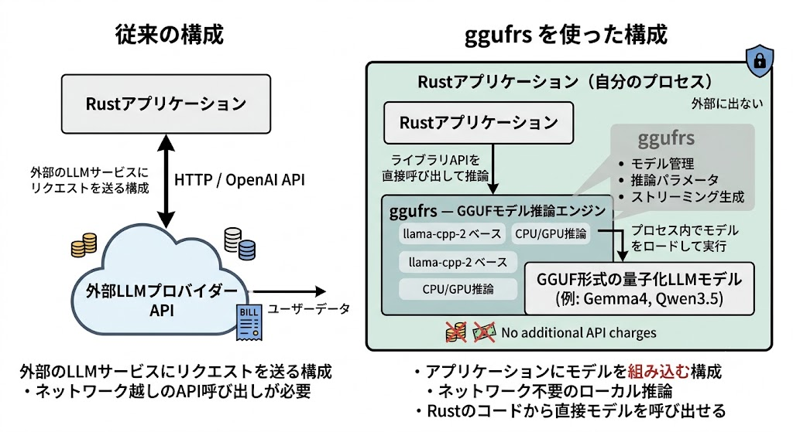

# ggufrs — Rust GGUF モデル推論エンジン

[](https://crates.io/crates/ggufrs)
[]()

**ggufrs** は [llama-cpp-2](https://crates.io/crates/llama-cpp-2) をバックエンドとして、GGUF 形式の量子化言語モデルを推論実行する Rust クレートです。
ライブラリ API としての直接推論と、OpenAI 互換 HTTP サーバーの両方を提供します。

---



## 目次

- [特徴](#特徴)
- [クイックスタート](#クイックスタート)
- [ビルド方法](#ビルド方法)
  - [動作要件](#動作要件)
  - [Cargo features](#cargo-features)
- [モデル自動ダウンロード](#モデル自動ダウンロード)
- [バイナリの使い方](#バイナリの使い方)
  - [test-chat — 対話型チャット](#test-chat--対話型チャット)
  - [test-run — パターン検証](#test-run--パターン検証)
- [ライブラリ API](#ライブラリ-api)
  - [クイックスタート（コード）](#クイックスタートコード)
  - [推論パラメータ](#推論パラメータ)
  - [モデル設定](#モデル設定)
  - [サーバーモード](#サーバーモード)
- [GPU サポート](#gpu-サポート)
  - [macOS（Metal）](#macosmetal)
  - [Windows / Linux（CUDA）](#windows--linuxcuda)
  - [CPU モード](#cpu-モード)
- [プロジェクト構成](#プロジェクト構成)
- [テスト](#テスト)

---

## 特徴

- **GGUF 形式の量子化モデル**に対応 — Qwen3.5 シリーズ、Gemma4 シリーズなど
- **OpenAI 互換 HTTP サーバー** — 既存の OpenAI クライアントから利用可能
- **モデル自動ダウンロード** — `build.rs` がビルド時に Hugging Face から自動ダウンロード
- **複数モデル管理** — 同一プロセス内で複数のモデルを切り替えて推論
- **ストリーミング生成** — トークン単位の逐次出力に対応
- **JSON Schema 拘束付き生成** — GBNF 文法による構造化出力
- **クロスプラットフォーム** — macOS / Windows / Linux

### ビルトインモデル

ビルド時に以下の4モデルが自動ダウンロードされます：

| モデル | サイズ | アーキテクチャ | 用途 |
|--------|--------|---------------|------|
| Gemma4 E2B (Q4_K_M) | ≈2.9GB | gemma4 | 軽量チャット、ASR補正 |
| Gemma4 E4B (Q4_K_M) | ≈4.6GB | gemma4 | 高精度推論 |
| Qwen3.5-0.8B (Q4_K_M) | ≈508MB | qwen35 | 超軽量検証 |
| Qwen3.5-2B (Q4_K_M) | ≈1.2GB | qwen35 | 標準検証 |

> **注記**: Qwen3.5 系は mistralrs 非互換のため現在 llama-cpp-2 で動作します。Gemma4 を推奨します。

---

## クイックスタート

```bash
# リポジトリをクローン
git clone https://github.com/t-kawata/zasso.git
cd zasso/crates/ggufrs

# ビルド（初回はモデルダウンロード + C++ コンパイルで数分かかります）
cargo build

# ワンショット推論（CPU モード）
cargo run --bin test-chat -- --model=gemma4-e2b --prompt="こんにちは"

# 対話モード
cargo run --bin test-chat -- --model=gemma4-e2b
> こんにちは
> Rustについて教えてください
> さようなら（空行で終了）

# パターン検証
cargo run --bin test-run
```

---

## ビルド方法

### 動作要件

| 要件 | バージョン | 備考 |
|------|-----------|------|
| Rust | edition 2021 | `rustup update` で最新に |
| cmake | ≥ 3.20 | llama-cpp-2 の C++ コンパイルに必要 |
| C++ コンパイラ | clang / gcc / MSVC | プラットフォーム標準のものを使用 |

**インストール確認**:
```bash
rustc --version
cmake --version
```

### Cargo features

```toml
[features]
default = ["cpu"]
cpu = []
metal = []    # macOS Apple Metal
cuda = []     # NVIDIA CUDA
```

| Feature | 説明 |
|---------|------|
| `cpu`（デフォルト） | CPU のみで推論 |
| `metal` | Apple Metal（macOS）。`build.rs` が `LLAMA_METAL=ON` を設定 |
| `cuda` | NVIDIA CUDA（Windows/Linux）。`build.rs` が `LLAMA_CUDA=ON` を設定 |

**ビルド例**:
```bash
# CPU モード（デフォルト）
cargo build

# macOS: Metal GPU アクセラレーション
cargo build --features metal

# CUDA（NVIDIA GPU）
cargo build --features cuda
```

> **macOS の注意**: `cpu` feature を指定しても、cmake が Metal.framework を自動検出して有効化します。純粋な CPU モードにするにはビルド環境での cmake 設定変更が必要です（詳細は [GPU サポート](#gpu-サポート) 参照）。

---

## モデル自動ダウンロード

`build.rs` がビルド時に Hugging Face からモデルファイルを自動ダウンロードします。

- ダウンロード先: `crates/ggufrs/models/`
- ダウンロード方式: `curl`（Unix） / `powershell`（Windows）
- タイムアウト: 600秒
- 既存ファイルはスキップ（冪等）
- ダウンロード失敗時はビルドを継続（実行時にモデル不在エラー）

手動で再ダウンロードする場合：
```bash
rm -rf models/
cargo build
```

---

## バイナリの使い方

### test-chat — 対話型チャット

**4種類のビルトインモデル**から任意のモデルを指定して、対話またはワンショット推論が行えます。

#### ワンショットモード

```bash
# Gemma4 E2B で推論
cargo run --bin test-chat -- --model=gemma4-e2b --prompt="こんにちは"

# Qwen3.5-2B で推論（温度・最大トークン指定）
cargo run --bin test-chat -- --model=qwen3.5-2b \
  --prompt="Rustの所有権について教えて" \
  --temperature=0.3 --max-tokens=1024
```

#### 対話モード

```bash
cargo run --bin test-chat -- --model=gemma4-e2b
```

起動後、`> ` プロンプトが表示され、複数ターンの会話が可能です：

```
対話モードを開始します。モデル: gemma4-e2b
空行または exit/quit で終了します。

> こんにちは
こんにちは！何かお手伝いできることはありますか？
  ⏱ 3.861秒 / 📊 24文字 / 6トークン / 2.5 TPS
> Rustを教えて
Rustはシステムプログラミング言語で...
  ⏱ 12.442秒 / 📊 320文字 / 80トークン / 6.4 TPS
> （空行で終了）
```

#### コマンドライン引数一覧

| 引数 | 必須 | デフォルト | 説明 |
|------|------|-----------|------|
| `--model=<NAME>` | ✅ | — | モデル名（`gemma4-e2b`, `gemma4-e4b`, `qwen3.5-0.8b`, `qwen3.5-2b`） |
| `--prompt=<TEXT>` | ❌ | — | ワンショットプロンプト（省略時は対話モード） |
| `--temperature=<F>` | ❌ | `0.7` | 温度パラメータ（0.0〜2.0） |
| `--max-tokens=<N>` | ❌ | `512` | 最大生成トークン数 |
| `--help`, `-h` | ❌ | — | ヘルプ表示 |

#### 会話履歴の管理

対話モードでは各ターンを以下の形式で連結し、モデルに文脈として渡します：

```
User: {入力}

Assistant: {応答}

```

履歴が 4000 文字を超えると、古いターンから自動的に切り詰められます。

---

### test-run — パターン検証

3パターンの推論を順次実行し、PASS/FAIL を一覧表示します。モデルの動作確認用です。

```bash
# 全パターン実行
cargo run --bin test-run

# 特定パターンのみ
cargo run --bin test-run -- 1
cargo run --bin test-run -- 1 3
```

| パターン | 内容 | 使用メソッド |
|---------|------|------------|
| 1 | Structured Output（JSON Schema 拘束付き生成） | `generate_structured()` |
| 2 | Text Generation（通常テキスト生成） | `generate()` |
| 3 | Streaming Generation（ストリーミング生成） | `generate_stream()` |

---

## ライブラリ API

ggufrs は Rust ライブラリとしても使用できます。

### クイックスタート（コード）

```rust
use ggufrs::*;

#[tokio::main]
async fn main() -> Result<(), GgufError> {
    // 1. モデル設定
    let config = GgufConfig {
        models: vec![ModelConfig::gemma4_e2b()],
        server: ServerConfig::default(),
        gpu: GpuConfig {
            provider: GpuProvider::Cpu,
            cpu_only: true,
        },
    };

    // 2. エンジン初期化
    let engine = GgufEngine::new(config).await?;

    // 3. 推論実行
    let params = GenerateParams {
        temperature: Some(0.7),
        max_tokens: Some(512),
        ..GenerateParams::default()
    };
    let response = engine.generate("gemma4-e2b", "こんにちは", params).await?;
    println!("{response}");

    Ok(())
}
```

### 推論パラメータ

```rust
pub struct GenerateParams {
    pub temperature: Option<f32>,       // 温度（0.0〜2.0、デフォルト 0.1）
    pub max_tokens: Option<u32>,        // 最大生成トークン数（デフォルト 256）
    pub top_p: Option<f32>,             // Top-P サンプリング
    pub presence_penalty: Option<f32>,  // 存在ペナルティ
    pub frequency_penalty: Option<f32>, // 頻度ペナルティ
}
```

### モデル設定

```rust
// ビルトインモデル
let model = ModelConfig::gemma4_e2b();     // Gemma4 E2B
let model = ModelConfig::gemma4_e4b();     // Gemma4 E4B
let model = ModelConfig::qwen3_5_0_8b();   // Qwen3.5-0.8B
let model = ModelConfig::qwen3_5_2b();     // Qwen3.5-2B

// カスタムモデル
let model = ModelConfig::custom("my-model", "path/to/model.gguf");
```

### サーバーモード

OpenAI 互換の HTTP サーバーを起動できます：

```rust
use std::sync::Arc;

let engine = Arc::new(GgufEngine::new(config).await?);
let handle = GgufEngine::start_server(engine.clone(), ServerConfig {
    bind: "127.0.0.1:3910".parse()?,
    models: vec!["gemma4-e2b".into()],
    auto_start_server: false,
}).await?;

// リクエスト例:
// POST /v1/chat/completions
// {"model": "gemma4-e2b", "messages": [{"role": "user", "content": "こんにちは"}]}
//
// GET /v1/models
```

または自動起動：
```rust
let engine = GgufEngine::new_with_auto_start(config).await?;
```

---

## GPU サポート

### macOS（Metal）

macOS では **cmake が Metal.framework を自動検出** し、GPU アクセラレーションが有効になります。
`cpu` feature を指定しても Metal は自動有効化されます。

```bash
# デフォルトビルドで Metal 有効
cargo run --bin test-chat -- --model=gemma4-e2b --prompt="こんにちは"
```

Metal の初期化ログ：
```
ggml_metal_device_init: GPU name:   MTL0 (Apple M2)
ggml_metal_device_init: GPU family: MTLGPUFamilyApple8 (1008)
```

> **CPU モードの制限**: 現状の llama-cpp-2 v0.1.150 では、macOS で Metal を完全に無効化する方法が提供されていません。ビルド時に cmake の `-DGGML_METAL=OFF` を明示的に渡すことで対応可能ですが、llama-cpp-2 の feature としては未対応です。

### Windows / Linux（CUDA）

NVIDIA GPU 環境では `--features cuda` で CUDA アクセラレーションが有効になります。

```bash
cargo run --features cuda --bin test-chat -- --model=gemma4-e2b --prompt="こんにちは"
```

### CPU モード

Windows / Linux ではデフォルトが CPU モードです。GPU 機能を一切有効化せず、純粋な CPU 推論のみで動作します。

```bash
# Windows/Linux のデフォルト
cargo run --bin test-chat -- --model=gemma4-e2b --prompt="こんにちは"
# → CPU のみ、GPU 関連のログは一切出力されない
```

---

## プロジェクト構成

```
crates/ggufrs/
├── Cargo.toml              # 依存関係・feature flags
├── build.rs                # モデル自動ダウンロード + cmake フラグ設定
├── models/                 # GGUF モデルファイル（gitignore）
├── src/
│   ├── lib.rs              # GgufEngine 構造体（エントリポイント）
│   ├── config.rs           # GgufConfig / ModelConfig / ServerConfig / GpuProvider
│   ├── error.rs            # GgufError エラー型
│   ├── registry.rs         # ModelRegistry — モデル一元管理
│   ├── consts/
│   │   └── settings.rs     # 静的定数（ポート番号・デフォルト値）
│   ├── inference/
│   │   ├── mod.rs          # InferenceEngine トレイト / GenerateParams
│   │   ├── generate.rs     # generate() / generate_structured() 実装
│   │   └── stream.rs       # generate_stream() 実装
│   ├── server/
│   │   ├── mod.rs          # build_router()
│   │   ├── router.rs       # Axum ルーター
│   │   ├── openai.rs       # OpenAI 互換ハンドラ
│   │   └── types.rs        # OpenAI 互換レスポンス型
│   └── bin/
│       ├── test-run.rs     # パターン検証バイナリ
│       └── test-chat.rs    # 対話型チャットバイナリ
└── tests/
    ├── ggufrs_api_check.rs # 公開API 型チェック
    └── server_integration_test.rs  # サーバー結合テスト
```

---

## テスト

```bash
# 全テスト実行（make 経由）
make test

# 直接実行
cargo test

# 特定バイナリのテストのみ
cargo test --bin test-chat
cargo test --bin test-run

# 全テスト（test-chat 含む）
cargo test --all-targets
```

---

## ライセンス

MIT OR Apache-2.0
