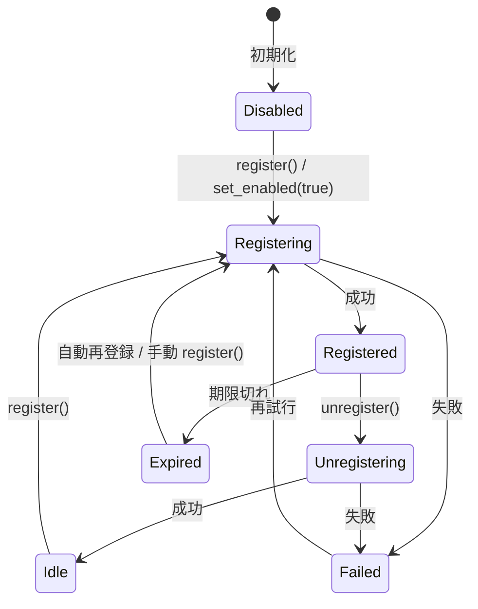

---
merge-history:
  -
    date: 2026-07-03
    source: /Users/shyme/shyme/zasso/crates/siprs/RFC02.md
    resolved:
      - RFC02-full
---

<!--
===== Anchor Marker System =====
このファイルには `[::REF-POINTER-BEGIN/END-*::]` マーカーが埋め込まれている。
これらのマーカーは機械的に子RFCへコードブロックを転記するためのものであり、
手動で編集・削除しないこと。マーカー範囲内の内容を変更した場合は、
generate-child-rfcs.js を再実行して子RFCの転記内容を更新すること。

マーカーID の解釈:
    {childId} = 子RFCのID（01, 02, ...）
  {seq}     = その子ID内での連番（001, 002, ...）
===============================
-->

# RFC: Rust SIP Client Crate 完全設計書

本書は、Tauri アプリケーションへ SIP ベースの音声通話機能を統合するための、Rust 製 private workspace crate の完全設計仕様である。本 RFC は要件定義を実装可能な精密設計へ落とし込み、公開 API、内部アーキテクチャ、状態遷移、FFI 境界、並行性モデル、ビルド戦略、エラー設計、イベントモデル、メディアパイプライン、設定仕様、テスト戦略、観測性、セキュリティ、性能要件、運用上の制約までを単一文書に包含する。

## 1. 目的

本 crate の目的は、Rust から PJSUA を安全かつ非同期的に利用し、複数 SIP アカウント、複数トランスポート、発着信、音声処理、DTMF、ICE/TURN/STUN、TLS、SRTP、およびアプリケーション統合向けイベント配信を、tokio ネイティブな API で提供することである。映像機能は対象外であり、音声のみに責務を限定する。

## 1a. M20 実装優先度マップ

M20 追補の全実装項目を実装順序の優先度とともに整理する。
各項目の詳細設計は後方の該当 `### M20 追補:` セクションに記述されている。
優先度は実装着手の目安であり、上位優先度の完了を下位の前提とはしない（並行着手可能な項目を含む）。

| 優先度 | 実装項目 | 設計判断 | 既存コード影響範囲 |
|--------|---------|---------|------------------|
| **P0** | NativeEvent → SipEventPayload 変換（Registration/Call/DTMF系） | Q1:A | `runtime/reactor.rs` — `process_native_event()` |
| **P0** | RegistrationStateChanged の RuntimeCommand::GetAccountInfo | Q8:B | `runtime/reactor.rs` + RuntimeCommand enum |
| **P0** | DtmfSentInfo 構造体定義と DtmfSent 発火実装 | Q2:A, Q14:A | `event.rs` + `runtime/reactor.rs` |
| **P0** | `account()` / `registration_state()` の `blocking_read` → `read().await` 修正 | Q3:A | `client.rs` + `account.rs` |
| **P1** | SubscribeAudio Reactor ハンドラ実装（conf_connect 経路） | Q2:A, Q5:B, Q10:B | `runtime/reactor.rs` + `backend/pjsua.rs` |
| **P1** | RuntimeCommand::ConfConnect / ConfDisconnect 新設 | Q3:A, Q5:B, Q11:B | RuntimeCommand enum + `runtime/reactor.rs` |
| **P1** | configure_codecs auto モード（Opus=255, PCMU=254） | Q7 | `backend/pjsua.rs` — `configure_codecs()` |
| **P1** | CallStateChanged 全 pjsip_inv_state 対応 | Q1:A | `runtime/reactor.rs` — CallState 変換 |
| **P1** | CallMediaStateChanged → MediaActive/Held/Error 変換 | Q1:A | `runtime/reactor.rs` — media_status 判定 |
| **P2** | Shutdown 中 command 振り分け（GetAccountInfo 許可） | Q12:C | `runtime/reactor.rs` — `dispatch_command()` |
| **P2** | EventBus 分割 + account_id ベース routing（Dual Client 基盤） | Q9:A | `runtime/reactor.rs` + `event.rs` |
| **P2** | Transport/ICE 系 NativeEvent 変換（重要度P1） | Q1:A | `runtime/reactor.rs` |
| **P2** | Dual Client TestContext utility | Q6:A | `tests/` |
| **P3** | Docker Integration Test Job (GitHub Actions) | Q4:A | `.github/workflows/` |
| **P3** | Prebuilt Refresh Pipeline | Q4:A | `.github/workflows/` + `vendor/prebuilt/` |

#### 設計判断対応表

上記マップで参照する設計判断（Q1:A〜Q14:A）の一覧。各判断の導出過程と詳細は対応する `### M20 追補:` セクションを参照。

後続の設計記述で `Q7` や `Q9:A` のような ID が現れた場合、本表で意味と該当箇所を確認できる。

| ID | 決定内容 | 該当セクション |
|----|---------|--------------|
| Q1:A | 全 NativeEvent → SipEventPayload を完全実装（P0/P1/P2 優先度付き） | M20 追補: NativeEvent 変換マッピング |
| Q2:A | DTMF 二段構え（戻り値=コマンド受理、DtmfSent=送出完了） | M20 追補: DtmfSentInfo |
| Q2:A | SubscribeAudio は conf_connect 標準経路で実装 | M20 追補: SubscribeAudio |
| Q3:A | tokio RwLock 維持 + `read().await` 徹底 + blocking_read 禁止 | M20 追補: ロック獲得ルール |
| Q3:A | RuntimeCommand::ConfConnect / ConfDisconnect 新設 | M20 追補: SubscribeAudio |
| Q3:A | configure_codecs 実装詳細を RFC に追記 | M20 追補: 明示的コーデック指定 |
| Q4:A | Docker/CI/prebuilt 自動化の設計を RFC に追記 | M20 追補: Docker テスト job |
| Q5:B | conf_connect RuntimeCommand 引数は CallId + MediaDirection で抽象化 | M20 追補: SubscribeAudio |
| Q6:A | Dual Client: 同一 PjsuaBackend singleton を複数 Client で共有 | M20 追補: Dual Client |
| Q7 | codec: 明示指定が基本。auto 時のみ Opus=255, PCMU=254 | M20 追補: 明示的コーデック指定 |
| Q8:B | RegistrationStateChanged は RuntimeCommand::GetAccountInfo 経由 | M20 追補: NativeEvent 変換マッピング |
| Q9:A | Dual Client routing: 単一 Reactor + EventBus 分割（global_runtime 維持） | M20 追補: Dual Client |
| Q10:B | conf_port_id 管理: PjsuaBackend 内部で解決（Runtime は CallId のみ意識） | M20 追補: ロック獲得ルール |
| Q11:B | 新 RuntimeCommand のエラーは既存バリアント（InvalidState/NotFound/InternalError）で兼用 | M20 追補: 新 RuntimeCommand のエラー設計 |
| Q12:C | Shutdown 中: GetAccountInfo 許可、conf_connect/disconnect 拒否 | M20 追補: Shutdown 中の RuntimeCommand |
| Q13:B | 新機能テスト層マッピングは既存 §43 に追記 | M20 追補: 新機能のテスト層 |
| Q14:A | DtmfSent: PJSIP callback 不在時は 500ms タイムアウトベースで発火 | M20 追補: DtmfSentInfo |

## 2. 非目的

本 crate は SIP サーバ実装、PBX 実装、独自 RTP スタック、録音ファイル書き出し機構、GUI、永続設定保存、通話課金、映像処理を提供しない。録音については `AudioChunkPair` の提供に留め、ファイルコンテナ化は利用側責務とする。

### 2.1 Tauri（フロントエンド）統合との責務境界

本 crate は Rust ネイティブの crate であり、Tauri の `tauri::ipc::Channel` や JavaScript との通信機構を提供しない。Tauri アプリケーションに統合する際は、以下の責務境界を明確にする。

**本 crate の責務範囲**:
- Rust 公開 API（`SipClient`, `SipEventPayload` 等）の提供。
- `tracing` による構造化ログ出力。Tauri の `tracing-subscriber` との統合は利用者側で行う。
- `serde::Serialize` / `Deserialize` は util 型を除き optional feature（`serde`）として提供する。`SecretString`（secrecy crate）のシリアライズは常に `"***REDACTED***"` となる。

**利用者（Tauri プラグイン層）の責務**:
- `SipEventPayload` をフロントエンドに流すための DTO（Data Transfer Object）への変換。
- `AudioChunkPair`（バイナリデータ）の効率的な転送（例: `tauri::ipc::Channel` 経由の Base64 エンコード、または共有メモリ参照）。
- `std::time::Instant`（`PairAligner` 内部使用）を外部に露出しないこと。タイムスタンプは `SystemTime` に変換してから DTO に格納する。
- フロントエンドからの操作コマンド（発信ボタン、着信応答等）を本 crate の Rust API へ変換するアダプタ層。

この線引きにより、本 crate は Tauri 非依存を保ち、テスト容易性と再利用性を確保する。

## 3. 用語

- **Client**: `SipClient` インスタンス全体を指す。
- **Account**: SIP REGISTER/認証/発信コンテキストを持つ論理アカウント。
- **Call**: 1 本の SIP セッション。
- **Media Session**: 1 Call に紐づく RTP/RTCP/codec/ICE/SRTP の実行単位。
- **Source**: OUT 方向へ音声を供給する任意の入力源。
- **Chunk Pair**: 同一時刻で揃えられた IN/OUT ペア音声バッファ。
- **Raw SIP Event**: 送受信 SIP メッセージ全文と解析済みメタデータを持つイベント。

## 4. 準拠要件

クレートは Rust 1.95 以上を MSRV とし、tokio を唯一の公開非同期ランタイム前提とする。PJSIP は **2.17** を正本バージョンとして固定する。patch version の更新は CI で互換性確認の上で追従するが、minor version の変更は別途評価判断とする。対象 OS は Windows x86_64、macOS arm64、Ubuntu x86_64 とし、ビルド時にプレビルド優先・欠損時ソースビルドという二段階戦略を採用する。

### 4.1 バージョニングポリシー

本 crate は以下のバージョニングポリシーに従う。

**0.x フェーズ（開発初期）**:
- API は semver に厳密には準拠しない。必要に応じて破壊的変更を行い、安定化を優先する。
- パブリック API の変更は `CHANGELOG.md` およびマイグレーションガイドで明示する。
- `SipEventPayload` のバリアント追加は破壊的変更と見なさない（`#[non_exhaustive]` によりマッチングは網羅的でなくてもよい）。

**1.0 以降（安定化フェーズ）**:
- semver に厳密に準拠する（MAJOR.MINOR.PATCH）。
- **MAJOR**: パブリック API の破壊的変更（enum バリアントの削除・リネーム、struct フィールドの削除、trait メソッドのシグネチャ変更）。
- **MINOR**: 後方互換のある機能追加（enum バリアントの追加、struct フィールドの追加、新 trait の追加）。`SipEventPayload` の拡張も MINOR 範囲。
- **PATCH**: バグ修正・リファクタリング・内部最適化。公開 API の変更は一切含めない。

**破壊的変更が許容される例外**:
- セキュリティ脆弱性の修正に必要な場合（MAJOR を待たずに PATCH で対応し、CHANGELOG に明記）。
- `SipClient::new()` のタイムアウトやリトライ動作の変更など、コンパイル時の型互換性に影響しない動作変更は PATCH 範囲とする。

## 5. 機能要求の確定化

以下を本 RFC の normative scope とする。

1. 複数 `SipAccount` の同時保持。
2. アカウント動的追加・削除。
3. アカウント単位の Register/Unregister と register enable の動的切替。
4. 未登録でも発信可能な発信専用モード。
5. UDP/TCP/TLS トランスポート。
6. feature flag による TLS/SRTP 切替。
7. ICE 完全対応、複数 STUN/TURN 設定。
8. コーデックは PCMU と Opus のみ。
9. DTMF の Inband / SIP INFO / RFC4733 の送受信。
10. 網羅的イベントバス。
11. IN/OUT ペアチャンク音声配信。
12. 高品質リサンプル・型変換。
13. 複数音源ミキシングとリアルタイム差替え。
14. `Result<T, SipError>` へ統一された API。
15. `SipClient: Send + Sync` の成立。

## 6. 全体構成

crate は以下のモジュール分割を採用する。各モジュールは public/private 境界を固定し、利用者が FFI 詳細に触れないようにする。

```text
siprs/
├── src/
│   ├── lib.rs
│   ├── client.rs
│   ├── config.rs
│   ├── account.rs
│   ├── call.rs
│   ├── transport.rs
│   ├── event.rs
│   ├── error.rs
│   ├── audio/
│   │   ├── mod.rs
│   │   ├── chunk.rs
│   │   ├── format.rs
│   │   ├── mixer.rs
│   │   ├── source.rs
│   │   ├── resampler.rs
│   │   └── bridge.rs
│   ├── ffi/
│   │   ├── mod.rs
│   │   ├── bindings.rs
│   │   ├── bootstrap.rs
│   │   ├── callbacks.rs
│   │   ├── strings.rs
│   │   ├── account.rs
│   │   ├── call.rs
│   │   ├── transport.rs
│   │   └── media.rs
│   ├── runtime/
│   │   ├── mod.rs
│   │   ├── command.rs
│   │   ├── reactor.rs
│   │   └── handle.rs
│   └── util/
│       ├── id.rs
│       ├── time.rs
│       └── sync.rs
├── build.rs
└── vendor/
├── prebuilt/
└── pjsip/           # PJSIP 2.17 正本ソース
```

この構成により、PJSIP callback thread 群、tokio user task 群、音声ミキサー処理、イベント配信を疎結合に維持する。

### 6.1 Crate 責務分割方針（設計判断）

本 RFC は SIP signalling、media bridge、audio processing、event bus を **単一の crate（`siprs`）** に同居させる設計を採用する。これは以下の理由による意図的な判断であり、責務肥大化による設計の混乱ではない。

**単一 crate を選択した理由**:
1. **PJSIP の密結合**: 当 crate の中核は PJSUA のライフサイクル管理と callback bridge である。PJSIP の conference bridge を共有する media 層と signalling 層を分離すると、FFI 境界を 2 重に管理する必要が生じ、unsafe コードの範囲が拡大する。
2. **通話とメディアの不可分性**: SIP 通話のライフサイクルと media session のライフサイクルは実装上不可分である。1 回の `pjsua_call_hangup()` で signalling と media の両方が終了するため、分離によるメリットより整合性管理コストが上回る。
3. **Tauri 統合の実用性**: Tauri デスクトップアプリケーションの構築において、追加の crate 境界がもたらす恩恵（個別バージョニング等）より、単一 crate の一貫性が実装効率で勝る。

**将来の分割可能性**:
- `siprs` のモジュール境界（`ffi/`, `runtime/`, `audio/`）は既に crate 分割を意識した疎結合に設計されている。
- 将来的に SIP signalling のみを独立させたい場合は、`runtime/` + `ffi/` を `siprs-core` として切り出し、`audio/` は `siprs-media` とすることが可能である。この分割判断は 1.0 リリース後の実際の利用実績に基づいて行う。

## 7. 並行性モデル

PJSIP は内部でネイティブスレッドを生成し callback を発火するため、公開 API を直接 callback thread 上で実行してはならない。本 crate は単一の **core reactor thread** を持ち、すべての pjsua_* 呼び出しをその reactor 上にシリアライズする。

### 7.1 実行コンテキスト

- **User async context**: 利用者の tokio task。
- **Core reactor**: `std::thread::JoinHandle<()>` 上で動作する専用スレッド。すべての PJSUA 制御 API をここで実行。
- **PJSIP native callbacks**: PJSUA が呼ぶ C callback。**最小限の work enqueue のみ実行**。ロック・メモリ確保・非同期待機は一切行わない。
- **Audio worker tasks**: AudioMixer ごとに 1 つ、Tokio blocking pool または専用スレッド上で動作する。AsyncAudioSource からの `.await` による音声 Pull、ミキシング、リサンプル、PairAligner 整列、lock-free queue へのフレーム書き込みまでを担当する。PJSIP のリアルタイムオーディオコールバックとは lock-free queue（`crossbeam_queue::ArrayQueue`）を介してのみ通信する。

### 7.1a 単一Reactorのスケーラビリティ注記

本 RFC の core reactor は単一スレッドを前提とする。これは Tauri デスクトップアプリ、AI 電話エージェント、〜30 同時通話までの想定利用範囲では十分であり、並行性の複雑さを抑える正しい設計判断である。

大規模 PBX 級（100 アカウント・300 同時通話以上）の要件が生じた場合は、reactor をアカウントグループ単位で分割するアーキテクチャへの移行を別途検討する。ただし、その場合も PJSIP のスレッド安全制約（特定の pjsua_* API は同じスレッドから呼び出す必要がある）がボトルネックとなる可能性が高く、単純な reactor 分割では解決できない点に注意する。

### 7.2 command serialization

公開 API は `RuntimeCommand` を unbounded MPSC で reactor へ送る。reactor は単一スレッドで順序実行し、結果を oneshot で返す。

```rust
pub(crate) enum RuntimeCommand {
    Initialize {
        config: ClientConfig,
        reply: tokio::sync::oneshot::Sender<Result<(), SipError>>,
    },
    AddAccount {
        config: AccountConfig,
        reply: tokio::sync::oneshot::Sender<Result<AccountId, SipError>>,
    },
    RemoveAccount {
        account_id: AccountId,
        reply: tokio::sync::oneshot::Sender<Result<(), SipError>>,
    },
    SetRegistration {
        account_id: AccountId,
        enabled: bool,
        reply: tokio::sync::oneshot::Sender<Result<(), SipError>>,
    },
    MakeCall {
        account_id: AccountId,
        request: OutgoingCallRequest,
        reply: tokio::sync::oneshot::Sender<Result<CallId, SipError>>,
    },
    Hangup {
        call_id: CallId,
        reason: HangupReason,
        reply: tokio::sync::oneshot::Sender<Result<(), SipError>>,
    },
    Hold {
        call_id: CallId,
        reply: tokio::sync::oneshot::Sender<Result<(), SipError>>,
    },
    Unhold {
        call_id: CallId,
        reply: tokio::sync::oneshot::Sender<Result<(), SipError>>,
    },
    SendDtmf {
        call_id: CallId,
        digits: String,
        method: DtmfMethod,
        reply: tokio::sync::oneshot::Sender<Result<(), SipError>>,
    },
    Shutdown {
        reply: tokio::sync::oneshot::Sender<Result<(), SipError>>,
    },
}
```

このシリアライズにより、PJSUA のスレッド安全制約を利用者へ露出させずに `Send + Sync` を成立させる。

## 8. 公開 API 設計

### 8.1 crate ルート

```rust
pub use crate::client::SipClient;
pub use crate::config::{ClientConfig, AccountConfig, TransportConfig, TlsConfig, IceConfig, TurnServerConfig, StunServerConfig};
pub use crate::account::{AccountId, SipAccountHandle, RegistrationState};
pub use crate::call::{CallId, CallState, OutgoingCallRequest, IncomingCall, HangupReason, ReferRequest};
pub use crate::audio::{AudioChunkPair, AudioTapMode, SampleRate, BitDepth, ChannelLayout, AudioFormat, AsyncAudioSource, SyncAudioSource, SyncSourceAdapter, AudioSourceId};
pub use crate::event::{SipEvent, SipEventPayload, EventBus, AccountEventReceiver, RawSipMessage, EventTimestamp};
pub use crate::error::{SipError, SipErrorKind};
```

### 8.2 SipClient

`SipClient` は参照カウント化された薄いハンドルであり、内部に reactor handle、イベントバス、アカウント/通話インデックス、shutdown state を持つ。

```rust
#[derive(Clone)]
pub struct SipClient {
    inner: std::sync::Arc<ClientInner>,
}

struct ClientInner {
    runtime: RuntimeHandle,
    events: EventBus,
    state: tokio::sync::RwLock<ClientState>,
    shutdown: tokio::sync::watch::Sender<bool>,
}
```

### 8.3 SipClient API

```rust
impl SipClient {
    pub async fn new(config: ClientConfig) -> Result<Self, SipError>;
    /// 制御系イベントの broadcast receiver を購読する。
    /// 内部では `EventBus::subscribe_control()` を呼び出す。
    pub fn subscribe(&self) -> tokio::sync::broadcast::Receiver<SipEvent>;
    /// RawSIP メッセージ専用の broadcast receiver を購読する。
    /// `ClientConfig::raw_sip_events.enabled == false` の場合は `None` を返す。
    pub fn subscribe_raw_sip(&self) -> Option<tokio::sync::broadcast::Receiver<RawSipMessage>>;
    pub fn subscribe_account(&self, account_id: AccountId) -> AccountEventReceiver;
    pub async fn add_account(&self, config: AccountConfig) -> Result<SipAccountHandle, SipError>;
    pub async fn remove_account(&self, account_id: AccountId) -> Result<(), SipError>;
    pub async fn account(&self, account_id: AccountId) -> Result<SipAccountHandle, SipError>;
    pub async fn accounts(&self) -> Vec<SipAccountHandle>;
    pub async fn shutdown(&self) -> Result<(), SipError>;
}
```

### 8.4 SipAccountHandle API

利用者は `SipAccountHandle` を通じてアカウント単位操作を行う。

```rust
#[derive(Clone)]
pub struct SipAccountHandle {
    client: SipClient,
    id: AccountId,
}

impl SipAccountHandle {
    pub fn id(&self) -> AccountId;
    pub async fn register(&self) -> Result<(), SipError>;
    pub async fn unregister(&self) -> Result<(), SipError>;
    pub async fn set_registration_enabled(&self, enabled: bool) -> Result<(), SipError>;
    pub async fn registration_state(&self) -> Result<RegistrationState, SipError>;
    pub async fn make_call(&self, request: OutgoingCallRequest) -> Result<CallId, SipError>;
    pub async fn update_config(&self, patch: AccountConfigPatch) -> Result<(), SipError>;
}
```

### 8.5 OutgoingCallRequest

```rust
pub struct OutgoingCallRequest {
    pub target_uri: String,
    pub headers: Vec<(String, String)>,
    pub auth_override: Option<AuthOverride>,
    pub preferred_transport: Option<TransportKind>,
    pub media: CallMediaPreferences,
    pub auto_answer_refer: bool,
}

pub struct CallMediaPreferences {
    pub enable_early_media: bool,
    pub enable_srtp: Option<bool>,
    pub preferred_codecs: Vec<Codec>,
}
```

`preferred_codecs` は最終的に `PCMU`, `Opus` のみ受理する。その他が指定された場合は validation error とする。

## 9. ID 設計

識別子はランタイム一意な非ゼロ整数とし、公開 API では newtype に隠蔽する。

```rust
#[derive(Debug, Clone, Copy, PartialEq, Eq, Hash, PartialOrd, Ord)]
pub struct AccountId(std::num::NonZeroU64);

#[derive(Debug, Clone, Copy, PartialEq, Eq, Hash, PartialOrd, Ord)]
pub struct CallId(std::num::NonZeroU64);

#[derive(Debug, Clone, Copy, PartialEq, Eq, Hash, PartialOrd, Ord)]
pub struct AudioSourceId(std::num::NonZeroU64);
```

PJSUA の `pjsua_acc_id` や `pjsua_call_id` は再利用されうるため、そのまま公開しない。内部では `BiMap<RuntimeId, NativeId>` で変換する。

## 10. ClientConfig 完全仕様

```rust
pub struct ClientConfig {
    pub user_agent: String,
    pub log_level: LogLevel,
    pub max_calls: u32,
    pub event_bus_capacity: usize,
    pub raw_sip_event_capacity: usize,
    pub audio: ClientAudioConfig,
    pub transports: Vec<TransportConfig>,
    pub stun_servers: Vec<StunServerConfig>,
    pub turn_servers: Vec<TurnServerConfig>,
    pub ice: IceConfig,
    pub raw_sip_events: RawSipEventConfig,
    pub timeouts: TimeoutConfig,
}

pub struct ClientAudioConfig {
    pub default_delivery_format: AudioFormat,
    pub pair_buffer_ms: u32,
    pub jitter_buffer_ms: u32,
    pub mixer_frame_ms: u32,
    pub max_sources_per_call: usize,
    pub resampler_quality: ResamplerQuality,
}

pub enum LogLevel { Error, Warn, Info, Debug, Trace }

pub struct TimeoutConfig {
    pub command_timeout: std::time::Duration,
    pub shutdown_timeout: std::time::Duration,
    pub register_timeout: std::time::Duration,
    pub invite_timeout: std::time::Duration,
}

pub struct RawSipEventConfig {
    pub enabled: bool,
    pub include_bodies: bool,
    pub max_body_bytes: usize,
    pub redact_authorization: bool,
}
```

### 10.1 既定値

```rust
impl Default for ClientConfig {
    fn default() -> Self {
        Self {
            user_agent: "tauri-siprs/0.1".into(),
            log_level: LogLevel::Info,
            max_calls: 32,
            event_bus_capacity: 2048,
            raw_sip_event_capacity: 4096,
            audio: ClientAudioConfig {
                default_delivery_format: AudioFormat {
                    sample_rate: SampleRate::Hz16000,
                    bit_depth: BitDepth::I16,
                    channel_layout: ChannelLayout::StereoInOut,
                    frame_ms: 20,
                },
                pair_buffer_ms: 120,
                jitter_buffer_ms: 60,
                mixer_frame_ms: 20,
                max_sources_per_call: 16,
                resampler_quality: ResamplerQuality::High,
            },
            transports: vec![TransportConfig::udp(5060), TransportConfig::tcp(5060)],
            stun_servers: vec![],
            turn_servers: vec![],
            ice: IceConfig::default(),
            raw_sip_events: RawSipEventConfig {
                enabled: true,
                include_bodies: true,
                max_body_bytes: 64 * 1024,
                redact_authorization: true,
            },
            timeouts: TimeoutConfig {
                command_timeout: std::time::Duration::from_secs(10),
                shutdown_timeout: std::time::Duration::from_secs(15),
                register_timeout: std::time::Duration::from_secs(15),
                invite_timeout: std::time::Duration::from_secs(90),
            },
        }
    }
}
```

既定 delivery format は要件に合わせて 16kHz / i16 / stereo(L=IN,R=OUT) とする。

## 11. AccountConfig 完全仕様

```rust
pub struct AccountConfig {
    pub display_name: Option<String>,
    pub username: String,
    pub auth_username: Option<String>,
    pub password: SecretString,
    pub domain: String,
    pub registrar_uri: Option<String>,
    pub outbound_proxy: Vec<String>,
    pub contact_params: Vec<(String, String)>,
    pub transport: AccountTransportPolicy,
    pub register_on_start: bool,
    pub allow_outbound_without_register: bool,
    pub registration_expires: std::time::Duration,
    pub codecs: AccountCodecPolicy,
    pub dtmf: DtmfPolicy,
    pub media: AccountMediaConfig,
    pub headers: Vec<(String, String)>,
}

pub struct AccountCodecPolicy {
    pub enable_pcmu: bool,
    pub enable_opus: bool,
    pub opus: OpusConfig,
}

pub struct OpusConfig {
    pub bitrate: u32,
    pub complexity: u8,
    pub cbr: bool,
    pub inband_fec: bool,
    pub dtx: bool,
    pub ptime_ms: u16,
}

pub struct DtmfPolicy {
    pub send_methods: Vec<DtmfMethod>,
    pub receive_methods: Vec<DtmfMethod>,
    pub default_send_method: DtmfMethod,
}

pub struct AccountMediaConfig {
    pub srtp: SrtpPolicy,
    pub ice: bool,
    pub vad: bool,
    pub ec_tail_ms: u16,
    pub input_gain_db: f32,
    pub output_gain_db: f32,
}
```

### 11.1 validation rules

- `username`, `domain`, `password` は空禁止。
- `register_on_start == false` でも `allow_outbound_without_register == true` なら有効。
- `registrar_uri` 未指定時は `sip:{domain}` を自動導出。
- codec policy は `enable_pcmu || enable_opus` が必須。
- DTMF policy は送信・受信ともに 1 つ以上 required。

## 12. TransportConfig 完全仕様

```rust
pub enum TransportConfig {
    Udp(UdpTransportConfig),
    Tcp(TcpTransportConfig),
    #[cfg(feature = "tls")]
    Tls(TlsTransportConfig),
}

pub struct UdpTransportConfig { pub bind_addr: std::net::SocketAddr }
pub struct TcpTransportConfig { pub bind_addr: std::net::SocketAddr }

#[cfg(feature = "tls")]
pub struct TlsTransportConfig {
    pub bind_addr: std::net::SocketAddr,
    pub tls: TlsConfig,
}

#[cfg(feature = "tls")]
pub struct TlsConfig {
    pub verify_server: bool,
    pub ca_cert_path: Option<std::path::PathBuf>,
    pub client_cert_path: Option<std::path::PathBuf>,
    pub client_key_path: Option<std::path::PathBuf>,
    pub server_name: Option<String>,
    pub allow_insecure_cipher_legacy: bool,
}
```

TLS は feature flag で完全に API から消える設計とし、無効時に TLS variant が型レベルで出現しないようにする。

## 13. ICE/STUN/TURN 完全仕様

```rust
pub struct IceConfig {
    pub enabled: bool,
    pub aggressive_nomination: bool,
    pub trickle_ice: bool,
    pub renomination: bool,
    pub max_host_candidates: usize,
}

impl Default for IceConfig {
    fn default() -> Self {
        Self {
            enabled: true,
            aggressive_nomination: true,
            trickle_ice: false,
            renomination: false,
            max_host_candidates: 16,
        }
    }
}

pub struct StunServerConfig {
    pub uri: String,
}

pub struct TurnServerConfig {
    pub uri: String,
    pub username: Option<String>,
    pub password: Option<SecretString>,
    pub transport: TurnTransport,
}
```

PJSIP 実装事情により trickle ICE は内部で非対応なら validation error で拒否するのではなく、`ClientInitialized` イベントに capability matrix を載せて明示する。だが要件が「ICE に完全対応」であるため、本 RFC では full ICE を必須とし、trickle ICE は disabled default の optional optimization とする。

## 14. エラー設計

すべての API は `Result<T, SipError>` を返す。`SipError` は stable な分類を持ち、native error code、文脈、recoverability を保持する。

```rust
#[derive(Debug, thiserror::Error)]
#[error("{kind}: {message}")]
pub struct SipError {
    pub kind: SipErrorKind,
    pub message: String,
    pub native_status: Option<i32>,
    pub account_id: Option<AccountId>,
    pub call_id: Option<CallId>,
    pub retryable: bool,
}

#[derive(Debug, Clone, Copy, PartialEq, Eq)]
pub enum SipErrorKind {
    InvalidConfig,
    InvalidState,
    AlreadyInitialized,
    NotInitialized,
    AccountNotFound,
    CallNotFound,
    TransportInitFailed,
    RegistrationFailed,
    AuthenticationFailed,
    InviteFailed,
    MediaInitFailed,
    MediaNegotiationFailed,
    IceFailed,
    TlsFailed,
    SrtpFailed,
    AudioFormatUnsupported,
    AudioPipelineBroken,
    DtmfFailed,
    Timeout,
    ChannelClosed,
    NativeError,
    ShutdownInProgress,
    InternalInvariantBroken,
}
```

### 14.1 エラー変換方針

- `pj_status_t != PJ_SUCCESS` は必ず `NativeError` または文脈特化エラーへ変換。
- 4xx/5xx/6xx は SIP 応答コードを `InviteFailed`/`RegistrationFailed` の message と supplemental field に格納。
- callback 内 panic は `catch_unwind` で握り潰さず `InternalInvariantBroken` を emit し、その call/account を安全停止する。

### M20 追補: 新 RuntimeCommand のエラー設計

`ConfConnect`, `ConfDisconnect`, `GetAccountInfo` の3つの RuntimeCommand が RFC M20 で追加される。これらのエラーは既存の `SipErrorKind` バリアントで表現し、新規バリアントは追加しない。

| RuntimeCommand | 失敗条件 | SipErrorKind | 補足 |
|---------------|---------|-------------|------|
| `ConfConnect` | conf_port 未解決（指定 CallId に conf_port が存在しない） | `InvalidState` | media が active でない通話に対して接続を試みた |
| `ConfConnect` | PJSIP conf_connect API エラー（既接続、無効ポート等） | `InternalError` | pj_status_t を message に格納 |
| `ConfDisconnect` | conf_port 未解決 | `InvalidState` | ConfConnect 未実行の通話に対して切断を試みた |
| `ConfDisconnect` | PJSIP conf_disconnect API エラー | `InternalError` | pj_status_t を message に格納 |
| `GetAccountInfo` | 指定 AccountId が存在しない | `NotFound` | account 削除後の query |
| `GetAccountInfo` | PJSIP API エラー | `InternalError` | pj_status_t を message に格納 |

新規バリアントを追加しない理由: RuntimeCommand ごとにエラーバリアントを増やすと `SipErrorKind` が肥大化し、エラー処理の網羅性チェックが実質的に機能しなくなる。既存の `InvalidState` / `NotFound` / `InternalError` の組み合わせで全ての失敗条件を表現可能である。

```rust
// ConfConnect のエラー変換例
fn convert_conf_connect_error(pj_status: pj_status_t, call_id: CallId) -> SipError {
    if pj_status == PJ_SUCCESS {
        return Ok(());
    }
    // conf_port 未解決は PJSIP エラーコード PJ_EINVALIDOP で検出
    if pj_status == PJ_EINVALIDOP {
        return Err(SipError::invalid_state(
            format!("ConfConnect: conf_port not resolved for call {call_id}")
        ));
    }
    Err(SipError::internal_error(
        format!("ConfConnect failed: pjsua_conf_connect returned {pj_status}")
    ))
}
```

## 15. イベントモデル

要件で列挙された全イベントを payload enum で完全定義する。イベントは `SipEvent`（メタデータ + payload）にラップされ、チャネル種別により loss-tolerant な制御系と大量発生するメディア系を分離する。

### 15.1 SipEventPayload

```rust
/// イベント種別を定義する payload enum。
/// `#[non_exhaustive]` により将来のバリアント追加に対する破壊的変更を防止する。
#[derive(Debug, Clone)]
#[non_exhaustive]
pub enum SipEventPayload {
    // ── 登録系 ──
    RegistrationStarted(RegistrationInfo),
    RegistrationSucceeded(RegistrationInfo),
    RegistrationFailed(RegistrationFailure),
    UnregistrationSucceeded,
    UnregistrationFailed(RegistrationFailure),
    RegistrationExpired,

    // ── 発着信系 ──
    OutgoingCallStarted(OutgoingCallInfo),
    OutgoingCallTrying(ProvisionalInfo),
    OutgoingCallRinging(ProvisionalInfo),
    EarlyMediaReceived(EarlyMediaInfo),
    CallConnected(ConnectedCallInfo),
    IncomingCall(IncomingCallInfo),
    CallDisconnected(DisconnectInfo),
    CallCancelled(CancelInfo),
    CallRejected(RejectInfo),
    CallHeld,
    CallResumed,
    ReferReceived(ReferRequest),
    TransferCompleted(TransferInfo),

    // ── メディア系 ──
    MediaActive(MediaActiveInfo),
    MediaStopped(MediaStoppedInfo),
    MediaError(MediaErrorInfo),

    // ── DTMF系 ──
    DtmfSent(DtmfSentInfo),
    DtmfReceived(DtmfReceivedInfo),

    // ── ICE系 ──
    IceNegotiationStarted,
    IceNegotiationSucceeded(IceSuccessInfo),
    IceNegotiationFailed(IceFailureInfo),

    // ── トランスポート系 ──
    TransportConnected(TransportConnectedInfo),
    TransportDisconnected(TransportDisconnectedInfo),
    TransportError(TransportErrorInfo),

    // ── アカウント系 ──
    AccountAdded(AccountSnapshot),
    AccountRemoved(AccountSnapshot),
    AccountConfigChanged(AccountSnapshot),

    // ── クライアントライフサイクル系 ──
    ClientInitialized(ClientCapabilities),
    ClientShutdown,

    // ── エラー系 ──
    Error(SipError),
}
```

### 15.2 SipEvent

```rust
#[derive(Debug, Clone)]
pub struct SipEvent {
    pub meta: EventMeta,
    pub payload: SipEventPayload,
}
```

### 15.3 EventMeta

```rust
#[derive(Debug, Clone)]
pub struct EventMeta {
    pub event_id: u64,
    pub timestamp: EventTimestamp,
    pub account_id: Option<AccountId>,
    pub call_id: Option<CallId>,
    pub direction: Option<EventDirection>,
    pub headers: Option<Vec<(String, String)>>,
    pub status_code: Option<u16>,
    pub reason_phrase: Option<String>,
    pub logical_context: std::collections::BTreeMap<String, String>,
}
```

要件にある `AccountId`、タイムスタンプ、関連 SIP メッセージ、ヘッダ、ステータスコード、論理的意味付け情報をすべて共通フィールドで保持する。

### 15.4 EventBus

`SipClient` は制御系イベントと RawSIP メッセージを別バスで配信する。これにより RawSIP 有効時の制御系イベント取りこぼしを防止する。

```rust
#[derive(Clone)]
pub struct EventBus {
    /// 制御系イベントのプライマリバス。順序保証・確実配送を期待する。
    control: tokio::sync::broadcast::Sender<SipEvent>,
    /// RawSIP メッセージ専用バス。有効時のみ使用され、制御系イベントとは独立して配送される。
    raw_sip: Option<tokio::sync::broadcast::Sender<RawSipMessage>>,
}

impl EventBus {
    pub fn new(control_capacity: usize, raw_sip_capacity: Option<usize>) -> Self {
        let (control_tx, _) = tokio::sync::broadcast::channel(control_capacity);
        let raw_sip = raw_sip_capacity.map(|cap| {
            let (tx, _) = tokio::sync::broadcast::channel(cap);
            tx
        });
        Self { control: control_tx, raw_sip }
    }

    /// 制御系イベントの購読
    pub fn subscribe_control(&self) -> tokio::sync::broadcast::Receiver<SipEvent> {
        self.control.subscribe()
    }

    /// RawSIP メッセージの購読
    pub fn subscribe_raw_sip(&self) -> Option<tokio::sync::broadcast::Receiver<RawSipMessage>> {
        self.raw_sip.as_ref().map(|tx| tx.subscribe())
    }

    /// 制御系イベントを発行
    pub fn publish(&self, event: SipEvent) {
        let _ = self.control.send(event);
    }

    /// RawSIP メッセージを発行（専用バスが有効な場合のみ）
    pub fn publish_raw_sip(&self, msg: RawSipMessage) {
        if let Some(ref tx) = self.raw_sip {
            let _ = tx.send(msg);
        }
    }
}
```

### 15.5 AccountEventReceiver

```rust
pub struct AccountEventReceiver {
    account_id: AccountId,
    inner: tokio::sync::broadcast::Receiver<SipEvent>,
}

impl AccountEventReceiver {
    pub async fn recv(&mut self) -> Result<SipEvent, tokio::sync::broadcast::error::RecvError> {
        loop {
            let ev = self.inner.recv().await?;
            if ev.meta.account_id == Some(self.account_id) {
                return Ok(ev);
            }
        }
    }
}
```

### 15.6 イベントバス分割の設計判断

- **制御系イベント**（登録・発着信・DTMF・ICE・トランスポート・クライアントライフサイクル・エラー）は `control` バスで配送される。順序は単一プロデューサ内で preserve される。
- **RawSIP メッセージ**は `raw_sip` 専用バスで配送される。大量発生時も制御系イベントの取りこぼしに影響しない。
- `RawSipEventConfig::enabled == false` の場合、`raw_sip` チャネル自体が作成されず、オーバーヘッドはゼロである。
- `subscribe()` メソッドは `subscribe_control()` に一元化し、`SipClient` の公開APIは変更しない。RawSIP 受信が必要な利用者は追加で `subscribe_raw_sip()` を呼ぶ。

### 15.7 重要: イベントバスは観測用途であり確実配送を保証しない

両バスとも `tokio::sync::broadcast` をベースとしており、**確実配送（reliable delivery）は保証されない**。イベントバスは主に**観測・UI更新・ロギング用途**を想定して設計されており、監査・課金・完全性が要求されるトランザクションのソースオブ真理として利用してはならない。

**配送特性**:
- **lossy 配送**: 購読者が処理遅延により `capacity` を超えて取りこぼした場合、`RecvError::Lagged(n)` が返る。n は欠落したメッセージ数である。これは異常ではなく、本バスの設計上の正常動作である。
- **再送機構なし**: broadcast チャネルは「全購読者への同報」を目的としており、個別購読者単位の再送機構は持たない。
- **取りこぼし検知と復旧**: `Lagged(n)` を受信した利用者は、必要に応じて `SipClient` の query API（`accounts()`, `call_state()` 等）で現在の状態を再取得することで、欠落を補償できる。
- **ソースオブ真理（Source of Truth）**: イベントバスではなく、`SipClient` の query API（`accounts()`, `call_state()`, `registration_state()`）が crate のソースオブ真理である。イベントは状態変化の通知であり、状態そのものではない。

**capacity 設計**:
- `event_bus_capacity` の既定値 2048 は、1 通話あたりの典型的なイベント数（REGISTER + INVITE + BYE + DTMF で約 20 イベント）に対して 100 通話分以上の余裕を持つ。通常運用での溢れは想定しない。
- 極端な高負荷環境（数百通話同時等）では必要に応じて capacity を拡大すること。
- 購読者が慢性的に遅延する場合は `Lagged` が頻発する。これは capacity 不足ではなく、購読者の処理能力不足を示すシグナルである。対策として購読者の処理を別タスクに分離するか、`AudioTapHandle` の oldest-drop 戦略と組み合わせて使用すること。

### M20 追補: NativeEvent → SipEventPayload 変換マッピング

Reactor の `process_native_event()` は PJSIP callback から受信した `NativeEvent` を対応する `SipEventPayload` に変換し、EventBus に publish する。以下が全 NativeEvent の完全なマッピング定義である。

#### 基本方針

- **重要度 P0**: 統合テストの成立に必須。RegistrationStateChanged, CallStateChanged, CallMediaStateChanged, DtmfDigit
- **重要度 P1**: 運用観測・障害検知に有用。TransportStateChanged, IceTransportError
- **重要度 P2**: 補完的情報。CallTsxStateChanged, CallRedirected, CallTransferStatus, CallReplaced, NatDetected

全 NativeEvent の実装を完了するまで M20 で完了する。P1/P2 のイベントは P0 実装完了後に順次対応する。

#### 完全マッピングテーブル

```rust
fn convert_native_event_to_payload(event: NativeEvent, backend: &dyn SipBackend) -> Option<SipEventPayload> {
    match event {
        // === P0: Registration系 ===
        NativeEvent::RegistrationStateChanged { acc_id } => {
            // RuntimeCommand::GetAccountInfo を発行し、PjsuaBackend 経由で
            // pjsua_acc_get_info() の結果を取得する（詳細は後述）
            None // 実際の変換は GetAccountInfo 完了後に行う
        }
        NativeEvent::RegistrationStarted { acc_id, renew } => {
            Some(SipEventPayload::RegistrationStarted(
                RegistrationInfo { account_id: AccountId::from(acc_id), renew, .. }
            ))
        }

        // === P0: Call系 ===
        NativeEvent::CallStateChanged { call_id, state } => {
            convert_call_state(call_id, state)
        }
        NativeEvent::CallMediaStateChanged { call_id } => {
            convert_call_media_state(call_id)
        }

        // === P0: DTMF系 ===
        NativeEvent::DtmfDigit { call_id, digit } => {
            Some(SipEventPayload::DtmfReceived(
                DtmfReceivedInfo { digit, method: DtmfMethod::Rfc4733, duration_ms: None, volume_dbm0: None }
            ))
        }

        // === P1: Transport/ICE系 ===
        NativeEvent::TransportStateChanged { transport_id, state } => {
            // P0完了後に実装: transport state を SipEventPayload::TransportConnected/Disconnected/Error に変換
            None
        }
        NativeEvent::IceTransportError { .. } => {
            // P0完了後に実装: ICE failure 情報を IceNegotiationFailed に変換
            None
        }

        // === P2: 補完的情報系 ===
        NativeEvent::CallTsxStateChanged { .. }
        | NativeEvent::CallRedirected { .. }
        | NativeEvent::CallTransferStatus { .. }
        | NativeEvent::CallReplaced { .. }
        | NativeEvent::NatDetected { .. } => {
            // 対象外: これらのイベントは PJSIP 内部のトランザクション詳細や
            // NAT 検出結果を通知するものであり、siprs crate の公開 API として
            // 提供する SipEventPayload の粒度より詳細すぎる。
            // 必要な場合は EventBus の RawSIP バス経由で取得可能。
            None
        }
    }
}
```

**マッピング対象外の根拠**: CallTsxStateChanged 等の低優先度イベントは PJSIP 内部の SIP トランザクション状態遷移を通知するものであり、siprs crate の公開 API として提供する call state モデル（CallState enum、Section 18 参照）とは抽象度が異なる。これらが必要なユースケースは RawSIP メッセージ購読（`subscribe_raw_sip()`）でカバーする。

#### CallStateChanged の pjsip_inv_state マッピング

PJSIP の `pjsip_inv_state` enum 値と `CallState`（Section 18）の対応は以下の通り:

| pjsip_inv_state | 値 | 変換先 CallState | 備考 |
|----------------|-----|-----------------|------|
| `PJSIP_INV_STATE_NULL` | 0 | None（イベント発行なし） | 初期状態。CREATE 前の空ハンドル |
| `PJSIP_INV_STATE_CALLING` | 1 | `Calling` | 発信側: INVITE 送信後。受信側では発生しない |
| `PJSIP_INV_STATE_CONNECTING` | 2 | `Trying` / `Ringing` | 遷移元が CALLING なら Trying、INCOMING なら Ringing |
| `PJSIP_INV_STATE_CONFIRMED` | 3 | `Active` | メディアネゴシエーション完了（= CallConnected） |
| `PJSIP_INV_STATE_DISCONNECTED` | 4 | `Disconnecting` → `Disconnected` | 切断開始。後続の切断理由解決後に Disconnected を発行 |

```rust
fn convert_call_state(call_id: CallId, state: pjsip_inv_state) -> Option<SipEventPayload> {
    match state {
        PJSIP_INV_STATE_NULL => None,
        PJSIP_INV_STATE_CALLING => Some(SipEventPayload::OutgoingCallStarted(/* ... */)),
        PJSIP_INV_STATE_CONNECTING => {
            // 遷移元が CALLING なら Trying、INCOMING なら Ringing
            // 実際の判定は Reactor の通話状態機械が保持する previous_state を用いる
            None // 実際は CallState 機械との連携が必要
        }
        PJSIP_INV_STATE_CONFIRMED => Some(SipEventPayload::CallConnected(/* ... */)),
        PJSIP_INV_STATE_DISCONNECTED => Some(SipEventPayload::CallDisconnected(/* ... */)),
    }
}
```

CONNECTING 状態（pjsip_inv_state=2）は Trying と Ringing の両方に対応しうる。Reactor は CallEntry の直前の state を参照して判別する:
- `Calling → Connecting` の遷移 → `Trying` を publish（発信側）
- `Incoming → Connecting` の遷移 → `Ringing` を publish（着信側）

#### CallMediaStateChanged の media_status 判定

`CallMediaStateChanged` は PJSIP の `on_call_media_state()` callback から発火される。`pjsua_call_get_info().media_status` の値に基づいて以下の変換を行う:

| pjsua_call_media_status | 意味 | 変換先 SipEventPayload |
|------------------------|------|----------------------|
| `PJSUA_CALL_MEDIA_NONE` | メディア未確立 | （イベント発行なし） |
| `PJSUA_CALL_MEDIA_ACTIVE` | メディア送受信中 | `MediaActive(MediaActiveInfo)` |
| `PJSUA_CALL_MEDIA_LOCAL_HOLD` | ローカルホールド中 | `CallHeld` |
| `PJSUA_CALL_MEDIA_REMOTE_HOLD` | リモートホールド中 | `CallHeld` |
| `PJSUA_CALL_MEDIA_ERROR` | メディアエラー | `MediaError(MediaErrorInfo)` |

```rust
fn convert_call_media_state(call_id: CallId) -> Option<SipEventPayload> {
    let info = pjsua_call_get_info(call_id);
    match info.media_status {
        PJSUA_CALL_MEDIA_ACTIVE => Some(SipEventPayload::MediaActive(MediaActiveInfo { call_id })),
        PJSUA_CALL_MEDIA_LOCAL_HOLD | PJSUA_CALL_MEDIA_REMOTE_HOLD => {
            Some(SipEventPayload::CallHeld)
        }
        PJSUA_CALL_MEDIA_ERROR => Some(SipEventPayload::MediaError(MediaErrorInfo { call_id })),
        _ => None,
    }
}
```

#### RegistrationStateChanged の RuntimeCommand パターン

RegistrationStateChanged は他の NativeEvent と異なり、PJSIP API（`pjsua_acc_get_info()`）の能動的呼び出しを必要とする。以下のフローで処理する:

```
PJSIP callback: on_reg_state2()
  → NativeEvent::RegistrationStateChanged { acc_id }
  → Reactor::process_native_event()
  → RuntimeCommand::GetAccountInfo { native_acc_id, reply_tx }
  → Reactor が GetAccountInfo を command queue にエンキュー
  → Reactor::process_command_queue() が GetAccountInfo を処理
  → PjsuaBackend::get_account_info(native_acc_id) を呼び出し
  → pjsua_acc_get_info() で registration status を取得
  → 結果を reply_tx で Reactor に返却
  → Reactor が RegistrationSucceeded / RegistrationFailed を EventBus に publish
  → RegistrationSucceeded: status code=200 の場合
  → RegistrationFailed: status code=4xx/5xx/6xx または timeout の場合
```

このパターンを採用する理由:
- PJSIP API（`pjsua_acc_get_info`）は PJSIP worker thread コンテキストから安全に呼び出せるが、callback bridge から Reactor への経路（process_native_event）は PJSIP thread 上で動作する。そのため直接 `PjsuaBackend` を呼ぶことはスレッドコンテキスト的に可能だが、責務分離の観点から RuntimeCommand 経由を選ぶ。
- RuntimeCommand 経由にすることで、MockBackend を使ったテストで RegistrationStateChanged の処理を検証可能になる。

```rust
// RuntimeCommand::GetAccountInfo の定義（RuntimeCommand enum に追加）
RuntimeCommand::GetAccountInfo {
    native_acc_id: pjsua_acc_id,
    reply_tx: oneshot::Sender<Result<AccountInfoSnapshot, SipError>>,
}

/// pjsua_acc_get_info() の結果を格納する snapshot 構造体。
/// 登録状態の確認に必要な最小限の情報を含む。
#[derive(Debug, Clone)]
pub struct AccountInfoSnapshot {
    pub acc_id: AccountId,
    pub registration_status: pjsip_status_code,
    pub registration_expires: Option<u32>,  // 秒。0=期限切れ
    pub online_status: bool,
    pub uri: String,
}
```

## 16. raw SIP メッセージ仕様

```rust
#[derive(Debug, Clone)]
pub struct RawSipMessage {
    pub direction: SipMessageDirection,
    pub transport: TransportKind,
    pub start_line: String,
    pub headers: Vec<(String, String)>,
    pub body: Option<Vec<u8>>,
    pub text: String,
    pub content_length: usize,
    pub remote_addr: Option<std::net::SocketAddr>,
    pub local_addr: Option<std::net::SocketAddr>,
}
```

`redact_authorization == true` の場合、`Authorization`, `Proxy-Authorization` は `***REDACTED***` に置換して格納する。

## 17. 登録状態モデル

```rust
#[derive(Debug, Clone, Copy, PartialEq, Eq)]
pub enum RegistrationState {
    Disabled,
    Idle,
    Registering,
    Registered,
    Unregistering,
    Failed,
    Expired,
}
```

### 17.1 遷移規則



**遷移規則**:
- `Disabled -> Registering` when `register()` or `set_registration_enabled(true)`。
- `Idle -> Registering` on explicit register。
- `Registering -> Registered | Failed`。
- `Registered -> Unregistering` on unregister。
- `Unregistering -> Idle | Failed`。
- `Registered -> Expired` on expiry callback。
- `Expired -> Registering` on auto re-register or manual register。
- `Failed -> Registering` on retry。

未登録でも `make_call()` は常に可能であるため、`RegistrationState` は発信可否に影響しない。

## 18. 通話状態モデル

```rust
#[derive(Debug, Clone, Copy, PartialEq, Eq)]
pub enum CallState {
    New,
    Calling,
    Trying,
    Ringing,
    EarlyMedia,
    Incoming,
    Connecting,
    Active,
    Held,
    Transferring,
    Disconnecting,
    Disconnected,
    Failed,
}
```

### 18.1 遷移規則

```mermaid
stateDiagram-v2
    state Outgoing {
        [*] --> New: make_call()
        New --> Calling
        Calling --> Trying
        Trying --> Ringing
        Trying --> EarlyMedia
        Ringing --> Connecting
        EarlyMedia --> Connecting
        Connecting --> Active
    }

    state Incoming {
        [*] --> New: on_incoming_call
        New --> Incoming
        Incoming --> Connecting: answer(200)
        Incoming --> Connecting: answer(183)
    }

    state ActiveSession {
        Active --> Held: hold()
        Held --> Active: unhold()
        Active --> Transferring: REFER送信
        Transferring --> Active: NOTIFY success
        Transferring --> Disconnecting: NOTIFY fail
    }

    Ringing --> Failed: 4xx/5xx/6xx
    EarlyMedia --> Failed: 4xx/5xx/6xx
    Connecting --> Failed

    Active --> Disconnecting: BYE/CANCEL/hangup
    Held --> Disconnecting
    Disconnecting --> Disconnected
    Disconnected --> [*]

    Failed --> [*]
```

**遷移規則**:
- Outgoing: `New -> Calling -> Trying -> Ringing | EarlyMedia | Connecting -> Active -> Held <-> Active -> Disconnecting -> Disconnected`。
- Incoming: `New -> Incoming -> Connecting -> Active`。
- `Ringing/EarlyMedia/Connecting -> Failed` if 4xx/5xx/6xx。
- `Any non-terminal -> Disconnecting -> Disconnected` on BYE/CANCEL/local hangup。
- `REFER` 送信時 `Transferring` transient state を経由し、最終 NOTIFY success/fail で遷移完了。

### 18.2 同時通話制約

`ClientConfig::max_calls` を上限とする。アカウントごとの上限は未設定なら無制限だが、後述の runtime validation で client 上限だけは強制する。

## 19. 発着信 API 詳細

```rust
impl SipClient {
    pub async fn answer(&self, call_id: CallId, code: u16) -> Result<(), SipError>;
    pub async fn hangup(&self, call_id: CallId, reason: HangupReason) -> Result<(), SipError>;
    pub async fn hold(&self, call_id: CallId) -> Result<(), SipError>;
    pub async fn unhold(&self, call_id: CallId) -> Result<(), SipError>;
    pub async fn transfer(&self, call_id: CallId, target: String) -> Result<(), SipError>;
    pub async fn send_dtmf(&self, call_id: CallId, digits: impl Into<String>, method: DtmfMethod) -> Result<(), SipError>;
    pub async fn call_state(&self, call_id: CallId) -> Result<CallState, SipError>;
}
```

### 19.1 answer semantics

- `180`: 着信呼び出し継続。
- `183`: SDP 付き provisional answer を許容。
- `200`: 通話受諾。
- `486`: Busy Here。
- `603`: Decline。

`answer()` は incoming call 以外に対して `InvalidState` を返す。

## 20. DTMF 仕様

```rust
#[derive(Debug, Clone, Copy, PartialEq, Eq)]
pub enum DtmfMethod {
    Inband,
    SipInfo,
    Rfc4733,
}
```

送信時、指定 method が account policy で無効なら `InvalidConfig`。受信時は PJSIP callback ごとに正規化し `DtmfReceived` を発火する。

```rust
pub struct DtmfReceivedInfo {
    pub method: DtmfMethod,
    pub digit: char,
    pub duration_ms: Option<u16>,
    pub volume_dbm0: Option<i8>,
}
```

### M20 追補: DtmfSentInfo 構造体と DtmfSent 発火設計

#### DtmfSentInfo 構造体

```rust
/// DTMF 送出試行の結果を表す。DtmfReceivedInfo（相手受信時の情報）とは異なり、
/// 送出側の試行結果（成功/失敗とエラー詳細）を伝える。
#[derive(Debug, Clone)]
pub struct DtmfSentInfo {
    pub method: DtmfMethod,
    pub digit: char,
    /// 送出試行の成否
    pub status: Result<(), SentDtmfError>,
    /// PJSIP 内部エラーコード（status=Err の場合のみ有効）
    pub pjsip_status: Option<pj_status_t>,
}

#[derive(Debug, Clone, PartialEq, Eq)]
pub enum SentDtmfError {
    /// PJSIP 内部エラー（pj_status_t 変換後）
    PjsipError(pj_status_t),
    /// タイムアウト（PJSIP callback 応答なし）
    Timeout,
}
```

#### DtmfSent 発火タイミング

`SipClient::send_dtmf()` の戻り値と `DtmfSent` イベントは以下の意味論で分離される:

| シグナル | 意味 | 保証 |
|---------|------|------|
| `send_dtmf()` の戻り値 `Ok(())` | RuntimeCommand::SendDtmf が Reactor の command queue に受理された。PJSIP の `pjsua_call_dial_dtmf()` が呼び出された | 同期的に確認可能 |
| `DtmfSent` イベント | PJSIP が DTMF データを実際に送出した（callback 経由）、またはタイムアウトにより送出試行完了とみなした | 非同期で通知 |

```rust
// SipBackend::send_dtmf — 戻り値は「PJSIP コマンド受理」を意味する
fn send_dtmf(&mut self, native_call_id: pjsua_call_id, method: &DtmfMethod, digits: &str) -> Result<(), SipError> {
    let pj_status = unsafe { ffi::pjsua_call_dial_dtmf(native_call_id, c_str) };
    if pj_status != ffi::PJ_SUCCESS {
        return Err(/* pj_status → SipError 変換 */);
    }
    // ここで DtmfSent を発火するわけではない。
    // 実際の DTMF 送出完了は PJSIP callback またはタイマーで検出する
    Ok(())
}
```

#### DtmfSent の発火条件（優先順位）

1. **PJSIP callback 経由（最優先）**: PJSIP の `on_dtmf_digit` callback は着信 DTMF の受信に加え、送信完了時にも呼ばれる可能性がある。まずこの挙動を確認し、送信完了時に呼ばれる場合はその callback から DtmfSent を発火する。
2. **タイムアウトベース（PJSIP callback 不在時の fallback）**: PJSIP callback による送信完了通知が確認できない場合、RuntimeCommand::SendDtmf の実行から 500ms 経過後に DtmfSent を自動発行する。このタイムアウト値は `DtmfConfig::sent_timeout_ms` として ClientConfig から設定可能とし、既定値を 500ms とする。

```rust
// DtmfSent 発火の fallback タイマー
// Reactor の SendDtmf ハンドラ内でタイマーを設定する
fn handle_send_dtmf(&mut self, cmd: RuntimeCommand::SendDtmf) {
    let call_id = cmd.call_id;
    let native_call_id = self.resolve_native_call_id(call_id);

    // PJSIP API 呼び出し
    let result = self.backend.send_dtmf(native_call_id, &cmd.method, &cmd.digits);

    // 戻り値で即時応答（コマンド受理）
    let _ = cmd.reply_tx.send(result.map_err(|e| e.into()));

    // 非同期 DtmfSent 発火のためのタイマー設定
    let timeout = self.config.dtmf.sent_timeout_ms.unwrap_or(500);
    let event_bus = self.events.clone();
    let call_id_for_event = call_id;
    self.spawn_timer(timeout, move || {
        event_bus.publish(SipEvent {
            meta: EventMeta { call_id: Some(call_id_for_event), .. },
            payload: SipEventPayload::DtmfSent(DtmfSentInfo {
                method: cmd.method,
                digit: cmd.digits.chars().next().unwrap_or('\0'),
                status: Ok(()),
                pjsip_status: None,
            }),
        });
    });
}
```

この二段構え設計により、`send_dtmf()` の呼び出し元は:
- 同期的に戻り値でコマンド受理を確認できる
- 非同期的に DtmfSent イベントで送出完了（またはタイムアウト）を確認できる
- 相手が実際に受信したことは DtmfReceived イベントで確認できる（エンドツーエンドの確認）

## 21. 音声フォーマットモデル

```rust
#[derive(Debug, Clone, Copy, PartialEq, Eq)]
pub enum SampleRate { Hz8000, Hz16000, Hz24000, Hz48000 }

#[derive(Debug, Clone, Copy, PartialEq)]
pub enum BitDepth { I16, F32 }

#[derive(Debug, Clone, Copy, PartialEq, Eq)]
pub enum ChannelLayout {
    Mono,
    StereoInOut,
}

#[derive(Debug, Clone, Copy, PartialEq)]
pub struct AudioFormat {
    pub sample_rate: SampleRate,
    pub bit_depth: BitDepth,
    pub channel_layout: ChannelLayout,
    pub frame_ms: u16,
}
```

### 21.1 AudioChunkPair

```rust
#[derive(Debug, Clone)]
pub struct AudioChunkPair {
    pub call_id: CallId,
    pub account_id: AccountId,
    pub timestamp: std::time::SystemTime,
    pub in_chunk: AudioChunk,
    pub out_chunk: AudioChunk,
}

#[derive(Debug, Clone)]
pub enum AudioChunk {
    I16(Vec<i16>),
    F32(Vec<f32>),
}
```

要件通り IN/OUT は同一タイムスタンプで対にされ、ズレは内部で吸収される。

## 22. 音声購読 API

```rust
/// 音声タップの振る舞いを指定する。
#[derive(Debug, Clone, Copy, PartialEq, Eq)]
pub enum AudioTapMode {
    /// リアルタイム優先（既定）。利用者が読み遅れた場合 oldest-drop で
    /// 最新ペアを優先する。低レイテンシが求められる監視・分析用途に適する。
    /// ドロップ発生時は `MediaError(AudioTapOverflow)` が報告される。
    Realtime,
    /// 完全性優先。チャネル満杯時は送信側（AudioWorkerTask）で
    /// バックプレッシャーをかけ、フレームのドロップを避ける。
    /// 録音・品質測定用途に適する。
    ///
    /// ただし、このモードは**ベストエフォート型の完全性保証**である。
    /// 利用者側の処理遅延が持続すると AudioWorkerTask の `process_frame`
    /// ループがブロックされ、同一通話の音声ミキシング全体にジッタが
    /// 発生する可能性がある。このモードを使用する際は、利用者が
    /// 十分に大きい `capacity` を指定し、`recv()` を速やかに消費すること。
    Lossless,
}

pub struct AudioTapHandle {
    rx: tokio::sync::mpsc::Receiver<AudioChunkPair>,
}

impl SipClient {
    pub async fn subscribe_audio(
        &self,
        call_id: CallId,
        format: AudioFormat,
        capacity: usize,
        mode: AudioTapMode,  // ← tap mode 指定
    ) -> Result<AudioTapHandle, SipError>;
}

impl AudioTapHandle {
    pub async fn recv(&mut self) -> Option<AudioChunkPair> {
        self.rx.recv().await
    }
}
```

### 22.1 backpressure policy

利用者が読み遅れた場合の挙動は `AudioTapMode` に依存する。

- **`Realtime`**: リアルタイム性を優先し oldest-drop を採用する。チャネル満杯時は最新 pair を優先し、`MediaError` に `AudioTapOverflow` を報告する。音声処理パイプラインへの影響は一切ない。
- **`Lossless`**: 送信側（AudioWorkerTask）でバックプレッシャーをかけ、フレームのドロップを避ける。ただし、持続的なバックプレッシャーは `AudioWorkerTask::process_frame()` ループをブロックし、同一通話の音声ミキシング全体にジッタやアンダーランを誘発する可能性がある。そのため、このモードは「ベストエフォート型の完全性保証」であり、真の lossless 保証ではない。録音用途では `capacity` を十分大きく（標準 frame 数換算で 5 秒以上相当）指定し、`recv()` を速やかに消費すること。

既定値は `Realtime` とする。

### M20 追補: SubscribeAudio Reactor ハンドラ実装設計

`RuntimeCommand::SubscribeAudio` の Reactor ハンドラは以下の経路で実装する:

```rust
/// メディアストリームの方向。ConfConnect で接続するポートを指定する。
#[derive(Debug, Clone, Copy, PartialEq, Eq)]
pub enum MediaDirection {
    /// 着信音声（相手→自分）の conf_port に接続
    Inbound,
    /// 発信音声（自分→相手）の conf_port に接続
    Outbound,
    /// 双方向（IN/OUT 両方）に接続。AudioTap の標準的な設定
    Both,
}
```

```text
SipClient::subscribe_audio(call_id, format, capacity, mode)
  → RuntimeCommand::SubscribeAudio { call_id, format, capacity, mode, reply_tx }
  → Reactor::process_command_queue()
  → Reactor が CallId → native_call_id を解決
  → RuntimeCommand::ConfConnect {
        call_id,
        media_direction: MediaDirection::Both,  // IN/OUT 両方
        reply_tx: inner_tx,
    } を発行（SubscribeAudio ハンドラ内部で）
  → PjsuaBackend::conf_connect(source, sink) で conference port 接続
  → AudioChunkPair の stream を作成
  → AudioTapHandle { rx: mpsc::Receiver<AudioChunkPair> } を生成
  → reply_tx で AudioTapHandle を SipClient に返却
```

#### SubscribeAudio ハンドラ擬似実装

```rust
// Reactor の SubscribeAudio ハンドラ
fn handle_subscribe_audio(&mut self, cmd: RuntimeCommand::SubscribeAudio) {
    // 1. CallId → native_call_id の解決
    let native_call_id = match self.state.calls.get(&cmd.call_id) {
        Some(entry) => entry.native_id,
        None => {
            let _ = cmd.reply_tx.send(Err(SipError::not_found("call not found")));
            return;
        }
    };

    // 2. conf_port の解決と接続（PjsuaBackend が conf_port_id を解決）
    let conf_result = self.backend.conf_connect_media(
        native_call_id,
        MediaDirection::Both,
    );

    // 3. AudioChunkPair stream と AudioTapHandle の生成
    let (tx, rx) = tokio::sync::mpsc::channel::<AudioChunkPair>(cmd.capacity);
    let handle = AudioTapHandle { rx };

    // 4. conf_port から AudioChunkPair への変換ループ起動
    //    このループは通話切断時に自動停止される
    self.spawn_audio_tap_task(native_call_id, tx, cmd.format, cmd.mode);

    // 5. 呼び出し元に AudioTapHandle を返却
    let _ = cmd.reply_tx.send(Ok(handle));
}
```

#### AudioTapMode と conf_connect の連携

`AudioTapMode` は conf_connect のチャネル設定に以下のように反映される:

| AudioTapMode | conf_connect 動作 | AudioTapHandle のチャネル挙動 |
|-------------|-------------------|------------------------------|
| `Realtime`（既定） | 通常の conf_connect。AudioWorkerTask の process_frame とは独立 | oldest-drop。満杯時は最新ペアを優先し `MediaError(AudioTapOverflow)` を報告 |
| `Lossless` | conf_connect + AudioWorkerTask の送信キューでバックプレッシャーを受ける | 満杯時は送信側ブロック。capacity を十分大きく設定すること |

`ConfConnect` RuntimeCommand の引数は `(CallId, MediaDirection)` で抽象化し、conf_port_id の解決は PjsuaBackend 内部で行う（PJSIP 固有の conf_port_id 型を Runtime に露出させない）。

```rust
// RuntimeCommand::ConfConnect の定義
RuntimeCommand::ConfConnect {
    call_id: CallId,
    /// 接続するメディア方向。Inbound / Outbound / Both
    media_direction: MediaDirection,
    reply_tx: oneshot::Sender<Result<(), SipError>>,
}

// PjsuaBackend 内部での conf_port_id 解決
impl PjsuaBackend {
    fn resolve_conf_port(&self, native_call_id: pjsua_call_id) -> Result<pjsua_conf_port_id, SipError> {
        let mut info = unsafe { std::mem::zeroed::<ffi::pjsua_call_info>() };
        let status = unsafe { ffi::pjsua_call_get_info(native_call_id, &mut info) };
        if status != ffi::PJ_SUCCESS {
            return Err(SipError::invalid_state("failed to get call info"));
        }
        Ok(info.conf_slot)
    }
}
```

## 23. AsyncAudioSource 仕様

本crateは MSRV 1.95 を前提とし、RPITIT（`async fn` in trait）が安定しているため、プライマリtraitに RPITIT を採用する。

```rust
/// 利用者が実装すべきプライマリtrait。RPITIT（async fn in trait）で定義する。
///
/// このtraitは object-safe ではないため、動的ディスパッチ用の
/// `ErasedAudioSource` が内部で自動導出される。
pub trait AsyncAudioSource: Send {
    async fn next_chunk(&mut self, buf: &mut [i16]) -> usize;
}
```

`AsyncAudioSource` は `async fn next_chunk` を RPITIT で直接定義するため、利用者は煩雑な `Pin<Box<dyn Future>>` の記述なしに実装できる。

### 23.1 動的ディスパッチ用自動導出

内部の `AudioMixer` は `Box<dyn AsyncAudioSource>` でソースを保持するため、object-safe な wrapper trait を自動導出する。利用者が意識する必要は一切ない。

```rust
/// 動的ディスパッチ用の object-safe trait（内部実装専用）。
/// `AsyncAudioSource` を実装した全型に対して blanket impl で自動導出される。
pub trait ErasedAudioSource: Send {
    fn next_chunk<'a>(
        &'a mut self,
        buf: &'a mut [i16],
    ) -> core::pin::Pin<Box<dyn core::future::Future<Output = usize> + Send + 'a>>;
}

impl<T: AsyncAudioSource + Send> ErasedAudioSource for T {
    fn next_chunk<'a>(
        &'a mut self,
        buf: &'a mut [i16],
    ) -> core::pin::Pin<Box<dyn core::future::Future<Output = usize> + Send + 'a>> {
        Box::pin(AsyncAudioSource::next_chunk(self, buf))
    }
}
```

### 23.2 SyncSourceAdapter

同期的な音声ソースを非同期traitに適合させるアダプタを提供する。

```rust
pub trait SyncAudioSource: Send {
    fn next_chunk(&mut self, buf: &mut [i16]) -> usize;
}

pub struct SyncSourceAdapter<T> {
    inner: T,
}

impl<T: SyncAudioSource + Send> AsyncAudioSource for SyncSourceAdapter<T> {
    async fn next_chunk(&mut self, buf: &mut [i16]) -> usize {
        self.inner.next_chunk(buf)
    }
}
```

### 23.3 設計判断の注記

- RPITIT 採用により、`Box::pin` による毎フレームのヒープアロケーションは blanket impl 内に閉じ込められ、利用者コードからは完全に隠蔽される。
- 動的ディスパッチが不要な静的ディスパッチの場合は `Box::pin` が完全に回避されるため、ホットパス上のオーバーヘッドはゼロである。
- 将来、`type_alias_impl_trait` (TAIT) などの機能が安定した場合、`ErasedAudioSource` をより効率的な実装に置き換える可能性があるが、現状の blanket impl で実用上十分な性能が得られる。

## 24. AudioMixer 設計

### 24.0 リアルタイム境界（最重要設計判断）

PJSIP のオーディオコールバック（`pjmedia_port` の `get_frame`/`put_frame`）は OS の最優先リアルタイムスレッドで駆動する。このスレッド内で以下の操作は**厳禁**である：

1. ロックの取得（`DashMap` の読み込み、`tokio::sync::Mutex` のブロッキング）
2. 非同期の待機（`.await` / Future の駆動）
3. メモリの動的確保（`Vec` の新設・拡張、`Box` の生成）
4. システムコールを伴う任意の処理

そのため、本 crate ではオーディオ処理を**2層**に完全分離する。

```text
┌─────────────────────────────────────────────────────────┐
│ AudioWorkerTask (Tokio async context)                    │
│                                                         │
│  AsyncAudioSource(s) ──┐                                │
│  AudioMixer (DashMap + Mutex + .await)                  │
│       ↓ mix_i16_frame() + resample (rubato)             │
│       ↓                                                 │
│  lock-free queue (crossbeam::ArrayQueue)                 │
│  ┌─────────────────────────────────────┐                │
│  │ ミキシング済み固定長PCMフレーム      │                │
│  └─────────────────────────────────────┘                │
└─────────────────────────────────────────────────────────┘
                             ↓ pop / push
┌─────────────────────────────────────────────────────────┐
│ RustMediaPort (PJSIP RT callback thread)                 │
│  get_frame() → queue pop → memcpy → 空ならゼロフィル     │
│  put_frame() → 受信音声を queue push                     │
│  メモリコピー以外の処理を行わない                         │
└─────────────────────────────────────────────────────────┘
```

### 24.1 AudioMixer（AudioWorkerTask 側）

1 通話ごとに `AudioMixer` を 1 つ持つ。`AudioMixer` は複数 source を frame ごとに pull、sum、clamp、gain 適用し、ミキシング済みフレームを lock-free queue へ書き込む。すべての操作は AudioWorkerTask 上で実行されるため、ロック・非同期待機・メモリ確保が安全に行える。

```rust
pub struct AudioMixer {
    format: InternalPcmFormat,
    sources: dashmap::DashMap<AudioSourceId, MixerSourceEntry>,
    master_gain: std::sync::atomic::AtomicU32,
    next_id: std::sync::atomic::AtomicU64,
    /// ミキシング済みOUTフレームを RT callback へ渡す lock-free queue
    out_queue: crossbeam_queue::ArrayQueue<Vec<i16>>,
    /// RT callback からの受信音声（IN）を受け取る lock-free queue
    in_queue: crossbeam_queue::ArrayQueue<Vec<i16>>,
}

struct MixerSourceEntry {
    source: tokio::sync::Mutex<Box<dyn ErasedAudioSource>>,
    gain: f32,
    muted: bool,
    eof: bool,
}
```

### 24.2 mixing algorithm

内部ミキシングは i32 accumulation でオーバーフローを避け、最後に saturating i16 に落とす。

```rust
fn mix_i16_frame(inputs: &[&[i16]], output: &mut [i16]) {
    for (sample_idx, out) in output.iter_mut().enumerate() {
        let mut acc: i32 = 0;
        for input in inputs {
            acc += input.get(sample_idx).copied().unwrap_or(0) as i32;
        }
        *out = acc.clamp(i16::MIN as i32, i16::MAX as i32) as i16;
    }
}
```

### 24.2 gain and normalization

既定では soft normalization は行わない。理由は通話品質の一貫性と予測可能性を優先するためである。利用者は source gain を明示設定する。

### 24.3 AudioWorkerTask 駆動

`AudioWorkerTask` は AudioMixer ごとに 1 つ、Tokio の blocking pool 上で動作する。

```rust
struct AudioWorker {
    mixer: AudioMixer,
    call_id: CallId,
    frame_duration: std::time::Duration,
}

impl AudioWorker {
    /// 定期的に呼び出される frame 処理
    /// 1. 各 AsyncAudioSource から .await で音声を pull
    /// 2. mix_i16_frame でミキシング
    /// 3. リサンプル・型変換
    /// 4. ミキシング済みフレームを out_queue へ push
    /// 5. in_queue から受信音声を pull し PairAligner へ渡す
    async fn process_frame(&mut self) {
        // 全sourceから非同期pull（RTスレッド上では不可能な操作）
        let mut frames = Vec::new();
        for entry in self.mixer.sources.iter_mut() {
            let mut guard = entry.value().source.lock().await;
            let mut buf = vec![0i16; self.mixer.format.frame_samples()];
            let n = guard.next_chunk(&mut buf).await;
            if n > 0 {
                buf.truncate(n);
                frames.push(buf);
            }
        }
        // ミキシング（i32 accumulation → saturating i16）
        let mut out_buf = vec![0i16; self.mixer.format.frame_samples()];
        mix_i16_frame(&frames.iter().map(|f| &f[..]).collect::<Vec<_>>(), &mut out_buf);
        // lock-free queue へ push（RT callback が pop する）
        let _ = self.mixer.out_queue.push(out_buf);
    }
}
```

### 24.4 source lifecycle

```rust
impl SipClient {
    /// 音声ソースを追加する。source は AudioWorkerTask 上で .await される。
    pub async fn add_audio_source(
        &self,
        call_id: CallId,
        source: Box<dyn AsyncAudioSource>,
    ) -> Result<AudioSourceId, SipError>;

    pub async fn remove_audio_source(&self, call_id: CallId, source_id: AudioSourceId) -> Result<(), SipError>;
    pub async fn set_audio_source_gain(&self, call_id: CallId, source_id: AudioSourceId, gain: f32) -> Result<(), SipError>;
    pub async fn mute_audio_source(&self, call_id: CallId, source_id: AudioSourceId, muted: bool) -> Result<(), SipError>;
}
```

通話中の追加・削除・切替は reactor command 経由で同期化し、次 frame 境界で反映する。

`Box<dyn AsyncAudioSource>` は内部で `ErasedAudioSource` に自動変換され、lock-free queue を介して AudioWorkerTask から駆動されるため、RT callback に非同期処理が漏洩することはない。

### 24.5 将来拡張：slab ベース source 管理（注記）

現状の `DashMap<AudioSourceId, Mutex<...>>` は多数音源時に DashMap のハッシュ競合と Mutex 取得がボトルネックになりうる。音源数が常時 32 を超えることが判明した場合、以下の固定長テーブルへの移行を検討する。

```rust
// 将来の最適化候補
struct OptimizedMixer {
    sources: slab::Slab<MixerSourceEntry>,   // 固定長・インデックスアクセス
    free_list: Vec<usize>,                    // 解放済みスロット
    next_id_gen: u64,
}
```

`slab` は DashMap と異なりロックフリーのインデックスアクセスが可能だが、source の動的追加削除が頻繁なユースケースではフラグメンテーションに注意が必要である。移行判断はプロファイリングを根拠とし、現状の DashMap を初期実装として採用する。

## 25. IN/OUT ペア整列アルゴリズム

受信音声は RTP 由来、送信音声は mixer 由来のため時間軸がずれる。内部では timestamped ring buffer を 2 本持ち、共通 frame boundary で最も近いサンプル列を結合する。

`PairAligner` は AudioWorkerTask（Tokio async context）上で動作するため、`Vec` の生成や `VecDeque` 操作を安全に行える。PJSIP RT callback からは直接触れられない。

```rust
struct TimedFrame<T> {
    ts_mono: std::time::Instant,
    data: T,
}

struct PairAligner {
    in_q: std::collections::VecDeque<TimedFrame<Vec<i16>>>,
    out_q: std::collections::VecDeque<TimedFrame<Vec<i16>>>,
    tolerance: std::time::Duration,
}

impl PairAligner {
    fn try_pair(&mut self) -> Option<(Vec<i16>, Vec<i16>, std::time::Instant)> {
        let in_front = self.in_q.front()?;
        let out_front = self.out_q.front()?;
        let delta = if in_front.ts_mono >= out_front.ts_mono {
            in_front.ts_mono - out_front.ts_mono
        } else {
            out_front.ts_mono - in_front.ts_mono
        };
        if delta <= self.tolerance {
            let in_frame = self.in_q.pop_front().unwrap();
            let out_frame = self.out_q.pop_front().unwrap();
            let ts = in_frame.ts_mono.max(out_frame.ts_mono);
            Some((in_frame.data, out_frame.data, ts))
        } else if in_front.ts_mono < out_front.ts_mono {
            let _ = self.in_q.pop_front();
            None
        } else {
            let _ = self.out_q.pop_front();
            None
        }
    }
}
```

### 25.1 欠損時の扱い

- IN なし/OUT あり、または逆の場合、tolerance 超過後にゼロパディングで pair を生成する。
- ゼロパディング実施時は `MediaError` ではなく `MediaActiveInfo::alignment_drift` に累積統計を記録する。
- 長時間欠損が続く場合のみ `MediaError(AudioAlignmentBroken)` を発火する。

### 25.2 メモリ最適化注記

現状の `Vec<i16>` 生成は AudioWorkerTask 上のメモリ確保を伴うが、Tokio async context で動作するため RT スレッド上の非決定的遅延問題は発生しない。ただし、高負荷時のアロケータ競合を避けるため、将来の最適化として以下を検討してもよい：

- 事前にプールされた固定長バッファのリング（`bytes::BytesMut` や再利用可能な `Vec` プール）を使用する。
- `crossbeam_queue::ArrayQueue` と同様の固定長 pre-allocated キューを PairAligner の入出力に使用する。
- 最初の最適化判断はプロファイリングを根拠とし、現状の実装で問題がなければ単純な `VecDeque<Vec<i16>>` を維持する。

## 26. リサンプラ設計

要件に従い `rubato` を用いる。内部 native format は PJSIP/codec negotiation に応じた monaural i16 PCM とし、利用者要求フォーマットへ出力時変換する。

```rust
pub struct ResamplePipeline {
    in_rate: SampleRate,
    out_rate: SampleRate,
    bit_depth: BitDepth,
    layout: ChannelLayout,
    rubato_i16_to_f32: Option<rubato::FftFixedIn<f32>>,
}
```

### 26.1 stereo in/out mapping

既定 stereo 出力では L=IN, R=OUT を保証する。

```rust
fn interleave_in_out(in_mono: &[i16], out_mono: &[i16]) -> Vec<i16> {
    let n = in_mono.len().min(out_mono.len());
    let mut out = Vec::with_capacity(n * 2);
    for i in 0..n {
        out.push(in_mono[i]);
        out.push(out_mono[i]);
    }
    out
}
```

## 27. PJSIP FFI 層

FFI 層は `unsafe` を完全に隔離する。bindgen 生成コードは `ffi::bindings` のみに置き、上位モジュールへは safe wrapper しか露出しない。

### 27.1 bindgen 生成方針

`build.rs` は platform 別に include path と define を設定し、`pjsua.h`, `pjsua-lib/pjsua.h`, `pjmedia-codec/opus.h` など必要ヘッダのみを対象にする。

```rust
let bindings = bindgen::Builder::default()
    .header("wrapper.h")
    .allowlist_function("pjsua_.*")
    .allowlist_function("pj_.*")
    .allowlist_type("pjsua_.*")
    .allowlist_type("pj_.*")
    .allowlist_var("PJSUA_.*")
    .allowlist_var("PJ_.*")
    .generate()
    .expect("bindgen failed");
```

### 27.2 C string 管理

PJSIP は `pj_str_t` を使うため、`CString` の lifetime 問題を避ける wrapper を定義する。

```rust
pub struct PjOwnedStr {
    bytes: Vec<u8>,
    raw: ffi::pj_str_t,
}

impl PjOwnedStr {
    pub fn new(s: &str) -> Self {
        let mut bytes = s.as_bytes().to_vec();
        let ptr = bytes.as_mut_ptr().cast::<i8>();
        let len = bytes.len() as _;
        let raw = ffi::pj_str_t { ptr, slen: len };
        Self { bytes, raw }
    }

    pub fn as_raw(&self) -> ffi::pj_str_t { self.raw }
}
```

### 27.3 callback bridge

callback 内では Rust object への直接 mutable access を避け、軽量イベントを enqueue する。

```rust
extern "C" fn on_incoming_call(acc_id: ffi::pjsua_acc_id, call_id: ffi::pjsua_call_id, _rdata: *mut ffi::pjsip_rx_data) {
    if let Some(rt) = runtime::global_runtime() {
        rt.enqueue_native_event(NativeEvent::IncomingCall { acc_id, call_id });
    }
}
```

### 27a. SipBackend 抽象化（内部 trait）

本 crate の Runtime は現在 PJSUA を唯一のバックエンドとするが、テスト容易性と将来の差し替え可能性を考慮し、内部に `SipBackend` trait を定義する。この trait は `runtime/` モジュールから参照され、全 PJSUA 呼び出しを透過する。

```rust
/// 内部 SIP バックエンド抽象化。Runtime はこの trait を通じてのみ
/// PJSUA を操作し、直接的な FFI 依存を runtime 層に漏らさない。
pub(crate) trait SipBackend: Send {
    fn initialize(&mut self, config: &ClientConfig) -> Result<ClientCapabilities, SipError>;
    fn shutdown(&mut self) -> Result<(), SipError>;
    fn create_transport(&mut self, config: &TransportConfig) -> Result<(), SipError>;
    fn add_account(&mut self, config: &AccountConfig) -> Result<(pjsua_acc_id, ClientCapabilities), SipError>;
    fn remove_account(&mut self, native_acc_id: pjsua_acc_id) -> Result<(), SipError>;
    fn set_registration(&mut self, native_acc_id: pjsua_acc_id, enabled: bool) -> Result<(), SipError>;
    fn make_call(&mut self, native_acc_id: pjsua_acc_id, request: &OutgoingCallRequest) -> Result<pjsua_call_id, SipError>;
    fn answer_call(&mut self, native_call_id: pjsua_call_id, code: u16) -> Result<(), SipError>;
    fn hangup(&mut self, native_call_id: pjsua_call_id) -> Result<(), SipError>;
    fn conf_connect(&mut self, source: pjsua_conf_port_id, sink: pjsua_conf_port_id) -> Result<(), SipError>;
    fn conf_disconnect(&mut self, source: pjsua_conf_port_id, sink: pjsua_conf_port_id) -> Result<(), SipError>;
    fn configure_codecs(&mut self) -> Result<(), SipError>;
    fn send_dtmf(&mut self, native_call_id: pjsua_call_id, method: &DtmfMethod, digits: &str) -> Result<(), SipError>;
    fn transfer_call(&mut self, native_call_id: pjsua_call_id, target: &str) -> Result<(), SipError>;
}

#[cfg(test)]
pub(crate) struct MockBackend { /* ... */ }
```

`SipBackend` trait は `pub(crate)` であり、外部に公開されない。

**この抽象化の目的**:
- Reactor のユニットテストで `MockBackend` を使用し、PJSIP の初期化なしに状態機械の検証を可能にする。
- `RuntimeCommand` から `SipBackend` の呼び出しへの変換経路が分離されるため、将来のバックエンド差し替え（独自 SIP stack や `siprs` 等）が発生した場合も影響範囲を `SipBackend` 実装のみに限定できる。

**現在の設計判断**: 本 RFC の MVP 範囲では PJSUA (`PjsuaBackend`) が唯一の実装である。`SipBackend` trait は内部テスト用として定義するに留め、backend 差し替えを目的とした public API の変更は 1.0 以降の検討事項とする。

### M20 追補: Dual Client 時の PJSIP callback routing

複数の `SipClient` インスタンスが同一の `PjsuaBackend` singleton を共有する場合（テスト時等）、PJSIP callback から正しい Reactor（正しい EventBus）にイベントを配送する必要がある。

**アーキテクチャ**: 単一 Reactor + EventBus 分割

```text
PJSIP callback (on_incoming_call, etc.)
  → runtime::global_runtime() で単一の Reactor を取得（既存設計維持）
  → Reactor::enqueue_native_event(NativeEvent) でイベントキューイング（既存設計維持）
  → Reactor::process_native_event() で NativeEvent → SipEventPayload 変換
  → EventBus::publish() の前に account_id ベースの EventBus 振り分け
```

```rust
// EventBus 振り分けロジック（Reactor 内）
fn dispatch_event(&self, event: SipEvent) {
    let account_id = event.meta.account_id;
    match account_id {
        // account_id が特定の Client に属する場合、その Client の EventBus に publish
        Some(aid) => {
            if let Some(client_bus) = self.client_event_buses.get(&aid) {
                client_bus.publish(event);
            } else {
                // 該当 Client なし → フォールバックとしてデフォルト EventBus に publish
                self.default_event_bus.publish(event);
            }
        }
        // account_id なし（Client ライフサイクルイベント等）は全 Client の EventBus に publish
        None => {
            self.default_event_bus.publish(event);
            for bus in self.client_event_buses.values() {
                bus.publish(event.clone());
            }
        }
    }
}
```

**設計原則**:
- `global_runtime()` は変更せず、単一 Reactor を維持する
- EventBus は SipClient ごとに個別インスタンスを持ち、Reactor が `account_id` ベースで振り分ける
- デフォルト EventBus は最初に生成された SipClient のものを使用する
- 全 EventBus に同一イベントが配送されることはない（account_id で一意に振り分け）

**テスト時の Dual Client 初期化パターン**:

```rust
// TestContext での Dual Client 初期化
let client_a = SipClient::new(config_a).await?;
// client_a の初期化時に Reactor とデフォルト EventBus が生成される
// PjsuaBackend singleton は最初の initialize で OnceLock に格納される

let client_b = SipClient::new(config_b).await?;
// client_b は既存の PjsuaBackend singleton を共有
// Reactor に client_b 用の EventBus が追加登録される
// client_b のアカウントは異なる account_id で追加される

// client_a.add_account() と client_b.add_account() で別々のアカウントを追加
let handle_a = client_a.add_account(account_a).await?;
let handle_b = client_b.add_account(account_b).await?;
```

この設計では PjsuaBackend の singleton 制約（`pjsua_init()` の1回制限）に従いつつ、複数 SipClient のイベント分離を実現する。

## 28. build.rs 戦略

要件どおり、`build.rs` はプレビルド優先、欠損時ソースビルドを行う。

### 28.1 探索順序

1. `vendor/prebuilt/{target-triple}/lib/` を確認。
2. 必須ライブラリ一式が揃っていれば link。
3. 欠損時 `vendor/pjsip/` ソースを CMake でビルド。
4. 成功時、生成物を `OUT_DIR/pjsip-build` へ配置し link。
5. bindgen 実行。

### 28.2 build script 擬似実装

```rust
fn main() {
    let target = std::env::var("TARGET").unwrap();
    let prebuilt_root = std::path::PathBuf::from("vendor/prebuilt").join(&target);

    if prebuilt_available(&prebuilt_root) {
        emit_link_directives(&prebuilt_root);
        generate_bindings(prebuilt_root.join("include"));
        return;
    }

    let src_root = std::path::PathBuf::from("vendor/pjsip");
    let build_root = std::path::PathBuf::from(std::env::var("OUT_DIR").unwrap()).join("pjsip-build");
    build_pjsip_from_source(&src_root, &build_root, &target);
    emit_link_directives(&build_root);
    generate_bindings(build_root.join("include"));
}
```

### 28.3 cmake flags

- `-DPJMEDIA_WITH_VIDEO=OFF` mandatory
- Opus enabled。
- TLS feature 無効時は TLS transport 無効。
- SRTP feature 無効時は SRTP 無効。

### 28.4 OS別システムパッケージ依存関係

ソースビルドフォールバック時、各 OS で以下のシステムパッケージが必須である。

**Ubuntu 22.04 x86_64**:
```bash
sudo apt-get install -y \
  build-essential cmake \
  libasound2-dev          # ALSA audio backend
  libssl-dev              # TLS transport
  libcrypto-dev           # OpenSSL crypto
  libuuid-dev             # UUID generation
  libsrtp2-dev            # SRTP (optional, feature dependent)
```

**macOS arm64**:
```bash
brew install pkg-config cmake
# system frameworks (CoreAudio, CoreFoundation, Security) は Xcode CLI 経由で自動リンク
```

**Windows x86_64**:
- MSVC Build Tools または Visual Studio が必要。
- `libsrtp` は vcpkg 経由で事前インストール推奨:
  ```powershell
  vcpkg install libsrtp:x64-windows
  ```
- prebuilt バイナリを同梱するため、通常の利用者がソースビルドを必要とするケースは稀である。

これらのパッケージが不足している場合、CMake の configure 段階でエラーとなり、`build.rs` はユーザフレンドリなエラーメッセージと共に失敗する。開発者が手元で `cargo build` した際の混乱を防ぐため、README に上記一覧を転載すること。

## 29. codec policy 強制

要件に従い PCMU と Opus 以外は無効化する。初期化時に全 codec を enumerate し、PCMU/Opus 以外 priority 0 に落とす。

```rust
fn configure_codecs() -> Result<(), SipError> {
    for codec in enumerate_native_codecs()? {
        match codec.name.as_str() {
            "PCMU/8000/1" => set_codec_priority(&codec, 254)?,
            name if name.starts_with("opus/") => set_codec_priority(&codec, 255)?,
            _ => set_codec_priority(&codec, 0)?,
        }
    }
    Ok(())
}
```

### 29.1 コーデックフォールバックルール

SDP negotiation 時は以下の優先順位でコーデックを交渉する。

1. **Opus**: 最優先。双方が Opus をサポートする場合は Opus で確立する。
2. **PCMU**: Opus が拒否された場合のフォールバック。Opus 非対応の相手先（旧式 SIP PBX、アナログゲートウェイ等）対応。
3. **失敗**: 両者に共通コーデックがない場合、`MediaNegotiationFailed` エラーを返す。

このフォールバックルールは `CallMediaPreferences::preferred_codecs` の指定順序とは独立して適用される。`preferred_codecs` は同一 priority 帯内での並び替えにのみ影響する（現在 PCMU/Opus のみのため実質的に無視される）[file:1]。

### 29.2 NegotiatedCodec と CodecSelectionPolicy

SDP negotiation の結果を表現する型を定義する。

```rust
/// SDP negotiation 後に確定した使用コーデック。
#[derive(Debug, Clone, Copy, PartialEq, Eq)]
pub enum NegotiatedCodec {
    /// PCMU (G.711 μ-law) / 8000Hz / 1ch
    Pcmu,
    /// Opus / 48000Hz / 2ch
    Opus(OpusConfig),
}

/// コーデック選択ポリシー。
/// CallMediaPreferences から派生し、negotiation 時の振る舞いを決定する。
#[derive(Debug, Clone)]
pub enum CodecSelectionPolicy {
    /// 設定された優先順位で交渉し、最初に合意したコーデックを採用する。
    /// 全コーデックが拒否された場合は MediaNegotiationFailed。
    Ordered,
    /// Opus を強制試行し、Opus が拒否された場合のみ PCMU にフォールバックする。
    /// 既定のポリシー。
    PreferOpusFallbackPcmu,
}

impl Default for CodecSelectionPolicy {
    fn default() -> Self { Self::PreferOpusFallbackPcmu }
}
```

`NegotiatedCodec` は `CallConnected` イベントの `ConnectedCallInfo` に含めて通知される。利用者は `MediaActiveInfo` を通じて negotiation 結果を確認できる。

### M20 追補: 明示的コーデック指定と auto モードの2層ポリシー

コーデック選択には「利用者の明示指定」と「システム自動選択（auto モード）」の2層がある。

#### 優先順位

```text
利用者の明示指定（CallMediaPreferences::preferred_codecs に1件以上指定）
  → preferred_codecs の先頭から順に SDP offer/answer で試行
  → 合意した最初のコーデックを採用
  → 全滅時は MediaNegotiationFailed

auto モード（preferred_codecs が空、または未指定）
  → 設定値: Opus=255, PCMU=254, その他全コーデック=0（無効）
  → Opus を最優先で試行、Opus 非対応相手には PCMU にフォールバック
  → 同一 priority 帯内では既定フォールバックルール（29.1 参照）に従う
```

#### 実装: configure_codecs auto モード

```rust
fn configure_codecs(&mut self) -> Result<(), SipError> {
    let codec_info = self.enumerate_codecs()?;
    for info in &codec_info {
        let priority: u8 = match info.codec_id.as_str() {
            "PCMU/8000/1" => 254,   // Opus 非対応環境用フォールバック
            id if id.starts_with("opus/") => 255,  // 最優先
            _ => 0,  // 無効化
        };
        let pj_status = unsafe {
            ffi::pjsua_codec_set_priority(
                info.as_raw_ptr(),
                priority as ffi::pj_uint8_t,
            )
        };
        if pj_status != ffi::PJ_SUCCESS {
            return Err(SipError::internal_error(
                format!("failed to set codec priority for {}", info.codec_id)
            ));
        }
    }
    Ok(())
}
```

#### 利用者が明示指定する場合の動作

`CallMediaPreferences::preferred_codecs` に1件以上のコーデックが指定された場合、`configure_codecs()` の auto 設定は bypass される。PJSIP の SDP offer/answer では利用者が指定したコーデックのみが提示され、auto 設定の priority 値は使用されない。

```rust
pub struct CallMediaPreferences {
    /// 空の場合は auto モード（Opus→PCMU の既定フォールバック）
    /// 1件以上指定された場合は明示指定モード
    pub preferred_codecs: Vec<Codec>,
    // ...
}
```

> **設計経緯**: M20 以前の設計では PCMU=255, Opus=254 としていたが、Opus を最優先とする本来の意図に合わせて Opus=255, PCMU=254 に修正した。フォールバックルール（Opus 非対応時は PCMU にフォールバック）自体に変更はない。

## 30. SRTP 仕様

SRTP は feature flag でオン・オフ可能、デフォルトオフとする。

```rust
#[derive(Debug, Clone, Copy, PartialEq, Eq)]
pub enum SrtpPolicy {
    Disabled,
    Optional,
    Mandatory,
}
```

feature 無効時 `Mandatory`/`Optional` は config validation で `InvalidConfig`。feature 有効時は SDP negotiation に `a=crypto` または DTLS-SRTP 相当の native support を反映する。PJSIP build variant が SDES SRTP のみなら capability にその旨明記する。

## 31. トランスポート再接続方針

- UDP: 接続概念なし。listen socket failure 時は `TransportError` emit 後、可能なら bind retry。
- TCP/TLS: connection-oriented state を追跡し、切断時 `TransportDisconnected` を emit。
- 登録アカウントは transport failure 後、PJSIP の再登録に加え backoff を伴う explicit refresh を試行。

```rust
pub struct ReconnectPolicy {
    pub base_delay: std::time::Duration,
    pub max_delay: std::time::Duration,
    pub jitter_ratio: f32,
}
```

## 32. Shutdown 仕様

`shutdown()` は idempotent である。進行中 command をこれ以上受け付けず、全 call を BYE/CANCEL、全 account を unregister、audio pipeline を drain し、最後に pjsua_destroy を実行する。

```rust
impl SipClient {
    pub async fn shutdown(&self) -> Result<(), SipError> {
        if self.inner.is_shutdown_started.swap(true, Ordering::SeqCst) {
            return Ok(());
        }
        self.inner.runtime.send_shutdown().await
    }
}
```

### 32.1 cancellation safety

各 async API は oneshot reply 待ち中に caller task が cancel されても reactor 処理は継続する。これにより native state と caller cancellation を分離する。

### M20 追補: Shutdown 中の RuntimeCommand 振り分け

M20 で追加される3つの RuntimeCommand は shutdown 中の挙動が異なる:

| RuntimeCommand | Shutdown 中の挙動 | 理由 |
|---------------|------------------|------|
| `GetAccountInfo` | **許可**（応答する） | 状態確認（読み取り専用）。shutdown 前の最終状態確認に有用。応答データに shutdown 進行中フラグを含める |
| `ConfConnect` | **拒否**（`Err(InvalidState("shutting down"))`） | メディアリソースの変更操作。shutdown 中に新規接続は無意味 |
| `ConfDisconnect` | **拒否**（`Err(InvalidState("shutting down"))`） | ConfConnect と同様。shutdown 中の切断処理は既存の media drain に委ねる |

```rust
// shutdown 中の RuntimeCommand 振り分け（Reactor 内）
fn dispatch_command(&mut self, cmd: RuntimeCommand) {
    if self.is_shutting_down {
        match &cmd {
            RuntimeCommand::GetAccountInfo { .. } => {
                // 読み取り専用コマンドは許可
                self.execute_get_account_info(cmd);
            }
            RuntimeCommand::ConfConnect { .. } | RuntimeCommand::ConfDisconnect { .. } => {
                // メディア変更コマンドは拒否
                Self::reject_command(cmd, SipError::invalid_state("shutting down"));
            }
            _ => {
                // 既存の shutdown 拒否ロジック（32.1）
                Self::reject_command(cmd, SipError::invalid_state("shutting down"));
            }
        }
        return;
    }
    // 通常の command dispatching
}
```

## 33. ランタイム内部 state

```rust
struct ClientState {
    initialized: bool,
    accounts: std::collections::BTreeMap<AccountId, AccountEntry>,
    calls: std::collections::BTreeMap<CallId, CallEntry>,
    transports: Vec<TransportRuntimeState>,
    capabilities: ClientCapabilities,
}

struct AccountEntry {
    id: AccountId,
    native_id: ffi::pjsua_acc_id,
    config: AccountConfig,
    registration: RegistrationState,
}

struct CallEntry {
    id: CallId,
    native_id: ffi::pjsua_call_id,
    account_id: AccountId,
    state: CallState,
    media: MediaRuntime,
}
```

状態の唯一正本は reactor thread が所有し、公開 query API は snapshot clone を返す。tokio `RwLock` は snapshot 共有用であり native source of truth ではない。

### M20 追補: ロック獲得ルールと conf_port_id 管理方針

#### Client 側: `read().await` 絶対義務

`SipClient::account()` および `SipAccountHandle::registration_state()` を含む全 query API は `tokio::sync::RwLock` に対して `read().await`（非ブロッキング）を使用しなければならない。**`blocking_read()` の使用は禁止する。**

```rust
// ✅ 正しい: read().await（非ブロッキング）
impl SipClient {
    pub async fn account(&self, account_id: AccountId) -> Result<SipAccountHandle, SipError> {
        let state = self.inner.state.read().await;  // read().await, NOT blocking_read()
        // ...
    }
}
```

`blocking_read()` は `#[tokio::test]` コンテキストを含む全ての tokio ランタイム上でパニックする（"Cannot block the current thread from within a runtime"）。async API として宣言されたメソッドは常に非ブロッキングロックを使用しなければならない。

#### Reactor 側: `write().await` による安全な更新

Reactor は ClientState の更新を `write().await` で行う。Reactor の command processing は単一タスクで逐次実行されるため、同一 Reactor 内での write-after-write の競合は発生しない。複数 Client が同一の PjsuaBackend singleton を共有する場合も、Reactor は単一であるため ClientState の排他制御は一貫している。

#### conf_port_id: PjsuaBackend 内部管理

conf_port_id（PJSIP の `pjsua_conf_port_id`）の管理は PjsuaBackend 内部で行い、Runtime（ClientState の CallEntry）には露出しない。

```rust
// PjsuaBackend 内部での conf_port_id 解決
// CallId → native_call_id の解決は Runtime の責務
// native_call_id → conf_port_id の解決は PjsuaBackend の責務
impl PjsuaBackend {
    fn resolve_conf_port(&self, native_call_id: pjsua_call_id) -> Result<pjsua_conf_port_id, SipError> {
        let mut info = unsafe { std::mem::zeroed::<ffi::pjsua_call_info>() };
        let status = unsafe { ffi::pjsua_call_get_info(native_call_id, &mut info) };
        if status != ffi::PJ_SUCCESS {
            return Err(SipError::invalid_state(
                format!("failed to get call info for native_call_id={}", native_call_id)
            ));
        }
        Ok(info.conf_slot)
    }
}
```

この設計により:
- Runtime（Reactor, ClientState）は PJSIP の conf_port_id 型に依存しない
- SipBackend の差し替え時に conf_port_id の概念を新しい backend に合わせて変更できる
- CallEntry に conf_port_id フィールドが不要になり、通話切断時のクリーンアップ漏れリスクが減る

## 34. 観測性

### 34.1 tracing

全 public operation と native callback を `tracing` span で囲む。

```rust
#[tracing::instrument(skip(self, request), fields(account_id = %self.id()))]
pub async fn make_call(&self, request: OutgoingCallRequest) -> Result<CallId, SipError> {
    self.client.make_call_inner(self.id, request).await
}
```

### 34.2 metrics

以下の counters/gauges を optional feature `metrics` で提供する。

- active_calls
- registered_accounts
- audio_tap_overflows_total
- dtmf_sent_total
- dtmf_received_total
- ice_failures_total
- transport_reconnects_total
- raw_sip_messages_total

### 34.3 ClientCapabilities

`ClientCapabilities` は初期化完了時に `ClientInitialized` イベントに載せて通知される。PJSIP のビルド時 feature とランタイム検出結果を反映し、利用者が実行可能な機能を判断するために用いる。

```rust
#[derive(Debug, Clone)]
pub struct ClientCapabilities {
    // ── 台数制約 ──
    pub max_calls: u32,
    pub max_accounts: u32,

    // ── トランスポート ──
    pub transport_types: Vec<TransportKind>,

    // ── セキュリティ ──
    pub tls_available: bool,
    pub tls_version: Option<String>,
    pub srtp_available: bool,
    pub srtp_types: Vec<SrtpImplementation>,

    // ── メディア ──
    pub available_codecs: Vec<Codec>,
    pub opus_available: bool,
    pub audio_devices: AudioDeviceCaps,

    // ── NAT/ICE ──
    pub ice_supported: bool,
    pub trickle_ice_supported: bool,
    pub stun_supported: bool,
    pub turn_supported: bool,

    // ── DTMF ──
    pub dtmf_methods: Vec<DtmfMethod>,

    // ── SIP 拡張機能 ──
    pub supports_refer: bool,
    pub supports_session_timers: bool,

    // ── 付加機能 ──
    pub event_bus_capacity: usize,
    pub raw_sip_events_supported: bool,
    pub mixer_max_sources: usize,
}

#[derive(Debug, Clone)]
pub enum SrtpImplementation {
    /// SDES (RFC 4568) による SRTP 鍵交換
    SdesSrtp,
    /// DTLS-SRTP (RFC 5763) — PJSIP 2.17 では experimental
    DtlsSrtp,
}

#[derive(Debug, Clone)]
pub struct AudioDeviceCaps {
    pub has_default_input: bool,
    pub has_default_output: bool,
    pub input_devices: Vec<String>,
    pub output_devices: Vec<String>,
}
```

`ClientCapabilities` は `SipClient::new()` 成功後に `ClientInitialized` イベントとして 1 度だけ発火される。利用者はこの情報をもとに、利用不可の機能を呼び出さないよう調整する。

## 35. セキュリティ

- `SecretString` により password の accidental debug print を防止。
- raw SIP event で Authorization header を redact。
- TLS verify default は true。
- TURN password も secret とする。
- メモリゼロ化が必要な secret は `secrecy` + optional `zeroize` を用いる。

## 36. プラットフォーム差異

- Windows: MSVC ABI 前提で prebuilt を同梱。
- macOS arm64: system frameworks 連携を build.rs で追加。
- Linux x86_64: `libasound`, `libssl`, `libcrypto`, `libuuid` 等の link 要件を build.rs で通知。

## 37. 受信 call の扱い

着信時は `IncomingCall` イベントを emit し、同時に state に `CallEntry` を作成する。

```rust
pub struct IncomingCall {
    pub from_uri: String,
    pub to_uri: String,
    pub display_name: Option<String>,
    pub headers: Vec<(String, String)>,
    pub offered_codecs: Vec<Codec>,
    pub has_early_media: bool,
}
```

利用者が一定時間応答しない場合、サーバ側タイムアウトに任せるのではなく optional auto reject timer を account config で設定可能とする。

## 38. REFER/転送仕様

要件に転送要求受信と転送完了があるため、blind transfer を first-class support とし、attended transfer は native support に依存するが本 RFC では blind transfer を mandatory とする。

```rust
pub struct ReferRequest {
    pub refer_to: String,
    pub referred_by: Option<String>,
    pub replaces: Option<String>,
}
```

転送完了は NOTIFY final state により判断し、成功/失敗詳細を `TransferInfo` に載せる。

## 39. Media bridge と PJSUA conference port

PJSUA conference bridge を利用して call media と custom media port を接続する。通話ごとに custom port を 2 つ持つ。

- **Capture tap port**: remote audio（IN）を Rust AudioWorkerTask 側へ pull。
- **Playback inject port**: Rust AudioWorkerTask の mixer 出力（OUT）を conference bridge へ push。

これにより mic device 以外の任意ソース注入が可能になる。

### 39.1 リアルタイム境界と lock-free queue

PJSIP callback（`get_frame`/`put_frame`）は OS の最優先リアルタイムスレッドで駆動する。このスレッド上では以下の操作のみが許容される：

- `crossbeam_queue::ArrayQueue` からの固定長データの `pop` / `push`（lock-free、非ブロッキング）
- 事前確保済みバッファへの `memcpy`
- アンダーラン時のゼロフィル

あらゆるロック・メモリ確保・非同期待機は禁止であり、これらの処理はすべて AudioWorkerTask（Tokio async context）で行われる。

### 39.2 custom media port 設計

```rust
/// PJSIP RT callback 側のメディアポート。
/// AudioWorkerTask から lock-free queue 経由でデータを受け取る。
/// この構造体の get_frame/put_frame は RT スレッドから呼ばれる。
struct RustMediaPort {
    base: ffi::pjmedia_port,
    direction: PortDirection,
    call_id: CallId,
    /// AudioWorkerTask からのミキシング済みOUTフレームを受信
    /// （RT callback 側はここから pop するのみ）
    rx_queue: crossbeam_queue::ArrayQueue<MediaFrame>,
    /// AudioWorkerTask へ送る受信INフレームを格納
    /// （RT callback 側はここへ push するのみ）
    tx_queue: crossbeam_queue::ArrayQueue<MediaFrame>,
}

// RT callback: get_frame() の実装（PJSIP realtime thread 上で呼ばれる）
unsafe extern "C" fn rust_get_frame(port: *mut ffi::pjmedia_port, frame: *mut ffi::pjmedia_frame) {
    let this = /* port->port_data から RustMediaPort を取得 */;
    if let Some(data) = this.rx_queue.pop() {
        // キューにデータがあればコピー（事前確保済みバッファへ memcpy）
        std::ptr::copy_nonoverlapping(data.ptr(), (*frame).buf, data.len());
        (*frame).size = data.len();
    } else {
        // アンダーラン → ゼロフィル（無音）
        std::ptr::write_bytes((*frame).buf, 0, (*frame).size);
    }
}

// RT callback: put_frame() の実装
unsafe extern "C" fn rust_put_frame(port: *mut ffi::pjmedia_port, frame: *mut ffi::pjmedia_frame) {
    let this = /* RustMediaPort を取得 */;
    let data = std::slice::from_raw_parts((*frame).buf as *const u8, (*frame).size);
    // lock-free push。失敗＝キュー満杯 → ドロップ（最新優先）
    let _ = this.tx_queue.push(MediaFrame::copy_from(data));
}

/// AudioWorkerTask 側のブリッジ。
/// AudioMixer からミキシング済みフレームを受け取り、RT callback 側へ転送する。
/// また、RT callback からの受信フレームを PairAligner へ渡す。
struct AudioBridge {
    /// RT callback 側へ送る OUT フレームキュー
    to_rt: crossbeam_queue::ArrayQueue<MediaFrame>,
    /// RT callback 側から受け取る IN フレームキュー
    from_rt: crossbeam_queue::ArrayQueue<MediaFrame>,
}
```

### 39.3 データフロー全体

```text
AudioWorkerTask (Tokio async)
  │
  ├─ AsyncAudioSource(s) → AudioMixer → [to_rt] → RT: out_queue.pop() → pjmedia_port
  │
  └─ [from_rt] ← PairAligner ← RT: in_queue.push() ← pjmedia_port
```

すべての queue は `crossbeam_queue::ArrayQueue`（固定長、lock-free、pre-allocated）であり、RT callback 上での非決定的遅延を完全に排除する。

## 40. audio device policy

要件はマイクデバイスを source の一種として含む。crate 自体は device abstraction を optional feature `cpal-input` で提供する。

```rust
#[cfg(feature = "cpal-input")]
pub async fn open_default_microphone_source(format: AudioFormat) -> Result<Box<dyn AsyncAudioSource>, SipError>;
```

feature 無効時も trait さえ実装すれば任意 source を追加できるため、RFC 完結性を損なわない。

## 41. 具体的使用例

### 41.1 Client 初期化

```rust
let client = SipClient::new(ClientConfig {
    transports: vec![
        TransportConfig::udp(5060),
        TransportConfig::tcp(5060),
    ],
    stun_servers: vec![
        StunServerConfig { uri: "stun:stun.l.google.com:19302".into() },
    ],
    ..Default::default()
}).await?;
```

### 41.2 account 追加と register

```rust
let account = client.add_account(AccountConfig {
    display_name: Some("Desk 01".into()),
    username: "1001".into(),
    auth_username: None,
    password: SecretString::new("secret".into()),
    domain: "pbx.example.com".into(),
    registrar_uri: Some("sip:pbx.example.com".into()),
    outbound_proxy: vec![],
    contact_params: vec![],
    transport: AccountTransportPolicy::Prefer(TransportKind::Udp),
    register_on_start: false,
    allow_outbound_without_register: true,
    registration_expires: std::time::Duration::from_secs(300),
    codecs: AccountCodecPolicy::default_voice(),
    dtmf: DtmfPolicy::all_methods(),
    media: AccountMediaConfig::default(),
    headers: vec![],
}).await?;

account.register().await?;
```

### 41.3 発信とイベント受信

```rust
// RawSIP メッセージも購読する場合
if let Some(mut raw_rx) = client.subscribe_raw_sip() {
    tokio::spawn(async move {
        while let Ok(msg) = raw_rx.recv().await {
            tracing::debug!("RAW SIP: {}", msg.start_line);
        }
    });
}

let mut rx = client.subscribe_account(account.id());
let call_id = account.make_call(OutgoingCallRequest {
    target_uri: "sip:1002@pbx.example.com".into(),
    headers: vec![],
    auth_override: None,
    preferred_transport: None,
    media: CallMediaPreferences {
        enable_early_media: true,
        enable_srtp: None,
        preferred_codecs: vec![Codec::Opus, Codec::Pcmu],
    },
    auto_answer_refer: false,
}).await?;

while let Ok(event) = rx.recv().await {
    match event.payload {
        SipEventPayload::OutgoingCallRinging(_) if event.meta.call_id == Some(call_id) => {
            println!("ringing");
        }
        SipEventPayload::CallConnected(_) if event.meta.call_id == Some(call_id) => {
            println!("connected");
            break;
        }
        SipEventPayload::CallRejected(ref rej) => {
            println!("rejected: {}", rej.status_code);
            break;
        }
        _ => {}
    }
}
```

### 41.4 音声 tap と WAV 書き出し準備

```rust
let mut tap = client.subscribe_audio(
    call_id,
    AudioFormat {
        sample_rate: SampleRate::Hz16000,
        bit_depth: BitDepth::I16,
        channel_layout: ChannelLayout::StereoInOut,
        frame_ms: 20,
    },
    512,
    AudioTapMode::Lossless,  // 録音用途のため Lossless モード
).await?;

while let Some(pair) = tap.recv().await {
    let AudioChunk::I16(stereo) = pair_to_stereo_i16(pair)?;
    wav_writer.write_all(bytemuck::cast_slice(&stereo))?;
}
```

### 41.5 AI TTS source 挿入

```rust
struct TtsStreamSource {
    rx: tokio::sync::mpsc::Receiver<Vec<i16>>,
}

impl AsyncAudioSource for TtsStreamSource {
    async fn next_chunk(&mut self, buf: &mut [i16]) -> usize {
        match self.rx.recv().await {
            Some(chunk) => {
                let n = chunk.len().min(buf.len());
                buf[..n].copy_from_slice(&chunk[..n]);
                n
            }
            None => 0,
        }
    }
}

let source_id = client.add_audio_source(call_id, Box::new(TtsStreamSource { rx })).await?;
client.set_audio_source_gain(call_id, source_id, 0.6).await?;
```

## 42. validation フェーズ

初期化時 validation は fail-fast とする。

- unsupported transport feature 使用禁止。
- codec zero selection 禁止。
- TLS config と feature 不整合禁止。
- SRTP mandatory かつ feature off 禁止。
- sample rate は 8/16/24/48k のみ。
- event bus capacity は 16 以上必須。
- raw SIP event capacity は event bus capacity 以上必須。
- pair buffer は frame_ms の整数倍必須。

```rust
fn validate_client_config(cfg: &ClientConfig) -> Result<(), SipError> {
    if cfg.event_bus_capacity < 16 {
        return Err(SipError::invalid_config("event_bus_capacity must be >= 16"));
    }
    if cfg.raw_sip_events.enabled && cfg.raw_sip_event_capacity < cfg.event_bus_capacity {
        return Err(SipError::invalid_config(
            "raw_sip_event_capacity must be >= event_bus_capacity",
        ));
    }
    if !matches!(cfg.audio.default_delivery_format.sample_rate, SampleRate::Hz8000 | SampleRate::Hz16000 | SampleRate::Hz24000 | SampleRate::Hz48000) {
        return Err(SipError::invalid_config("unsupported sample rate"));
    }
    Ok(())
}
```

## 43. テスト戦略

テストは以下 4 層で構成する。下層ほど高速にフィードバックを得られる。

```text
Layer 1: Unit Tests        ← 最速、mock/PJSIP不要、cargo test
Layer 2: State-Machine     ← SipBackend Mock使用、PJSIP不要
Layer 3: SIP Integration   ← ローカルSIP server、PJSIP必要
Layer 4: Interop           ← 実PBX/Proxy、CI外
```

### 43.1 Layer 1: Unit Tests（PJSIP不要）

`SipBackend::MockBackend` を使って runtime を介さずに純粋なロジックを検証する。

- config validation（ClientConfig / AccountConfig の全 validation rule）
- id mapping（BiMap の挿入・削除・ルックアップ）
- pair aligner（時間ズレ・欠損・ゼロパディング）
- resampler format conversion（rubato 経由の mono→stereo 変換）
- mixer clipping semantics（i32 accumulation の飽和動作）
- event filtering（AccountEventReceiver のフィルタロジック）
- `SipError` のエラー種別と retryable フラグの一貫性

### 43.2 Layer 2: Deterministic State-Machine Tests（PJSIP不要）

`MockBackend` を注入した Runtime を使用し、PJSIP の初期化なしに状態機械の全遷移を検証する。

- **RegistrationState**:
  - `Disabled → Registering → Registered → Unregistering → Idle` の正常系
  - `Registering → Failed → Registering` の再試行系
  - `Registered → Expired → Registering` の期限切れ系
- **CallState**:
  - Outgoing: `New → Calling → Trying → Ringing → Connecting → Active → Disconnecting → Disconnected`
  - Incoming: `New → Incoming → Connecting → Active → Disconnecting → Disconnected`
  - 異常系: `Ringing → Failed`（4xx/5xx/6xx）、タイムアウト、cancel、transfer、hold/unhold
- **Concurrency**:
  - `max_calls` 超過時の動作保証
  - 同一アカウントの重複 register/unregister
  - shutdown 中の新規操作拒否（`InvalidState`）

### 43.3 Layer 3: SIP Integration Tests（ローカルSIP server）

Docker 等で起動した SIP server に対し、実際の PJSUA 経由で SIP プロトコルレベルの結合試験を実施する。

- REGISTER（認証成功・失敗、再登録タイマー）
- INVITE/BYE（正常切断、cancel）
- provisional response handling（180 Ringing, 183 Early Media）
- DTMF send/receive（Inband / SIP INFO / RFC4733 の各方式）
- unregister/re-register
- dual account simultaneous call
- TURN/ICE negotiation（STUN server 併用）
- media loopback（audio tap で取得した `AudioChunkPair` の sign 確認）

ローカル SIP server は試験対象ごとに以下を使い分ける：
- **Asterisk** (PJSIPチャネル): REGISTER, INVITE, DTMF, Transfer
- **FreeSWITCH**: ICE/TURN, Opus codec negotiation

### 43.4 Layer 4: 相互接続試験（実 PBX / Proxy）

以下の SIP PBX / Proxy との相互接続試験を実施する。

| PBX | 試験項目 | 優先度 |
|-----|----------|--------|
| **Asterisk** (LTS) | REGISTER, INVITE, BYE, DTMF(RFC4733), Opus/PCMU, Hold/Unhold, Blind Transfer, SRTP | P0 |
| **FreeSWITCH** | REGISTER, INVITE, BYE, DTMF(SIP INFO), Opus/PCMU, ICE/TURN | P0 |
| **OpenSIPS** | REGISTER(認証), Outbound Proxy, TLS transport, TCP failover | P1 |
| **Kamailio** | REGISTER(Contactパラメータ), dialog state tracking, REFER routing | P1 |
| **3CX** (SBC) | REGISTER, INVITE, SRTP mandatory, ICE negotiation | P1 |

P0 は 1.0 リリース前に完了必須。P1 は 1.0 リリース後に順次対応とする。

### 43.5 プラットフォームテスト

各 target OS で prebuilt link、source build fallback の双方を CI で検証する。

### M20 追補: 新機能のテスト層マッピング

M20 で追加される新機能のテスト層対応:

| M20 新機能 | テスト層 | 検証内容 | 備考 |
|-----------|---------|---------|------|
| NativeEvent → SipEventPayload 変換 | Layer 2 (MockBackend) | 各 NativeEvent が正しい SipEventPayload に変換されること | `MockBackend` で NativeEvent 注入 |
| RegistrationStateChanged | Layer 2 (MockBackend) | GetAccountInfo RuntimeCommand → RegistrationSucceeded/Failed 発火 | Layer 3 (Asterisk) で実登録状態遷移確認 |
| CallStateChanged pjsip_inv_state 全対応 | Layer 2 (MockBackend) | 全 state 値 (0-4) に対する CallState 変換 | state=2 CONNECTING→Trying/Ringing の判定ロジック |
| CallMediaStateChanged | Layer 2 (MockBackend) | media_status 値ごとの MediaActive/Held/Error 変換 | |
| DtmfSent 二段構え（戻り値 vs イベント） | Layer 2 (MockBackend) | send_dtmf 戻り値=DtmfSent 発火の分離 | Layer 3 (Asterisk) で実 DTMF 送出確認 |
| DtmfSent タイムアウトフォールバック | Layer 2 (MockBackend) | 500ms 経過後の DtmfSent 自動発行 | タイマー動作の検証 |
| SubscribeAudio conf_connect | Layer 3 (SIP Integration) | subscribe_audio → conf_connect → AudioTapHandle 生成 | Docker Asterisk 環境必須 |
| conf_connect/disconnect RuntimeCommand | Layer 3 (SIP Integration) | conf_port 接続/切断の動作確認 | media loopback テスト統合 |
| configure_codecs auto モード | Layer 2 (MockBackend) | pjsua_codec_set_priority 呼び出し確認 | Opus=255, PCMU=254 の設定 |
| Dual Client (call_reject 対応) | Layer 3 (SIP Integration) | 同一 PjsuaBackend singleton 共有 + EventBus 分離 | 双方向 Client の初期化・発着信 |
| low-priority NativeEvent (P1/P2) | Layer 2 (MockBackend) | None 返却（意図的無視）の確認 | |

#### プレースホルダーテストの解決条件

| テスト | 現状 | 解決条件 | 前提チケット/設計判断 |
|-------|------|---------|-------------------|
| `call::call_reject` | eprintln! でスキップ | Dual Client utility（同一 PjsuaBackend singleton + EventBus 分割）を使用して着信応答を検証 | Q6:A, Q9:A |
| `provisional::early_media_received` | eprintln! でスキップ | 183 Session Progress を送信する SIPp スクリプトを代替手段として用意。Asterisk Echo は 183 を送信しないため、SIPp で uac シナリオを定義する | SIPp スクリプトの作成 |
| `register::reregister_after_unregister` | 一部未検証 | `account()` の `blocking_read` → `read().await` 修正完了後に有効化 | Q3:A（Q1:A ではない） |

#### Dual Client テスト utility 設計

```rust
/// 双方向テスト用の TestContext（2 Client 版）
struct DualClientContext {
    client_a: SipClient,
    client_b: SipClient,
    // client_a → account_a で発信 → client_b → account_b で着信
    account_a: SipAccountHandle,
    account_b: SipAccountHandle,
}

impl DualClientContext {
    async fn new(config_a: ClientConfig, config_b: ClientConfig) -> Result<Self, SipError> {
        // client_a が最初に初期化される → Reactor + PjsuaBackend singleton 生成
        let client_a = SipClient::new(config_a).await?;
        // client_b は既存の PjsuaBackend singleton を共有
        let client_b = SipClient::new(config_b).await?;
        // 各 Client に別々のアカウントを追加
        let account_a = client_a.add_account(account_config_a).await?;
        let account_b = client_b.add_account(account_config_b).await?;
        Ok(Self { client_a, client_b, account_a, account_b })
    }

    async fn call_a_to_b(&self) -> CallId {
        self.account_a.make_call(OutgoingCallRequest {
            target_uri: self.account_b.config().sip_uri(),
            // ...
        }).await.unwrap()
    }
}
```

## 44. CI/CD 要件

- matrix: `windows-latest`, `macos-14`, `ubuntu-22.04`
- features: default, `tls`, `srtp`, `tls+srtp`
- job: `cargo test`, `cargo check --all-features`, sample integration smoke
- binary artifact と prebuilt refresh pipeline を分離

### M20 追補: Docker テスト job と prebuilt CI pipeline

#### Docker Integration Test Job（GitHub Actions）

```yaml
integration-test:
  runs-on: ubuntu-22.04
  services:
    asterisk:
      image: asterisk:20.6.0
      ports:
        - 5060:5060/udp
        - 5061:5061/tcp
  steps:
    - uses: actions/checkout@v4
    - uses: dtolnay/rust-toolchain@stable
    - name: Build with pjsip
      run: cargo build --features pjsip
    - name: Run integration tests
      run: cargo test --features pjsip --test integration_test
      env:
        SIP_SERVER: localhost
        SIP_PORT: 5060
```

#### Prebuilt Refresh Pipeline

macOS prebuilt バイナリの自動再ビルド pipeline:

```yaml
prebuilt-refresh:
  runs-on: macos-14
  steps:
    - uses: actions/checkout@v4
    - name: Build PJSIP prebuilt
      run: |
        cd vendor/pjsip
        mkdir -p build && cd build
        cmake .. \
          -DCMAKE_BUILD_TYPE=Release \
          -DSRTP_WITH_OPENSSL=OFF \
          -DPJ_BUILD_SHARED_LIBS=OFF
        make -j$(sysctl -n hw.ncpu)
        make install
    - name: Upload prebuilt artifacts
      uses: actions/upload-artifact@v4
      with:
        name: pjsip-prebuilt-macos
        path: vendor/prebuilt/macos/
```

**source build fallback への昇格**: prebuilt バイナリが利用できない環境では `build.rs` が自動的に source build へフォールバックする（既存設計維持）。prebuilt 提供は CI の pipeline として自動化し、手動ビルド手順（`vendor/prebuilt/BUILD.md`）は補助的ドキュメントとする。

## 45. 既知の実装上の難所と設計上の解答

### 45.1 PJSIP callback から async への橋渡し

解答は「callback では enqueue のみ、状態遷移は reactor」である。これにより reentrancy と mutex inversion を回避する。

### 45.2 送受音声の時間ズレ

解答は「PairAligner + tolerance + ゼロパディング + drift metrics」である。

### 45.3 multi-source injection

解答は「通話ごと AudioMixer と source lifecycle API」であり、frame boundary で atomic に切替える。

### 45.4 native id 再利用

解答は「public id を別採番し bi-map 変換」である。

## 46. panic policy

公開 API は panic-free を目標とする。内部 invariant 破壊時のみ `tracing::error!` と `SipEventPayload::Error` を emit し、該当 call/account を切り離す。FFI callback 境界では `catch_unwind` 必須。

### 46.1 catch_unwind 発火時のクリーンアップ手順

FFI callback 内で `catch_unwind` がパニックを捕捉した場合、以下の手順で安全停止を実行する。

1. **即時 stopping**:
   - パニックが発生した callback のコンテキスト（account_id / call_id）を特定する。
   - 該当エンティティを `ClientState` 上で `Stopping` 状態に遷移させる。これにより、そのエンティティへの新規操作（`make_call`、`send_dtmf` 等）は `InvalidState` で即座に拒否される。
   - `SipEventPayload::Error(InternalInvariantBroken)` を `control` バスに emit する。

2. **非同期クリーンアップ**（Core Reactor 経由）:
   - reactor thread 上で非同期のクリーンアップコマンドをキューイングする。
   - 通話の場合: `pjsua_call_hangup()` を呼び、PJSUA conference port を切断する。
   - アカウントの場合: `pjsua_acc_set_registration(acc_id, PJ_FALSE)` を呼ぶ。
   - media port の場合: `pjsua_conf_remove_port()` を呼ぶ。
   - 各操作は個別の `catch_unwind` で保護し、クリーンアップ自体のパニックが連鎖しないようにする。

3. **リソースリークの許容**:
   - `catch_unwind` で捕捉されたパニックは、Rust 側の所有するデータ構造（`Vec`、`HashMap`、`Arc` etc.）の一部が壊れている可能性がある。
   - 破損したデータ構造に依存した完全なクリーンアップは不可能であり、一部のリソース（PJSUA のメモリプール、メディアポートのバッファ等）がリークすることを許容する。
   - リークの影響範囲は当該 call/account に限定され、他の通話・アカウントや client 全体の安定性には影響しない。
   - 累積リークを検出するため、`ClientCapabilities` の `max_calls` を超過した場合は警告を発する。

4. **事後通知**:
   - クリーンアップ完了後、`SipEventPayload::CallDisconnected` または相当する終了イベントを emit する。
   - クリーンアップがタイムアウトした場合（`TimeoutConfig::shutdown_timeout`）、`SipEventPayload::Error` を emit し、以降の reactor 処理を継続する。

この設計により、`catch_unwind` 発火時も「該当エンティティの隔離と安全停止」を保証し、crate 全体のダウンを防止する。

## 47. メモリ所有権規則

- native callback 由来 pointer は callback スコープ外へ保持禁止。
- 必要情報は即座に Rust owned data へコピー。
- `pj_pool_t` 由来メモリは Rust struct の field に埋め込まない。
- `pj_str_t` は常に Rust 側 owner を保持。

## 48. デフォルトポリシーの明文化

- 既定 transport: UDP + TCP
- 既定 codec order: Opus > PCMU
- 既定 DTMF send method: RFC4733
- 既定 audio delivery: 16kHz/i16/stereo L=IN R=OUT
- 既定 raw SIP events: enabled
- 既定 SRTP: disabled
- 既定 ICE: enabled

## 49. lib.rs 雛形

```rust
mod client;
mod config;
mod account;
mod call;
mod transport;
mod event;
mod error;
pub mod audio;
mod ffi;
mod runtime;
mod util;

pub use client::SipClient;
pub use config::*;
pub use account::*;
pub use call::*;
pub use transport::*;
pub use event::*;
pub use error::*;
pub use audio::*;
```

## 50. 受け入れ基準

本 RFC に準拠した実装は、次を満たしたとき完了と見なす。

- 3 対応 OS で build 成功
- PJSUA バインディングが自動生成される
- prebuilt 優先、欠損時 source build が機能する
- 複数 account の独立 register/unregister が動作
- 未登録アカウントで発信できる
- UDP/TCP/TLS、SRTP、ICE/STUN/TURN が設定通り動作
- PCMU/Opus のみ交渉される
- DTMF 3 方式の送受信イベントが得られる
- 全列挙イベントが発火する
- `AudioChunkPair` が format guarantee 付きで取得できる
- 複数 audio source の同時注入・切替が通話中に行える
- 全 API が `Result<T, SipError>` で統一される
- `SipClient: Send + Sync` が成立する

## 51. 結論

本 RFC は、元要件定義で要求された SIP クライアント crate の責務をすべて単一文書に閉じた完全設計へ展開したものであり、公開 API、内部スレッドモデル、FFI 境界、音声ミキシング、イベント体系、ビルド戦略、検証方針までを実装可能な粒度で固定している。この設計に従う限り、実装フェーズで新たな責務分割や次版への先送りを行う必要はなく、残る作業は本 RFC のコード化である。

## 52. HTTP/WebSocket API 層 — 責務範囲と crate 分割

本 crate は Rust 公開 API（SipClient, SipAccountHandle, EventBus）を提供する純粋なライブラリとしての側面と、HTTP/WebSocket 経由で外部から全操作・全イベント取得を可能にするスタンドアロンサーバーとしての側面を併せ持つ。

### 52.1 Crate 分割方針（設計判断）

**決定: 分離 crate 方式（siprs + siprs-server）**

```text
zasso/
├── crates/
│   ├── siprs/              # 純粋なSIPクライアントライブラリ
│   │   └── src/            # 既存 §6 のモジュール群
│   └── siprs-server/       # HTTP/WebSocket API サーバー
│       ├── src/
│       │   ├── main.rs     # スタンドアロンバイナリ
│       │   ├── lib.rs      # Tauri 埋め込み用ライブラリエントリ
│       │   ├── routes/     # Axum ルーター定義
│       │   ├── auth/       # JWT 認証・認可
│       │   ├── ws/         # WebSocket セッション管理
│       │   └── db/         # SQLite 永続化（migrations/ 含む）
│       └── migrations/     # SeaORM マイグレーションファイル
```

**選択理由**:
- Tauri アプリに埋め込む場合、HTTP/WS サーバー全体（Axum, tokio-tungstenite, rusqlite 等）の依存は不要。分離によりバンドルサイズを最小化する。
- siprs の責務を「SIP クライアントコア」に限定し、単体テストが HTTP 依存から解放される。
- 将来のバックエンド差し替え（PJSIP → 独自実装）の際も siprs-server は影響を受けない。

```toml
# siprs-server/Cargo.toml（workspace メンバーとして追加）
[package]
name = "siprs-server"
version.workspace = true
edition.workspace = true

[dependencies]
siprs = { path = "../siprs", features = ["serde"] }
axum = "0.8"
tokio = { workspace = true, features = ["full"] }
tokio-tungstenite = "0.24"
serde = { workspace = true, features = ["derive"] }
serde_json = { workspace = true }
jsonwebtoken = "9"
rusqlite = { version = "0.32", features = ["bundled"] }
sea-orm = { version = "1.1", features = ["sqlite-sqlx", "macros"] }
tracing = { workspace = true }

[features]
default = []
cli = ["clap"]   # バイナリビルド時のみ

[lib]
name = "siprs_server"
path = "src/lib.rs"

[[bin]]
name = "siprs-server"
path = "src/main.rs"
required-features = ["cli"]
```

```toml
# siprs/Cargo.toml への feature 追記（参考）
[features]
default = []
serde = ["dep:serde", "dep:serde_json", "dep:secrecy/serde"]
tls = []    # PJSIP TLS transport
srtp = []   # PJSIP SRTP

# 注: siprs 自体に Axum 等の HTTP 依存は一切追加しない。
# 「server」feature も siprs には定義せず、siprs-server のみが依存を持つ。
```

### 52.2 ライセンス方針

本 crate は PJSIP（GPL v2）に依存する。1.0 リリースまでの現フェーズではライセンス形式は未確定とし、実装を優先する。

**目標ライセンス構成（1.0 リリース時に確定）**:
- siprs 本体: MIT / Apache 2.0 デュアルライセンス
- PJSIP とのリンク: GPL linking exception を明示的に付与
- 商用利用者: GPL のコピーレフト効果がアプリ全体に及ばないよう例外条項で保護

```text
// LICENSE 冒頭（目標）
siprs is dual-licensed under MIT and Apache 2.0.
The PJSIP library (vendored under vendor/pjsip/) is licensed under GPL v2.
As a special exception, programs linked against siprs are not required
to be licensed under GPL v2. This exception does not apply to modifications
of siprs itself.
```

### 52.3 マルチインスタンス方式（設計判断）

PJSIP の `pjsua_init()` は 1 回のみ呼び出し可能である。この制約の下で複数 SipClient を扱う方式を以下の方針とする。

**決定: 単一 PjsuaBackend singleton 共有（Dual Client）モデルを本番運用として正式サポート**

- 最初の `SipClient::new()` で Reactor + PjsuaBackend singleton を生成する。
- 2 つ目以降の `SipClient::new()` は既存の PjsuaBackend singleton を共有し、Reactor に新規 EventBus を追加登録する。
- イベント配送は `account_id` ベースの EventBus 振り分けにより Client ごとに分離する（§27a M20 追補 参照）。
- Dual Client はテスト用 utility ではなく、本番マルチテナント運用の標準モデルとする。

```rust
// マルチインスタンス初期化の本番使用例
let client_a = SipClient::new(config_a).await?; // 初回 → PjsuaBackend singleton 生成
let client_b = SipClient::new(config_b).await?; // 2回目 → singleton 共有 + EventBus 追加

let handle_a = client_a.add_account(account_a).await?;
let handle_b = client_b.add_account(account_b).await?;

// client_a のイベントは client_a の EventBus にのみ配送される
// client_b のイベントは client_b の EventBus にのみ配送される
```

### 52.4 PJSIP 非 Pure Rust の補足

本 crate は `vendor/pjsip/` 内の C ライブラリ（PJSUA 2.17）に依存する。`unsafe` FFI 境界は `ffi/` モジュールに隔離され、以下の監査方針に従う。

- `ffi/bindings.rs`: `bindgen` 自動生成。手動編集禁止。
- `ffi/callbacks.rs`: extern "C" 関数。catch_unwind 必須。最小限の work enqueue のみ。
- `ffi/strings.rs`: `pj_str_t` <-> Rust &str 変換。常に Rust 側でメモリ所有。

## 53. スタンドアロンサーバーモード

siprs-server crate は Axum ベースの HTTP/WS サーバーとして動作し、全ての SIP 操作とイベント取得を外部 API として公開する。

### 53.1 起動モード

```rust
// siprs-server/src/main.rs — バイナリエントリ
#[tokio::main]
async fn main() -> Result<(), SipError> {
    let config = ServerConfig::from_args(); // clap で CLI 引数パース

    // siprs の SipClient を初期化
    let sip_client = SipClient::new(config.client_config).await?;

    // 永続化 DB を初期化（rusqlite + SeaORM）
    let db = DatabasePool::open(&config.db_path).await?;

    // 保存済みアカウントを復元
    let accounts = db.load_accounts().await?;
    for account_config in accounts {
        sip_client.add_account(account_config).await?;
    }

    // Axum サーバー起動
    let app_state = AppState { sip_client, db };
    let router = build_router(app_state);

    let listener = tokio::net::TcpListener::bind(config.bind_addr).await?;
    axum::serve(listener, router).await?;
    Ok(())
}
```

### 53.2 設定ファイル構成

```rust
/// siprs-server の起動設定。ファイル（JSON/YAML）または CLI 引数で指定。
pub struct ServerConfig {
    pub bind_addr: SocketAddr,            // デフォルト: 127.0.0.1:3910
    pub db_path: PathBuf,                 // デフォルト: ~/.siprs/data.db
    pub config_file: Option<PathBuf>,     // ClientConfig + AccountConfig を外部ファイルから一括読み込み
    pub allowed_origins: Vec<String>,     // CORS 設定
    pub auth: AuthConfig,
}

pub struct AuthConfig {
    pub mode: AuthMode,                   // None | ApiKey | Jwt
    pub jwt_secret: Option<SecretString>, // JWT 秘密鍵
    pub jwt_expiry_secs: u64,            // デフォルト: 3600
}

pub enum AuthMode {
    /// 127.0.0.1 のみ Listen（デフォルト）
    LocalhostOnly,
    /// API Key 認証
    ApiKey { key: SecretString },
    /// JWT 認証（SIP アカウント認証から発行）
    Jwt,
}
```

## 54. HTTP/WebSocket API プロトコル構成

**決定: REST（操作系）+ WebSocket（イベント配信 + 音声バイナリ）の 2 層構成**

### 54.1 REST API エンドポイント一覧

全操作は RESTful なエンドポイントとして公開する。

| Method | Path | 説明 |
|--------|------|------|
| `POST` | `/api/v1/auth/token` | SIP アカウント認証 → JWT 発行 |
| `GET` | `/api/v1/accounts` | アカウント一覧 |
| `POST` | `/api/v1/accounts` | アカウント追加 |
| `DELETE` | `/api/v1/accounts/:id` | アカウント削除 |
| `GET` | `/api/v1/accounts/:id` | アカウント情報取得 |
| `POST` | `/api/v1/accounts/:id/register` | Register 実行 |
| `POST` | `/api/v1/accounts/:id/unregister` | Unregister 実行 |
| `POST` | `/api/v1/accounts/:id/calls` | 発信（make_call） |
| `GET` | `/api/v1/calls` | 通話一覧 |
| `GET` | `/api/v1/calls/:id` | 通話状態取得 |
| `POST` | `/api/v1/calls/:id/hangup` | 切断 |
| `POST` | `/api/v1/calls/:id/hold` | Hold |
| `POST` | `/api/v1/calls/:id/unhold` | Hold 解除 |
| `POST` | `/api/v1/calls/:id/dtmf` | DTMF 送信 |
| `POST` | `/api/v1/calls/:id/transfer` | 転送（REFER） |
| `GET` | `/api/v1/events` | Server-Sent Events（制御系イベント監視用） |
| `GET` | `/api/v1/health` | ヘルスチェック |
| `POST` | `/api/v1/shutdown` | SIP Client シャットダウン |

### 54.2 WebSocket エンドポイント

```text
ws://<host>:<port>/api/v1/ws            # 制御系イベント + 音声チャンク
ws://<host>:<port>/api/v1/ws/audio      # 音声チャンク専用（制御系不要時）
```

WebSocket 接続時は `Authorization: Bearer <token>` ヘッダで認証する。音声専用チャネルは制御系イベントの配送負荷を受けず、音声チャンクの安定転送に特化する。

### 54.3 Axum Router 構造

```rust
// siprs-server/src/routes/mod.rs
pub fn build_router(state: AppState) -> Router {
    Router::new()
        // 認証不要
        .route("/api/v1/health", get(health_check))
        .route("/api/v1/auth/token", post(auth::issue_token))
        // JWT 認証必須（layer で共通検証）
        .route("/api/v1/accounts", get(list_accounts).post(add_account))
        .route("/api/v1/accounts/:id", get(get_account).delete(remove_account))
        .route("/api/v1/accounts/:id/register", post(register_account))
        .route("/api/v1/accounts/:id/unregister", post(unregister_account))
        .route("/api/v1/accounts/:id/calls", post(make_call))
        .route("/api/v1/calls", get(list_calls))
        .route("/api/v1/calls/:id", get(get_call_state))
        .route("/api/v1/calls/:id/hangup", post(hangup_call))
        .route("/api/v1/calls/:id/hold", post(hold_call))
        .route("/api/v1/calls/:id/unhold", post(unhold_call))
        .route("/api/v1/calls/:id/dtmf", post(send_dtmf))
        .route("/api/v1/calls/:id/transfer", post(transfer_call))
        .route("/api/v1/shutdown", post(shutdown))
        // WebSocket
        .route("/api/v1/ws", get(ws_handler))
        .route("/api/v1/ws/audio", get(ws_audio_handler))
        // JWT 認証レイヤー
        .layer(AxumJWTAuthLayer::new(state.jwt_validator.clone()))
        .with_state(state)
}
```

### 54.4 WebSocket メッセージプロトコル

制御系イベント（JSON テキストフレーム）と音声チャンク（バイナリフレーム）は同一または別個の WebSocket 接続で配送される。

**テキストフレーム（制御系イベント）**:

```json
{
  "type": "event",
  "seq": 1042,
  "payload": {
    "kind": "CallConnected",
    "call_id": 7,
    "account_id": 3,
    "timestamp_ms": 1748935200123
  }
}
```

**バイナリフレーム（音声チャンク）**: 先頭 24 バイトの固定ヘッダ + 可変長 PCM データで構成する。

```rust
/// WebSocket バイナリフレームの固定ヘッダ構造（24 bytes）
#[repr(C, packed)]
pub struct AudioFrameHeader {
    pub sequence_number: u64,     // グローバルシーケンス番号（EventBus と共通）
    pub timestamp_ms: u64,        // サンプリング時刻（Unix epoch ms）
    pub frame_ms: u16,            // フレーム長（ms）、通常 20
    pub sample_rate: u16,         // サンプリングレート（Hz）
    pub channels: u8,             // チャネル数（1=mono, 2=stereo）
    pub bits_per_sample: u8,      // ビット深度（16= i16）
    pub call_id: u32,             // 通話 ID（0 は制御用）
    pub reserved: [u8; 4],        // 将来拡張用
}
// 合計 24 バイト
```

### 54.5 イベント-音声時間的相関保証（設計判断）

**決定: グローバルシーケンス番号（sequence number）をプライマリキーとし、タイムスタンプをフォールバック指標として併用する。**

EventBus が発行する全 SipEvent には単調増加する u64 sequence number が付与される。AudioChunkPair にも同一系列の sequence number 範囲（`first_seq: u64, last_seq: u64`）が載り、受信側は sequence number で制御系イベントと音声チャンクを対応付ける。

```rust
// SipEvent への sequence number 追加
#[derive(Debug, Clone)]
pub struct SipEvent {
    pub meta: EventMeta,
    pub seq: u64,               // 追加: グローバルシーケンス番号
    pub payload: SipEventPayload,
}

// AudioChunkPair への sequence number 範囲追加
#[derive(Debug, Clone)]
pub struct AudioChunkPair {
    pub first_seq: u64,         // このチャンクの先頭サンプルに対応する sequence number
    pub last_seq: u64,          // このチャンクの最終サンプルに対応する sequence number
    pub timestamp: EventTimestamp,
    pub input: AudioBuffer,
    pub output: AudioBuffer,
}
```

対応付けの具体例:
1. 時刻 T に `CallConnected` イベント（seq=1000）が発行される
2. 時刻 T から T+20ms の音声チャンクには `first_seq=1000, last_seq=1010` が載る
3. 受信側は `seq=1000` の CallConnected と `first_seq=1000` の音声チャンクが同時刻の情報であると判断できる

## 55. 認証・認可モデル

**決定: SIP アカウント認証による JWT 発行 + Bearer Token 検証（Axum middleware）**

### 55.1 JWT 発行エンドポイント

```rust
// POST /api/v1/auth/token
// Request:  { "sip_username": "1001", "sip_password": "secret", "sip_domain": "pbx.example.com" }
// Response: { "token": "eyJ...", "expires_in": 3600 }

async fn issue_token(
    Json(req): Json<AuthRequest>,
    State(state): State<AppState>,
) -> Result<Json<AuthResponse>, AuthError> {
    // 1. SIP アカウントが存在し、認証情報が一致するか検証
    let account = state.sip_client.find_account(&req.sip_username, &req.sip_domain)
        .ok_or(AuthError::InvalidCredentials)?;

    // 2. JWT 発行
    let claims = Claims {
        sub: account.id().to_string(),
        username: req.sip_username,
        domain: req.sip_domain,
        exp: now + state.config.auth.jwt_expiry_secs,
        scope: "sip:all",   // 全 API 操作可能
    };
    let token = encode(&Header::default(), &claims, &EncodingKey::from_secret(secret));

    Ok(Json(AuthResponse { token, expires_in: state.config.auth.jwt_expiry_secs }))
}
```

### 55.2 Axum JWT 認証 Middleware

```rust
/// JWT 認証レイヤー。Authorization: Bearer <token> ヘッダを検証する。
/// WebSocket 接続時も同一のトークンをクエリパラメータまたはヘッダで検証する。
pub struct AxumJWTAuthLayer {
    validator: JwtValidator,
}

impl<S> Layer<S> for AxumJWTAuthLayer {
    type Service = AxumJWTAuthMiddleware<S>;
    fn layer(&self, inner: S) -> Self::Service {
        AxumJWTAuthMiddleware { inner, validator: self.validator.clone() }
    }
}
```

### 55.3 認証設定のデフォルト

- デフォルトのバインドアドレス: `127.0.0.1:3910`（ローカルホストのみ）
- デフォルトの認証モード: `LocalhostOnly`（認証不要）
- 外部公開時は `AuthConfig` で認証モードを強制する

## 56. 設定永続化 — SQLite + SeaORM

**決定: SQLite + SeaORM による設定・アカウント情報の永続化。SQLite ドライバには rusqlite（https://crates.io/crates/rusqlite, https://docs.rs/rusqlite/latest/rusqlite/）を使用し、bundled feature によりシステムライブラリに依存せずビルド可能とする。**

マイグレーション管理は mycute プロジェクト（`~/shyme/mycute/Makefile`）の構成を参考に、Makefile 経由で gen-migration / migrate-refresh / migrate-fresh / migrate-up / gen-entities を実行する。

### 56.1 テーブルスキーマ

```sql
-- accounts: SIP アカウント設定の永続化
CREATE TABLE accounts (
    id            INTEGER PRIMARY KEY AUTOINCREMENT,
    display_name  TEXT,
    username      TEXT NOT NULL,
    auth_username TEXT,
    password      BLOB NOT NULL,              -- 暗号化済み
    domain        TEXT NOT NULL,
    registrar_uri TEXT,
    transport     TEXT NOT NULL DEFAULT 'udp',
    register_on_start INTEGER NOT NULL DEFAULT 1,
    allow_outbound_without_register INTEGER NOT NULL DEFAULT 1,
    created_at    TEXT NOT NULL DEFAULT (datetime('now')),
    updated_at    TEXT NOT NULL DEFAULT (datetime('now'))
);

-- transport_configs: トランスポート設定
CREATE TABLE transport_configs (
    id       INTEGER PRIMARY KEY AUTOINCREMENT,
    kind     TEXT NOT NULL CHECK(kind IN ('udp','tcp','tls')),
    bind_addr TEXT NOT NULL,
    port     INTEGER NOT NULL,
    tls_config_id INTEGER REFERENCES tls_configs(id)
);

-- client_settings: 汎用キーバリュー設定
CREATE TABLE client_settings (
    key   TEXT PRIMARY KEY,
    value TEXT NOT NULL
);

-- tls_configs: TLS 証明書設定
CREATE TABLE tls_configs (
    id                    INTEGER PRIMARY KEY AUTOINCREMENT,
    verify_server         INTEGER NOT NULL DEFAULT 1,
    ca_cert_path          TEXT,
    client_cert_path      TEXT,
    server_name           TEXT
);
```

### 56.2 マイグレーション管理

マイグレーション管理は `siprs-server/migrations/` ディレクトリで行う。

```makefile
# siprs-server/Makefile（mycute プロジェクト参考）
.PHONY: gen-migration migrate-refresh migrate-fresh migrate-up gen-entities

gen-migration:
	sea-orm-cli migrate generate "$(name)"

migrate-up:
	sea-orm-cli migrate up

migrate-refresh: migrate-fresh gen-entities

migrate-fresh:
	sea-orm-cli migrate fresh

gen-entities:
	sea-orm-cli generate entity -o src/db/entities
```

```bash
# 初回セットアップ
cd crates/siprs-server && make migrate-fresh
```

## 57. テスト戦略拡張 — Layer 5（HTTP/WebSocket API Integration Test）

**決定: 既存 4 層に加え Layer 5 を新設し、全層で可能な限り網羅的なテストコードを維持する。**

Layer 5 は split-rfc-to-children による将来の I/O 境界分割時にテストスコープも安全に分割できるよう、モジュール境界を明確に意識して設計する。

### 57.1 テスト層構造（拡張版）

```text
Layer 1: Unit Tests                ← 最速、mock/PJSIP不要
  └── config validation, id mapping, pair aligner, mixer, event filter, error consistency

Layer 2: State-Machine Tests       ← PJSIP不要、MockBackend使用
  └── RegistrationState, CallState 全遷移、concurrency、shutdown

Layer 3: SIP Integration Tests     ← Docker Asterisk/FreeSWITCH、PJSIP必要
  └── REGISTER, INVITE/BYE, DTMF, ICE/TURN, media loopback

Layer 4: Interop Tests             ← 実 PBX/Proxy、CI外
  └── Asterisk, FreeSWITCH, OpenSIPS, Kamailio, 3CX

Layer 5: API Integration Tests     ← 新設、Axum TestResponse + WebSocket client
  ├── REST API 単体テスト（Axum Router のリクエスト→レスポンス）
  ├── WebSocket 接続テスト（イベント受信の確認）
  ├── 音声バイナリフレーム送受信テスト
  ├── JWT 認証フローテスト（token 発行→検証→拒否）
  └── SIP 結合テスト（Docker Asterisk + HTTP/WS API → SIP シグナリング）
```

### 57.2 テストディレクトリ構成

```text
siprs-server/
├── tests/
│   ├── api/
│   │   ├── auth_test.rs            # JWT 発行・検証・期限切れ
│   │   ├── accounts_test.rs        # CRUD + register/unregister
│   │   ├── calls_test.rs           # make_call, hangup, hold, dtmf
│   │   └── health_test.rs          # ヘルスチェック
│   ├── ws/
│   │   ├── event_stream_test.rs    # WebSocket イベント受信
│   │   ├── audio_frame_test.rs     # 音声バイナリフレーム送受信
│   │   └── auth_test.rs            # WebSocket 認証
│   └── integration/
│       └── sip_via_api_test.rs     # Docker Asterisk + HTTP API 結合
```

```rust
// tests/api/accounts_test.rs — Axum TestResponse 使用例
#[tokio::test]
async fn test_add_account_via_api() {
    let app = build_test_app().await;

    // JWT トークン取得
    let token = get_test_token(&app).await;

    // Account 追加
    let response = app
        .post("/api/v1/accounts")
        .header("Authorization", format!("Bearer {}", token))
        .json(&serde_json::json!({
            "username": "1001",
            "password": "secret",
            "domain": "pbx.example.com",
        }))
        .await;

    assert_eq!(response.status(), StatusCode::OK);

    // 追加後のアカウント一覧確認
    let list = app
        .get("/api/v1/accounts")
        .header("Authorization", format!("Bearer {}", token))
        .await;

    let accounts: Vec<AccountSnapshot> = list.json();
    assert!(accounts.iter().any(|a| a.username == "1001"));
}
```

```rust
// tests/ws/event_stream_test.rs — WebSocket 接続テスト例
#[tokio::test]
async fn test_ws_event_stream() {
    let app = build_test_app().await;
    let token = get_test_token(&app).await;

    // WebSocket 接続（Authorization ヘッダ付き）
    let (ws_stream, _) = app
        .ws("/api/v1/ws")
        .header("Authorization", format!("Bearer {}", token))
        .await
        .expect("WebSocket 接続成功");

    let (mut write, mut read) = ws_stream.split();

    // ClientInitialized イベントを受信するまで待機
    let event = read.next().await.expect("イベント受信");
    let text = event.into_text().expect("テキストフレーム");
    let parsed: serde_json::Value = serde_json::from_str(&text).unwrap();

    assert_eq!(parsed["payload"]["kind"], "ClientInitialized");
}
```

### 57.3 split-rfc-to-children との連携

将来本 RFC を I/O 境界で分割する際は、以下のガイドラインに従う。

- 各子 RFC に対応するテストモジュールも同時に分割する。
- `siprs-server/tests/api/` 以下のテストは CRUD 境界で分割する（accounts_test.rs, calls_test.rs 等）。
- `siprs-server/tests/ws/` 以下のテストはプロトコル層で分割する。
- Layer 3（SIP Integration）と Layer 5 の結合テストは、Docker 依存の有無で分割基準とする。

## 58. セマンティックバージョニング運用方針

**決定: 0.x フェーズは柔軟性を最優先とし、バージョニング規定に過度にこだわらない。**

現在の siprs は初期開発フェーズにあり、API はまだ固まっていない。以下の方針で運用する。

- 破壊的変更は CHANGELOG.md の unreleased セクションに記載する。
- 0.x の間は deprecation 期間は設けず、必要に応じて即座に変更する。
- 1.0 以降は cargo semver-checks を CI に導入し、API 互換性を自動検証する。
- 1.0 移行後は破壊的変更の前に最低 1 リリースの deprecation 予告を行う。

## 59. SIP ネットワーキング詳細

### 59.1 TLS 証明書管理

**決定: PJSIP の TLS 処理に委譲し、証明書情報（フィンガープリント、有効期限）を NativeEvent として Rust 側に通知する。**

PJSIP の TLS 実装は OpenSSL ベースで実績があるため、TLS ハンドシェイク・証明書検証・暗号化処理は PJSIP に完全委譲する。Rust 側では以下の情報を NativeEvent 経由で受信し、利用者に可視性を提供する。

```rust
// 新規 NativeEvent バリアント
pub(crate) enum NativeEvent {
    // ... 既存バリアント ...

    /// TLS 証明書情報（接続確立時または証明書更新時に発火）
    TlsCertificateInfo {
        transport_id: pjsua_transport_id,
        server_name: String,
        peer_cert_fingerprint: String,        // SHA-256 フィンガープリント
        peer_cert_subject: String,
        peer_cert_issuer: String,
        peer_cert_expiry: i64,                // Unix timestamp
        verified: bool,                       // 検証結果
    },

    /// DNS 解決結果
    DnsResolutionResult {
        hostname: String,
        resolved_addresses: Vec<String>,      // 解決された IP アドレス一覧
        srv_records: Vec<SrvRecord>,          // SRV レコード（該当する場合）
        ttl_secs: u32,
    },
}
```

### 59.2 DNS SRV/NAPTR 解決

PJSIP 内蔵の DNS 解決機能を使用する。Rust 側で DNS 解決を再実装しない。

- PJSIP の `pjsip_resolver` が SRV/NAPTR 解決を行う。
- 解決結果は `NativeEvent::DnsResolutionResult` として Rust 側に通知される。
- 利用者は DNS 解決結果を監視し、障害時（全候補到達不能等）の代替処理を実装できる。

### 59.3 マルチネットワークインターフェース

PJSIP のトランスポート設定にバインドアドレスを指定するのみとし、経路制御・フェイルオーバーは OS のネットワークスタックに委ねる。

```rust
// マルチホーミング設定例
let config = ClientConfig {
    transports: vec![
        TransportConfig::udp("0.0.0.0:5060".parse().unwrap()),       // 全インターフェース
        TransportConfig::tcp("192.168.1.10:5060".parse().unwrap()),   // 特定IF
        TransportConfig::tcp("10.0.0.10:5060".parse().unwrap()),      // VPN IF
    ],
    // ...
};
```

特定インターフェース障害時の自動フェイルオーバーは PJSIP のトランスポート管理機能に委ね、Rust 側ではトランスポート切断イベント（`NativeEvent::TransportDisconnected`）を監視する。

## 60. 既存 RFC セクションとの対応関係

## 61. split-rfc-to-children のための参考情報 — RFC設計書が示す I/O 境界の手がかり

本セクションは、後日 `/split-rfc-to-children`（RFC分割）、`/formulate-tickets`（チケット策定）、`/formulate-tickets-for-next`（次フェーズチケット策定）を実行する際に、安全な I/O 境界や実装スコープの判断材料を得るための手がかりとして、RFC 設計書自体が自然な切断面を参考情報として示すものである。「これが正しい分割である」と決めつけるものではなく、設計の記述の中に現れる境界の候補を書き留めておくことで、実際の分割作業の一助とすることを目的とする。

### 61.1 観測された自然な I/O 境界

本 RFC の設計記述を俯瞰すると、以下のような「ここで切ってもよさそう」と思われる箇所が複数存在する。これらは設計上の責務分離が自然に境界を形成している場所であり、依存関係の方向が一貫している。

| # | 境界の種類 | 切断面（左側/上流 → 右側/下流） | 該当セクション | 備考 |
|---|-----------|-------------------------------|--------------|------|
| B1 | **crate 境界** | `siprs-core`（コアライブラリ）→ `siprs-server`（API サーバー） | §52, §6 | siprs-server は siprs に依存するが逆はない。最も確実な切断面 |
| B2 | **FFI 境界** | Rust `runtime/` ←→ C `vendor/pjsip/` | §27, §45.1 | unsafe 境界。callback bridge は `NativeEvent` という typed enum で抽象化済み |
| B3 | **Async 境界** | `Reactor`（単一スレッド）←→ `AudioWorkerTask`（個別スレッド） | §7, §39 | lock-free queue（crossbeam::ArrayQueue）経由の一方向通信 |
| B4 | **API 公開境界** | `SipClient`（Rust API）←→ HTTP/WebSocket API 利用者 | §8, §54 | ネットワーク境界。シリアライズ形式（JSON）が契約 |
| B5 | **イベント配送境界** | EventBus（broadcast）←→ 購読者（tokio task） | §15.4, §54.5 | broadcast channel の切断。購読者がいなくても送信側は動作する |
| B6 | **永続化境界** | `siprs-server` runtime ←→ SQLite（rusqlite） | §56 | データベースファイルが独立した状態を持つ。マイグレーションでスキーマ管理 |
| B7 | **認証境界** | REST API Router ←→ JWT 検証 Middleware | §55 | Axum Layer として分離済み。認証方式の差し替えが Layer 交換で可能 |

### 61.2 境界の属性

各境界の特性を把握しておくと、分割後のテストや結合方法を決める際の参考になる。

| 境界 | 同期/非同期 | データ形式 | 分割後の結合手段 | テスト独立性 |
|------|-----------|-----------|----------------|------------|
| B1 (crate) | 非同期（async fn） | Rust trait/pub struct | Cargo.toml dependency | 高い。MockBackend で siprs 単体テスト可能 |
| B2 (FFI) | 同期的（C callback） | NativeEvent enum + oneshot | 再リンク + bindgen 再生成 | 低い。PJSIP 初期化が必要 |
| B3 (audio) | lock-free queue | MediaFrame（固定長バイナリ） | crossbeam queue | 中程度。両側立てないとテスト困難 |
| B4 (API) | 非同期（HTTP/WS） | JSON + バイナリフレーム | HTTP クライアント接続 | 高い。モックサーバーでテスト可能 |
| B5 (event) | broadcast channel | SipEvent（Rust struct） | tokio::sync::broadcast | 高い。Receiver 単体で購読テスト可能 |
| B6 (DB) | 同期的（rusqlite API） | SQL + BLOB | ファイルパス共有 | 高い。`:memory:` で分離テスト可能 |
| B7 (auth) | 非同期（Axum middleware） | JWT（文字列） | HTTP Header 受け渡し | 高い。テスト用 secret で分離可能 |

### 61.3 分割時に注意が必要な依存関係

以下の依存関係は循環または暗黙的であり、分割時に追加の考慮が必要となる。

- **NativeEvent の拡張**: B2 境界で新たな NativeEvent バリアントを追加する場合、Reactor での変換処理（NativeEvent → SipEventPayload）と EventBus 配送の両方に影響が及ぶ。分割後もこの変換テーブルの一貫性を保つ仕組み（共有クレート上の型定義、または protocol buffer スキーマ）が望ましい。
- **RuntimeCommand の追加**: 新しい操作を追加する場合、公開 API（SipClient）→ RuntimeCommand enum → Reactor でのハンドラ追加 → SipBackend trait → PjsuaBackend 実装 の全層に影響が及ぶ。このパイプライン全体が 1 つの crate（siprs）にある現状は、むしろ整合性を保ちやすい期間と捉え、分割は 1.0 以降の安定化後が安全である。
- **sequence number の一貫性**: EventBus の sequence number は AudioChunkPair と SipEvent の両方で共有される。§54.5 で設計したこの相関保証は、siprs と siprs-server の分割後も維持する必要がある。分割後の整合性を保証するためには、sequence number の採番を Reactor 内で一元的に行う設計が有効である。

### 61.4 テスト分割への参考

テストの分割は I/O 境界の切断と連動して行うと安全である。

- **B1 で分割する場合**: `siprs/tests/` は Layer 1 + Layer 2（PJSIP不要）のテストのみを含め、`siprs-server/tests/` に Layer 5（HTTP/WS API）を配置する設計が自然。
- **B4 で分割する場合**: `siprs-server/tests/api/` と `siprs-server/tests/ws/` は HTTP サーバーさえ立てれば独立して実行可能。Docker を必要とするテストは `siprs-server/tests/integration/` に隔離する。
- **B6 で分割する場合**: 永続化層のテストは `:memory:` SQLite で完全分離可能。アカウント CRUD のテストは SIP シグナリングなしで実施できるため、最も高速なフィードバックが得られる層である。

### 61.5 分割後のファイル構成（一案）

```text
# 案：B1（crate境界）とB4（API境界）で分割した場合の構成
zasso/crates/
├── siprs/                    # 変更なし（既存 §6 の構成を維持）
│   ├── src/
│   ├── build.rs
│   ├── vendor/
│   └── Cargo.toml
├── siprs-server/             # 新設（§53, §54, §55, §56, §57）
│   ├── src/
│   ├── migrations/
│   ├── tests/
│   └── Cargo.toml
└── siprs-core/               # 将来のさらなる分割例（siprs から runtime/ + ffi/ を抽出）
    ├── src/
    │   ├── runtime/
    │   ├── ffi/
    │   ├── event.rs
    │   └── command.rs
    └── Cargo.toml
```

ただし、これは 1.0 以降の実際の利用実績に基づいて判断するものであり、現在のフェーズでは siprs 単一 crate での開発を継続する。

### 61.6 参考: 本セクションの目的と限界

- 本セクションは RFC の設計記述から**事後的に観測された**境界を書き留めたものであり、境界を**事前に設計した**ものではない。
- 実際の分割判断は、実装が進みコードとテストが蓄積された後、`/split-rfc-to-children` 実行時に行う。
- ここに書かれた境界の候補は参考情報であり、分割時に新たな発見があればそちらを優先してよい。

| grill 決定 | 関連既存セクション | 補足 |
|-----------|------------------|------|
| crate 分割（§52） | §6 全体構成, §6.1 Crate責務分割方針 | 単一 crate から siprs + siprs-server への拡張 |
| スタンドアロンサーバー（§53） | §8 公開API設計 | 既存 API の HTTP/WS ラッパーとして位置付け |
| イベント配信（§54） | §15 イベントモデル, §15.4 EventBus | EventBus に sequence number 追加 |
| JWT 認証（§55） | §35 セキュリティ | 新規追加。SecretString との連携 |
| SQLite 永続化（§56） | §10 ClientConfig, §11 AccountConfig | 設定のライフサイクル管理を追加 |
| テスト拡張（§57） | §43 テスト戦略 | Layer 5 として既存4層に追加 |
| バージョニング（§58） | §4.1 バージョニングポリシー | 0.x 柔軟性の方針を補足 |
| ネットワーキング（§59） | §12 TransportConfig, §13 ICE/STUN/TURN | NativeEvent 通知を追加 |
