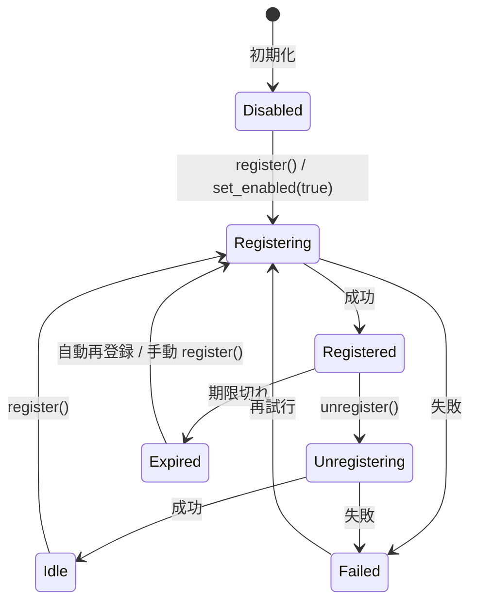

# RFC: Rust SIP Client Crate 完全設計書

本書は、Tauri アプリケーションへ SIP ベースの音声通話機能を統合するための、Rust 製 private workspace crate の完全設計仕様である [file:1]。本 RFC は要件定義を実装可能な精密設計へ落とし込み、公開 API、内部アーキテクチャ、状態遷移、FFI 境界、並行性モデル、ビルド戦略、エラー設計、イベントモデル、メディアパイプライン、設定仕様、テスト戦略、観測性、セキュリティ、性能要件、運用上の制約までを単一文書に包含する [file:1]。

## 1. 目的

本 crate の目的は、Rust から PJSUA を安全かつ非同期的に利用し、複数 SIP アカウント、複数トランスポート、発着信、音声処理、DTMF、ICE/TURN/STUN、TLS、SRTP、およびアプリケーション統合向けイベント配信を、tokio ネイティブな API で提供することである [file:1]。映像機能は対象外であり、音声のみに責務を限定する [file:1]。

## 2. 非目的

本 crate は SIP サーバ実装、PBX 実装、独自 RTP スタック、録音ファイル書き出し機構、GUI、永続設定保存、通話課金、映像処理を提供しない [file:1]。録音については `AudioChunkPair` の提供に留め、ファイルコンテナ化は利用側責務とする [file:1]。

### 2.1 Tauri（フロントエンド）統合との責務境界

本 crate は Rust ネイティブの crate であり、Tauri の `tauri::ipc::Channel` や JavaScript との通信機構を提供しない。Tauri アプリケーションに統合する際は、以下の責務境界を明確にする [file:1]。

**本 crate の責務範囲**:
- Rust 公開 API（`SipClient`, `SipEventPayload` 等）の提供。
- `tracing` による構造化ログ出力。Tauri の `tracing-subscriber` との統合は利用者側で行う。
- `serde::Serialize` / `Deserialize` は util 型を除き optional feature（`serde`）として提供する。`SecretString`（secrecy crate）のシリアライズは常に `"***REDACTED***"` となる。

**利用者（Tauri プラグイン層）の責務**:
- `SipEventPayload` をフロントエンドに流すための DTO（Data Transfer Object）への変換。
- `AudioChunkPair`（バイナリデータ）の効率的な転送（例: `tauri::ipc::Channel` 経由の Base64 エンコード、または共有メモリ参照）。
- `std::time::Instant`（`PairAligner` 内部使用）を外部に露出しないこと。タイムスタンプは `SystemTime` に変換してから DTO に格納する。
- フロントエンドからの操作コマンド（発信ボタン、着信応答等）を本 crate の Rust API へ変換するアダプタ層。

この線引きにより、本 crate は Tauri 非依存を保ち、テスト容易性と再利用性を確保する [file:1]。

## 3. 用語

- **Client**: `SipClient` インスタンス全体を指す。
- **Account**: SIP REGISTER/認証/発信コンテキストを持つ論理アカウント。
- **Call**: 1 本の SIP セッション。
- **Media Session**: 1 Call に紐づく RTP/RTCP/codec/ICE/SRTP の実行単位。
- **Source**: OUT 方向へ音声を供給する任意の入力源。
- **Chunk Pair**: 同一時刻で揃えられた IN/OUT ペア音声バッファ。
- **Raw SIP Event**: 送受信 SIP メッセージ全文と解析済みメタデータを持つイベント。

## 4. 準拠要件

クレートは Rust 1.95 以上を MSRV とし、tokio を唯一の公開非同期ランタイム前提とする [file:1]。PJSIP は **2.17** を正本バージョンとして固定する [file:1]。patch version の更新は CI で互換性確認の上で追従するが、minor version の変更は別途評価判断とする [file:1]。対象 OS は Windows x86_64、macOS arm64、Ubuntu x86_64 とし、ビルド時にプレビルド優先・欠損時ソースビルドという二段階戦略を採用する [file:1]。

### 4.1 バージョニングポリシー

本 crate は以下のバージョニングポリシーに従う [file:1]。

**0.x フェーズ（開発初期）**:
- API は semver に厳密には準拠しない。必要に応じて破壊的変更を行い、安定化を優先する。
- パブリック API の変更は `CHANGELOG.md` およびマイグレーションガイドで明示する。
- `SipEventPayload` のバリアント追加は破壊的変更と見なさない（`#[non_exhaustive]` によりマッチングは網羅的でなくてもよい）。

**1.0 以降（安定化フェーズ）**:
- semver に厳密に準拠する（MAJOR.MINOR.PATCH）。
- **MAJOR**: パブリック API の破壊的変更（enum バリアントの削除・リネーム、struct フィールドの削除、trait メソッドのシグネチャ変更）。
- **MINOR**: 後方互換のある機能追加（enum バリアントの追加、struct フィールドの追加、新 trait の追加）。`SipEventPayload` の拡張も MINOR 範囲。
- **PATCH**: バグ修正・リファクタリング・内部最適化。公開 API の変更は一切含めない。

**破壊的変更が許容される例外**:
- セキュリティ脆弱性の修正に必要な場合（MAJOR を待たずに PATCH で対応し、CHANGELOG に明記）。
- `SipClient::new()` のタイムアウトやリトライ動作の変更など、コンパイル時の型互換性に影響しない動作変更は PATCH 範囲とする。

## 5. 機能要求の確定化

以下を本 RFC の normative scope とする [file:1]。

1. 複数 `SipAccount` の同時保持。
2. アカウント動的追加・削除。
3. アカウント単位の Register/Unregister と register enable の動的切替。
4. 未登録でも発信可能な発信専用モード。
5. UDP/TCP/TLS トランスポート。
6. feature flag による TLS/SRTP 切替。
7. ICE 完全対応、複数 STUN/TURN 設定。
8. コーデックは PCMU と Opus のみ。
9. DTMF の Inband / SIP INFO / RFC4733 の送受信。
10. 網羅的イベントバス。
11. IN/OUT ペアチャンク音声配信。
12. 高品質リサンプル・型変換。
13. 複数音源ミキシングとリアルタイム差替え。
14. `Result<T, SipError>` へ統一された API。
15. `SipClient: Send + Sync` の成立 [file:1]。

## 6. 全体構成

crate は以下のモジュール分割を採用する。各モジュールは public/private 境界を固定し、利用者が FFI 詳細に触れないようにする。

```text
siprs/
├── src/
│   ├── lib.rs
│   ├── client.rs
│   ├── config.rs
│   ├── account.rs
│   ├── call.rs
│   ├── transport.rs
│   ├── event.rs
│   ├── error.rs
│   ├── audio/
│   │   ├── mod.rs
│   │   ├── chunk.rs
│   │   ├── format.rs
│   │   ├── mixer.rs
│   │   ├── source.rs
│   │   ├── resampler.rs
│   │   └── bridge.rs
│   ├── ffi/
│   │   ├── mod.rs
│   │   ├── bindings.rs
│   │   ├── bootstrap.rs
│   │   ├── callbacks.rs
│   │   ├── strings.rs
│   │   ├── account.rs
│   │   ├── call.rs
│   │   ├── transport.rs
│   │   └── media.rs
│   ├── runtime/
│   │   ├── mod.rs
│   │   ├── command.rs
│   │   ├── reactor.rs
│   │   └── handle.rs
│   └── util/
│       ├── id.rs
│       ├── time.rs
│       └── sync.rs
├── build.rs
└── vendor/
├── prebuilt/
└── pjsip/           # PJSIP 2.17 正本ソース
```

この構成により、PJSIP callback thread 群、tokio user task 群、音声ミキサー処理、イベント配信を疎結合に維持する [file:1]。

### 6.1 Crate 責務分割方針（設計判断）

本 RFC は SIP signalling、media bridge、audio processing、event bus を **単一の crate（`siprs`）** に同居させる設計を採用する。これは以下の理由による意図的な判断であり、責務肥大化による設計の混乱ではない [file:1]。

**単一 crate を選択した理由**:
1. **PJSIP の密結合**: 当 crate の中核は PJSUA のライフサイクル管理と callback bridge である。PJSIP の conference bridge を共有する media 層と signalling 層を分離すると、FFI 境界を 2 重に管理する必要が生じ、unsafe コードの範囲が拡大する。
2. **通話とメディアの不可分性**: SIP 通話のライフサイクルと media session のライフサイクルは実装上不可分である。1 回の `pjsua_call_hangup()` で signalling と media の両方が終了するため、分離によるメリットより整合性管理コストが上回る。
3. **Tauri 統合の実用性**: Tauri デスクトップアプリケーションの構築において、追加の crate 境界がもたらす恩恵（個別バージョニング等）より、単一 crate の一貫性が実装効率で勝る。

**将来の分割可能性**:
- `siprs` のモジュール境界（`ffi/`, `runtime/`, `audio/`）は既に crate 分割を意識した疎結合に設計されている [file:1]。
- 将来的に SIP signalling のみを独立させたい場合は、`runtime/` + `ffi/` を `siprs-core` として切り出し、`audio/` は `siprs-media` とすることが可能である。この分割判断は 1.0 リリース後の実際の利用実績に基づいて行う [file:1]。

## 7. 並行性モデル

PJSIP は内部でネイティブスレッドを生成し callback を発火するため、公開 API を直接 callback thread 上で実行してはならない [file:1]。本 crate は単一の **core reactor thread** を持ち、すべての pjsua_* 呼び出しをその reactor 上にシリアライズする。

### 7.1 実行コンテキスト

- **User async context**: 利用者の tokio task。
- **Core reactor**: `std::thread::JoinHandle<()>` 上で動作する専用スレッド。すべての PJSUA 制御 API をここで実行。
- **PJSIP native callbacks**: PJSUA が呼ぶ C callback。**最小限の work enqueue のみ実行**。ロック・メモリ確保・非同期待機は一切行わない [file:1]。
- **Audio worker tasks**: AudioMixer ごとに 1 つ、Tokio blocking pool または専用スレッド上で動作する。AsyncAudioSource からの `.await` による音声 Pull、ミキシング、リサンプル、PairAligner 整列、lock-free queue へのフレーム書き込みまでを担当する [file:1]。PJSIP のリアルタイムオーディオコールバックとは lock-free queue（`crossbeam_queue::ArrayQueue`）を介してのみ通信する [file:1]。

### 7.1a 単一Reactorのスケーラビリティ注記

本 RFC の core reactor は単一スレッドを前提とする。これは Tauri デスクトップアプリ、AI 電話エージェント、〜30 同時通話までの想定利用範囲では十分であり、並行性の複雑さを抑える正しい設計判断である [file:1]。

大規模 PBX 級（100 アカウント・300 同時通話以上）の要件が生じた場合は、reactor をアカウントグループ単位で分割するアーキテクチャへの移行を別途検討する。ただし、その場合も PJSIP のスレッド安全制約（特定の pjsua_* API は同じスレッドから呼び出す必要がある）がボトルネックとなる可能性が高く、単純な reactor 分割では解決できない点に注意する [file:1]。

### 7.2 command serialization

公開 API は `RuntimeCommand` を unbounded MPSC で reactor へ送る。reactor は単一スレッドで順序実行し、結果を oneshot で返す。

```rust
pub(crate) enum RuntimeCommand {
    Initialize {
        config: ClientConfig,
        reply: tokio::sync::oneshot::Sender<Result<(), SipError>>,
    },
    AddAccount {
        config: AccountConfig,
        reply: tokio::sync::oneshot::Sender<Result<AccountId, SipError>>,
    },
    RemoveAccount {
        account_id: AccountId,
        reply: tokio::sync::oneshot::Sender<Result<(), SipError>>,
    },
    SetRegistration {
        account_id: AccountId,
        enabled: bool,
        reply: tokio::sync::oneshot::Sender<Result<(), SipError>>,
    },
    MakeCall {
        account_id: AccountId,
        request: OutgoingCallRequest,
        reply: tokio::sync::oneshot::Sender<Result<CallId, SipError>>,
    },
    Hangup {
        call_id: CallId,
        reason: HangupReason,
        reply: tokio::sync::oneshot::Sender<Result<(), SipError>>,
    },
    Hold {
        call_id: CallId,
        reply: tokio::sync::oneshot::Sender<Result<(), SipError>>,
    },
    Unhold {
        call_id: CallId,
        reply: tokio::sync::oneshot::Sender<Result<(), SipError>>,
    },
    SendDtmf {
        call_id: CallId,
        digits: String,
        method: DtmfMethod,
        reply: tokio::sync::oneshot::Sender<Result<(), SipError>>,
    },
    Shutdown {
        reply: tokio::sync::oneshot::Sender<Result<(), SipError>>,
    },
}
```

このシリアライズにより、PJSUA のスレッド安全制約を利用者へ露出させずに `Send + Sync` を成立させる [file:1]。

## 8. 公開 API 設計

### 8.1 crate ルート

```rust
pub use crate::client::SipClient;
pub use crate::config::{ClientConfig, AccountConfig, TransportConfig, TlsConfig, IceConfig, TurnServerConfig, StunServerConfig};
pub use crate::account::{AccountId, SipAccountHandle, RegistrationState};
pub use crate::call::{CallId, CallState, OutgoingCallRequest, IncomingCall, HangupReason, ReferRequest};
pub use crate::audio::{AudioChunkPair, AudioTapMode, SampleRate, BitDepth, ChannelLayout, AudioFormat, AsyncAudioSource, SyncAudioSource, SyncSourceAdapter, AudioSourceId};
pub use crate::event::{SipEvent, SipEventPayload, EventBus, AccountEventReceiver, RawSipMessage, EventTimestamp};
pub use crate::error::{SipError, SipErrorKind};
```

### 8.2 SipClient

`SipClient` は参照カウント化された薄いハンドルであり、内部に reactor handle、イベントバス、アカウント/通話インデックス、shutdown state を持つ。

```rust
#[derive(Clone)]
pub struct SipClient {
    inner: std::sync::Arc<ClientInner>,
}

struct ClientInner {
    runtime: RuntimeHandle,
    events: EventBus,
    state: tokio::sync::RwLock<ClientState>,
    shutdown: tokio::sync::watch::Sender<bool>,
}
```

### 8.3 SipClient API

```rust
impl SipClient {
    pub async fn new(config: ClientConfig) -> Result<Self, SipError>;
    /// 制御系イベントの broadcast receiver を購読する。
    /// 内部では `EventBus::subscribe_control()` を呼び出す。
    pub fn subscribe(&self) -> tokio::sync::broadcast::Receiver<SipEvent>;
    /// RawSIP メッセージ専用の broadcast receiver を購読する。
    /// `ClientConfig::raw_sip_events.enabled == false` の場合は `None` を返す。
    pub fn subscribe_raw_sip(&self) -> Option<tokio::sync::broadcast::Receiver<RawSipMessage>>;
    pub fn subscribe_account(&self, account_id: AccountId) -> AccountEventReceiver;
    pub async fn add_account(&self, config: AccountConfig) -> Result<SipAccountHandle, SipError>;
    pub async fn remove_account(&self, account_id: AccountId) -> Result<(), SipError>;
    pub async fn account(&self, account_id: AccountId) -> Result<SipAccountHandle, SipError>;
    pub async fn accounts(&self) -> Vec<SipAccountHandle>;
    pub async fn shutdown(&self) -> Result<(), SipError>;
}
```

### 8.4 SipAccountHandle API

利用者は `SipAccountHandle` を通じてアカウント単位操作を行う。

```rust
#[derive(Clone)]
pub struct SipAccountHandle {
    client: SipClient,
    id: AccountId,
}

impl SipAccountHandle {
    pub fn id(&self) -> AccountId;
    pub async fn register(&self) -> Result<(), SipError>;
    pub async fn unregister(&self) -> Result<(), SipError>;
    pub async fn set_registration_enabled(&self, enabled: bool) -> Result<(), SipError>;
    pub async fn registration_state(&self) -> Result<RegistrationState, SipError>;
    pub async fn make_call(&self, request: OutgoingCallRequest) -> Result<CallId, SipError>;
    pub async fn update_config(&self, patch: AccountConfigPatch) -> Result<(), SipError>;
}
```

### 8.5 OutgoingCallRequest

```rust
pub struct OutgoingCallRequest {
    pub target_uri: String,
    pub headers: Vec<(String, String)>,
    pub auth_override: Option<AuthOverride>,
    pub preferred_transport: Option<TransportKind>,
    pub media: CallMediaPreferences,
    pub auto_answer_refer: bool,
}

pub struct CallMediaPreferences {
    pub enable_early_media: bool,
    pub enable_srtp: Option<bool>,
    pub preferred_codecs: Vec<Codec>,
}
```

`preferred_codecs` は最終的に `PCMU`, `Opus` のみ受理する。その他が指定された場合は validation error とする [file:1]。

## 9. ID 設計

識別子はランタイム一意な非ゼロ整数とし、公開 API では newtype に隠蔽する。

```rust
#[derive(Debug, Clone, Copy, PartialEq, Eq, Hash, PartialOrd, Ord)]
pub struct AccountId(std::num::NonZeroU64);

#[derive(Debug, Clone, Copy, PartialEq, Eq, Hash, PartialOrd, Ord)]
pub struct CallId(std::num::NonZeroU64);

#[derive(Debug, Clone, Copy, PartialEq, Eq, Hash, PartialOrd, Ord)]
pub struct AudioSourceId(std::num::NonZeroU64);
```

PJSUA の `pjsua_acc_id` や `pjsua_call_id` は再利用されうるため、そのまま公開しない。内部では `BiMap<RuntimeId, NativeId>` で変換する。

## 10. ClientConfig 完全仕様

```rust
pub struct ClientConfig {
    pub user_agent: String,
    pub log_level: LogLevel,
    pub max_calls: u32,
    pub event_bus_capacity: usize,
    pub raw_sip_event_capacity: usize,
    pub audio: ClientAudioConfig,
    pub transports: Vec<TransportConfig>,
    pub stun_servers: Vec<StunServerConfig>,
    pub turn_servers: Vec<TurnServerConfig>,
    pub ice: IceConfig,
    pub raw_sip_events: RawSipEventConfig,
    pub timeouts: TimeoutConfig,
}

pub struct ClientAudioConfig {
    pub default_delivery_format: AudioFormat,
    pub pair_buffer_ms: u32,
    pub jitter_buffer_ms: u32,
    pub mixer_frame_ms: u32,
    pub max_sources_per_call: usize,
    pub resampler_quality: ResamplerQuality,
}

pub enum LogLevel { Error, Warn, Info, Debug, Trace }

pub struct TimeoutConfig {
    pub command_timeout: std::time::Duration,
    pub shutdown_timeout: std::time::Duration,
    pub register_timeout: std::time::Duration,
    pub invite_timeout: std::time::Duration,
}

pub struct RawSipEventConfig {
    pub enabled: bool,
    pub include_bodies: bool,
    pub max_body_bytes: usize,
    pub redact_authorization: bool,
}
```

### 10.1 既定値

```rust
impl Default for ClientConfig {
    fn default() -> Self {
        Self {
            user_agent: "tauri-siprs/0.1".into(),
            log_level: LogLevel::Info,
            max_calls: 32,
            event_bus_capacity: 2048,
            raw_sip_event_capacity: 4096,
            audio: ClientAudioConfig {
                default_delivery_format: AudioFormat {
                    sample_rate: SampleRate::Hz16000,
                    bit_depth: BitDepth::I16,
                    channel_layout: ChannelLayout::StereoInOut,
                    frame_ms: 20,
                },
                pair_buffer_ms: 120,
                jitter_buffer_ms: 60,
                mixer_frame_ms: 20,
                max_sources_per_call: 16,
                resampler_quality: ResamplerQuality::High,
            },
            transports: vec![TransportConfig::udp(5060), TransportConfig::tcp(5060)],
            stun_servers: vec![],
            turn_servers: vec![],
            ice: IceConfig::default(),
            raw_sip_events: RawSipEventConfig {
                enabled: true,
                include_bodies: true,
                max_body_bytes: 64 * 1024,
                redact_authorization: true,
            },
            timeouts: TimeoutConfig {
                command_timeout: std::time::Duration::from_secs(10),
                shutdown_timeout: std::time::Duration::from_secs(15),
                register_timeout: std::time::Duration::from_secs(15),
                invite_timeout: std::time::Duration::from_secs(90),
            },
        }
    }
}
```

既定 delivery format は要件に合わせて 16kHz / i16 / stereo(L=IN,R=OUT) とする [file:1]。

## 11. AccountConfig 完全仕様

```rust
pub struct AccountConfig {
    pub display_name: Option<String>,
    pub username: String,
    pub auth_username: Option<String>,
    pub password: SecretString,
    pub domain: String,
    pub registrar_uri: Option<String>,
    pub outbound_proxy: Vec<String>,
    pub contact_params: Vec<(String, String)>,
    pub transport: AccountTransportPolicy,
    pub register_on_start: bool,
    pub allow_outbound_without_register: bool,
    pub registration_expires: std::time::Duration,
    pub codecs: AccountCodecPolicy,
    pub dtmf: DtmfPolicy,
    pub media: AccountMediaConfig,
    pub headers: Vec<(String, String)>,
}

pub struct AccountCodecPolicy {
    pub enable_pcmu: bool,
    pub enable_opus: bool,
    pub opus: OpusConfig,
}

pub struct OpusConfig {
    pub bitrate: u32,
    pub complexity: u8,
    pub cbr: bool,
    pub inband_fec: bool,
    pub dtx: bool,
    pub ptime_ms: u16,
}

pub struct DtmfPolicy {
    pub send_methods: Vec<DtmfMethod>,
    pub receive_methods: Vec<DtmfMethod>,
    pub default_send_method: DtmfMethod,
}

pub struct AccountMediaConfig {
    pub srtp: SrtpPolicy,
    pub ice: bool,
    pub vad: bool,
    pub ec_tail_ms: u16,
    pub input_gain_db: f32,
    pub output_gain_db: f32,
}
```

### 11.1 validation rules

- `username`, `domain`, `password` は空禁止。
- `register_on_start == false` でも `allow_outbound_without_register == true` なら有効。
- `registrar_uri` 未指定時は `sip:{domain}` を自動導出。
- codec policy は `enable_pcmu || enable_opus` が必須 [file:1]。
- DTMF policy は送信・受信ともに 1 つ以上 required [file:1]。

## 12. TransportConfig 完全仕様

```rust
pub enum TransportConfig {
    Udp(UdpTransportConfig),
    Tcp(TcpTransportConfig),
    #[cfg(feature = "tls")]
    Tls(TlsTransportConfig),
}

pub struct UdpTransportConfig { pub bind_addr: std::net::SocketAddr }
pub struct TcpTransportConfig { pub bind_addr: std::net::SocketAddr }

#[cfg(feature = "tls")]
pub struct TlsTransportConfig {
    pub bind_addr: std::net::SocketAddr,
    pub tls: TlsConfig,
}

#[cfg(feature = "tls")]
pub struct TlsConfig {
    pub verify_server: bool,
    pub ca_cert_path: Option<std::path::PathBuf>,
    pub client_cert_path: Option<std::path::PathBuf>,
    pub client_key_path: Option<std::path::PathBuf>,
    pub server_name: Option<String>,
    pub allow_insecure_cipher_legacy: bool,
}
```

TLS は feature flag で完全に API から消える設計とし、無効時に TLS variant が型レベルで出現しないようにする [file:1]。

## 13. ICE/STUN/TURN 完全仕様

```rust
pub struct IceConfig {
    pub enabled: bool,
    pub aggressive_nomination: bool,
    pub trickle_ice: bool,
    pub renomination: bool,
    pub max_host_candidates: usize,
}

impl Default for IceConfig {
    fn default() -> Self {
        Self {
            enabled: true,
            aggressive_nomination: true,
            trickle_ice: false,
            renomination: false,
            max_host_candidates: 16,
        }
    }
}

pub struct StunServerConfig {
    pub uri: String,
}

pub struct TurnServerConfig {
    pub uri: String,
    pub username: Option<String>,
    pub password: Option<SecretString>,
    pub transport: TurnTransport,
}
```

PJSIP 実装事情により trickle ICE は内部で非対応なら validation error で拒否するのではなく、`ClientInitialized` イベントに capability matrix を載せて明示する。だが要件が「ICE に完全対応」であるため、本 RFC では full ICE を必須とし、trickle ICE は disabled default の optional optimization とする [file:1]。

## 14. エラー設計

すべての API は `Result<T, SipError>` を返す [file:1]。`SipError` は stable な分類を持ち、native error code、文脈、recoverability を保持する。

```rust
#[derive(Debug, thiserror::Error)]
#[error("{kind}: {message}")]
pub struct SipError {
    pub kind: SipErrorKind,
    pub message: String,
    pub native_status: Option<i32>,
    pub account_id: Option<AccountId>,
    pub call_id: Option<CallId>,
    pub retryable: bool,
}

#[derive(Debug, Clone, Copy, PartialEq, Eq)]
pub enum SipErrorKind {
    InvalidConfig,
    InvalidState,
    AlreadyInitialized,
    NotInitialized,
    AccountNotFound,
    CallNotFound,
    TransportInitFailed,
    RegistrationFailed,
    AuthenticationFailed,
    InviteFailed,
    MediaInitFailed,
    MediaNegotiationFailed,
    IceFailed,
    TlsFailed,
    SrtpFailed,
    AudioFormatUnsupported,
    AudioPipelineBroken,
    DtmfFailed,
    Timeout,
    ChannelClosed,
    NativeError,
    ShutdownInProgress,
    InternalInvariantBroken,
}
```

### 14.1 エラー変換方針

- `pj_status_t != PJ_SUCCESS` は必ず `NativeError` または文脈特化エラーへ変換。
- 4xx/5xx/6xx は SIP 応答コードを `InviteFailed`/`RegistrationFailed` の message と supplemental field に格納。
- callback 内 panic は `catch_unwind` で握り潰さず `InternalInvariantBroken` を emit し、その call/account を安全停止する。

## 15. イベントモデル

要件で列挙された全イベントを payload enum で完全定義する [file:1]。イベントは `SipEvent`（メタデータ + payload）にラップされ、チャネル種別により loss-tolerant な制御系と大量発生するメディア系を分離する。

### 15.1 SipEventPayload

```rust
/// イベント種別を定義する payload enum。
/// `#[non_exhaustive]` により将来のバリアント追加に対する破壊的変更を防止する [file:1]。
#[derive(Debug, Clone)]
#[non_exhaustive]
pub enum SipEventPayload {
    // ── 登録系 ──
    RegistrationStarted(RegistrationInfo),
    RegistrationSucceeded(RegistrationInfo),
    RegistrationFailed(RegistrationFailure),
    UnregistrationSucceeded,
    UnregistrationFailed(RegistrationFailure),
    RegistrationExpired,

    // ── 発着信系 ──
    OutgoingCallStarted(OutgoingCallInfo),
    OutgoingCallTrying(ProvisionalInfo),
    OutgoingCallRinging(ProvisionalInfo),
    EarlyMediaReceived(EarlyMediaInfo),
    CallConnected(ConnectedCallInfo),
    IncomingCall(IncomingCallInfo),
    CallDisconnected(DisconnectInfo),
    CallCancelled(CancelInfo),
    CallRejected(RejectInfo),
    CallHeld,
    CallResumed,
    ReferReceived(ReferRequest),
    TransferCompleted(TransferInfo),

    // ── メディア系 ──
    MediaActive(MediaActiveInfo),
    MediaStopped(MediaStoppedInfo),
    MediaError(MediaErrorInfo),

    // ── DTMF系 ──
    DtmfSent(DtmfSentInfo),
    DtmfReceived(DtmfReceivedInfo),

    // ── ICE系 ──
    IceNegotiationStarted,
    IceNegotiationSucceeded(IceSuccessInfo),
    IceNegotiationFailed(IceFailureInfo),

    // ── トランスポート系 ──
    TransportConnected(TransportConnectedInfo),
    TransportDisconnected(TransportDisconnectedInfo),
    TransportError(TransportErrorInfo),

    // ── アカウント系 ──
    AccountAdded(AccountSnapshot),
    AccountRemoved(AccountSnapshot),
    AccountConfigChanged(AccountSnapshot),

    // ── クライアントライフサイクル系 ──
    ClientInitialized(ClientCapabilities),
    ClientShutdown,

    // ── エラー系 ──
    Error(SipError),
}
```

### 15.2 SipEvent

```rust
#[derive(Debug, Clone)]
pub struct SipEvent {
    pub meta: EventMeta,
    pub payload: SipEventPayload,
}
```

### 15.3 EventMeta

```rust
#[derive(Debug, Clone)]
pub struct EventMeta {
    pub event_id: u64,
    pub timestamp: EventTimestamp,
    pub account_id: Option<AccountId>,
    pub call_id: Option<CallId>,
    pub direction: Option<EventDirection>,
    pub headers: Option<Vec<(String, String)>>,
    pub status_code: Option<u16>,
    pub reason_phrase: Option<String>,
    pub logical_context: std::collections::BTreeMap<String, String>,
}
```

要件にある `AccountId`、タイムスタンプ、関連 SIP メッセージ、ヘッダ、ステータスコード、論理的意味付け情報をすべて共通フィールドで保持する [file:1]。

### 15.4 EventBus

`SipClient` は制御系イベントと RawSIP メッセージを別バスで配信する。これにより RawSIP 有効時の制御系イベント取りこぼしを防止する [file:1]。

```rust
#[derive(Clone)]
pub struct EventBus {
    /// 制御系イベントのプライマリバス。順序保証・確実配送を期待する。
    control: tokio::sync::broadcast::Sender<SipEvent>,
    /// RawSIP メッセージ専用バス。有効時のみ使用され、制御系イベントとは独立して配送される。
    raw_sip: Option<tokio::sync::broadcast::Sender<RawSipMessage>>,
}

impl EventBus {
    pub fn new(control_capacity: usize, raw_sip_capacity: Option<usize>) -> Self {
        let (control_tx, _) = tokio::sync::broadcast::channel(control_capacity);
        let raw_sip = raw_sip_capacity.map(|cap| {
            let (tx, _) = tokio::sync::broadcast::channel(cap);
            tx
        });
        Self { control: control_tx, raw_sip }
    }

    /// 制御系イベントの購読
    pub fn subscribe_control(&self) -> tokio::sync::broadcast::Receiver<SipEvent> {
        self.control.subscribe()
    }

    /// RawSIP メッセージの購読
    pub fn subscribe_raw_sip(&self) -> Option<tokio::sync::broadcast::Receiver<RawSipMessage>> {
        self.raw_sip.as_ref().map(|tx| tx.subscribe())
    }

    /// 制御系イベントを発行
    pub fn publish(&self, event: SipEvent) {
        let _ = self.control.send(event);
    }

    /// RawSIP メッセージを発行（専用バスが有効な場合のみ）
    pub fn publish_raw_sip(&self, msg: RawSipMessage) {
        if let Some(ref tx) = self.raw_sip {
            let _ = tx.send(msg);
        }
    }
}
```

### 15.5 AccountEventReceiver

```rust
pub struct AccountEventReceiver {
    account_id: AccountId,
    inner: tokio::sync::broadcast::Receiver<SipEvent>,
}

impl AccountEventReceiver {
    pub async fn recv(&mut self) -> Result<SipEvent, tokio::sync::broadcast::error::RecvError> {
        loop {
            let ev = self.inner.recv().await?;
            if ev.meta.account_id == Some(self.account_id) {
                return Ok(ev);
            }
        }
    }
}
```

### 15.6 イベントバス分割の設計判断

- **制御系イベント**（登録・発着信・DTMF・ICE・トランスポート・クライアントライフサイクル・エラー）は `control` バスで配送される。順序は単一プロデューサ内で preserve される [file:1]。
- **RawSIP メッセージ**は `raw_sip` 専用バスで配送される。大量発生時も制御系イベントの取りこぼしに影響しない [file:1]。
- `RawSipEventConfig::enabled == false` の場合、`raw_sip` チャネル自体が作成されず、オーバーヘッドはゼロである [file:1]。
- `subscribe()` メソッドは `subscribe_control()` に一元化し、`SipClient` の公開APIは変更しない。RawSIP 受信が必要な利用者は追加で `subscribe_raw_sip()` を呼ぶ [file:1]。

### 15.7 重要: イベントバスは観測用途であり確実配送を保証しない

両バスとも `tokio::sync::broadcast` をベースとしており、**確実配送（reliable delivery）は保証されない**。イベントバスは主に**観測・UI更新・ロギング用途**を想定して設計されており、監査・課金・完全性が要求されるトランザクションのソースオブ真理として利用してはならない [file:1]。

**配送特性**:
- **lossy 配送**: 購読者が処理遅延により `capacity` を超えて取りこぼした場合、`RecvError::Lagged(n)` が返る。n は欠落したメッセージ数である。これは異常ではなく、本バスの設計上の正常動作である [file:1]。
- **再送機構なし**: broadcast チャネルは「全購読者への同報」を目的としており、個別購読者単位の再送機構は持たない [file:1]。
- **取りこぼし検知と復旧**: `Lagged(n)` を受信した利用者は、必要に応じて `SipClient` の query API（`accounts()`, `call_state()` 等）で現在の状態を再取得することで、欠落を補償できる [file:1]。
- **ソースオブ真理（Source of Truth）**: イベントバスではなく、`SipClient` の query API（`accounts()`, `call_state()`, `registration_state()`）が crate のソースオブ真理である。イベントは状態変化の通知であり、状態そのものではない [file:1]。

**capacity 設計**:
- `event_bus_capacity` の既定値 2048 は、1 通話あたりの典型的なイベント数（REGISTER + INVITE + BYE + DTMF で約 20 イベント）に対して 100 通話分以上の余裕を持つ。通常運用での溢れは想定しない [file:1]。
- 極端な高負荷環境（数百通話同時等）では必要に応じて capacity を拡大すること。
- 購読者が慢性的に遅延する場合は `Lagged` が頻発する。これは capacity 不足ではなく、購読者の処理能力不足を示すシグナルである。対策として購読者の処理を別タスクに分離するか、`AudioTapHandle` の oldest-drop 戦略と組み合わせて使用すること [file:1]。

## 16. raw SIP メッセージ仕様

```rust
#[derive(Debug, Clone)]
pub struct RawSipMessage {
    pub direction: SipMessageDirection,
    pub transport: TransportKind,
    pub start_line: String,
    pub headers: Vec<(String, String)>,
    pub body: Option<Vec<u8>>,
    pub text: String,
    pub content_length: usize,
    pub remote_addr: Option<std::net::SocketAddr>,
    pub local_addr: Option<std::net::SocketAddr>,
}
```

`redact_authorization == true` の場合、`Authorization`, `Proxy-Authorization` は `***REDACTED***` に置換して格納する。

## 17. 登録状態モデル

```rust
#[derive(Debug, Clone, Copy, PartialEq, Eq)]
pub enum RegistrationState {
    Disabled,
    Idle,
    Registering,
    Registered,
    Unregistering,
    Failed,
    Expired,
}
```

### 17.1 遷移規則



**遷移規則**:
- `Disabled -> Registering` when `register()` or `set_registration_enabled(true)`。
- `Idle -> Registering` on explicit register。
- `Registering -> Registered | Failed`。
- `Registered -> Unregistering` on unregister。
- `Unregistering -> Idle | Failed`。
- `Registered -> Expired` on expiry callback。
- `Expired -> Registering` on auto re-register or manual register。
- `Failed -> Registering` on retry。

未登録でも `make_call()` は常に可能であるため、`RegistrationState` は発信可否に影響しない [file:1]。

## 18. 通話状態モデル

```rust
#[derive(Debug, Clone, Copy, PartialEq, Eq)]
pub enum CallState {
    New,
    Calling,
    Trying,
    Ringing,
    EarlyMedia,
    Incoming,
    Connecting,
    Active,
    Held,
    Transferring,
    Disconnecting,
    Disconnected,
    Failed,
}
```

### 18.1 遷移規則

```mermaid
stateDiagram-v2
    state Outgoing {
        [*] --> New: make_call()
        New --> Calling
        Calling --> Trying
        Trying --> Ringing
        Trying --> EarlyMedia
        Ringing --> Connecting
        EarlyMedia --> Connecting
        Connecting --> Active
    }

    state Incoming {
        [*] --> New: on_incoming_call
        New --> Incoming
        Incoming --> Connecting: answer(200)
        Incoming --> Connecting: answer(183)
    }

    state ActiveSession {
        Active --> Held: hold()
        Held --> Active: unhold()
        Active --> Transferring: REFER送信
        Transferring --> Active: NOTIFY success
        Transferring --> Disconnecting: NOTIFY fail
    }

    Ringing --> Failed: 4xx/5xx/6xx
    EarlyMedia --> Failed: 4xx/5xx/6xx
    Connecting --> Failed

    Active --> Disconnecting: BYE/CANCEL/hangup
    Held --> Disconnecting
    Disconnecting --> Disconnected
    Disconnected --> [*]

    Failed --> [*]
```

**遷移規則**:
- Outgoing: `New -> Calling -> Trying -> Ringing | EarlyMedia | Connecting -> Active -> Held <-> Active -> Disconnecting -> Disconnected`。
- Incoming: `New -> Incoming -> Connecting -> Active`。
- `Ringing/EarlyMedia/Connecting -> Failed` if 4xx/5xx/6xx。
- `Any non-terminal -> Disconnecting -> Disconnected` on BYE/CANCEL/local hangup。
- `REFER` 送信時 `Transferring` transient state を経由し、最終 NOTIFY success/fail で遷移完了。

### 18.2 同時通話制約

`ClientConfig::max_calls` を上限とする。アカウントごとの上限は未設定なら無制限だが、後述の runtime validation で client 上限だけは強制する。

## 19. 発着信 API 詳細

```rust
impl SipClient {
    pub async fn answer(&self, call_id: CallId, code: u16) -> Result<(), SipError>;
    pub async fn hangup(&self, call_id: CallId, reason: HangupReason) -> Result<(), SipError>;
    pub async fn hold(&self, call_id: CallId) -> Result<(), SipError>;
    pub async fn unhold(&self, call_id: CallId) -> Result<(), SipError>;
    pub async fn transfer(&self, call_id: CallId, target: String) -> Result<(), SipError>;
    pub async fn send_dtmf(&self, call_id: CallId, digits: impl Into<String>, method: DtmfMethod) -> Result<(), SipError>;
    pub async fn call_state(&self, call_id: CallId) -> Result<CallState, SipError>;
}
```

### 19.1 answer semantics

- `180`: 着信呼び出し継続。
- `183`: SDP 付き provisional answer を許容。
- `200`: 通話受諾。
- `486`: Busy Here。
- `603`: Decline。

`answer()` は incoming call 以外に対して `InvalidState` を返す。

## 20. DTMF 仕様

```rust
#[derive(Debug, Clone, Copy, PartialEq, Eq)]
pub enum DtmfMethod {
    Inband,
    SipInfo,
    Rfc4733,
}
```

送信時、指定 method が account policy で無効なら `InvalidConfig`。受信時は PJSIP callback ごとに正規化し `DtmfReceived` を発火する [file:1]。

```rust
pub struct DtmfReceivedInfo {
    pub method: DtmfMethod,
    pub digit: char,
    pub duration_ms: Option<u16>,
    pub volume_dbm0: Option<i8>,
}
```

## 21. 音声フォーマットモデル

```rust
#[derive(Debug, Clone, Copy, PartialEq, Eq)]
pub enum SampleRate { Hz8000, Hz16000, Hz24000, Hz48000 }

#[derive(Debug, Clone, Copy, PartialEq)]
pub enum BitDepth { I16, F32 }

#[derive(Debug, Clone, Copy, PartialEq, Eq)]
pub enum ChannelLayout {
    Mono,
    StereoInOut,
}

#[derive(Debug, Clone, Copy, PartialEq)]
pub struct AudioFormat {
    pub sample_rate: SampleRate,
    pub bit_depth: BitDepth,
    pub channel_layout: ChannelLayout,
    pub frame_ms: u16,
}
```

### 21.1 AudioChunkPair

```rust
#[derive(Debug, Clone)]
pub struct AudioChunkPair {
    pub call_id: CallId,
    pub account_id: AccountId,
    pub timestamp: std::time::SystemTime,
    pub in_chunk: AudioChunk,
    pub out_chunk: AudioChunk,
}

#[derive(Debug, Clone)]
pub enum AudioChunk {
    I16(Vec<i16>),
    F32(Vec<f32>),
}
```

要件通り IN/OUT は同一タイムスタンプで対にされ、ズレは内部で吸収される [file:1]。

## 22. 音声購読 API

```rust
/// 音声タップの振る舞いを指定する。
#[derive(Debug, Clone, Copy, PartialEq, Eq)]
pub enum AudioTapMode {
    /// リアルタイム優先（既定）。利用者が読み遅れた場合 oldest-drop で
    /// 最新ペアを優先する。低レイテンシが求められる監視・分析用途に適する。
    /// ドロップ発生時は `MediaError(AudioTapOverflow)` が報告される。
    Realtime,
    /// 完全性優先。チャネル満杯時は送信側（AudioWorkerTask）で
    /// バックプレッシャーをかけ、フレームのドロップを避ける。
    /// 録音・品質測定用途に適する。
    ///
    /// ただし、このモードは**ベストエフォート型の完全性保証**である。
    /// 利用者側の処理遅延が持続すると AudioWorkerTask の `process_frame`
    /// ループがブロックされ、同一通話の音声ミキシング全体にジッタが
    /// 発生する可能性がある。このモードを使用する際は、利用者が
    /// 十分に大きい `capacity` を指定し、`recv()` を速やかに消費すること [file:1]。
    Lossless,
}

pub struct AudioTapHandle {
    rx: tokio::sync::mpsc::Receiver<AudioChunkPair>,
}

impl SipClient {
    pub async fn subscribe_audio(
        &self,
        call_id: CallId,
        format: AudioFormat,
        capacity: usize,
        mode: AudioTapMode,  // ← tap mode 指定
    ) -> Result<AudioTapHandle, SipError>;
}

impl AudioTapHandle {
    pub async fn recv(&mut self) -> Option<AudioChunkPair> {
        self.rx.recv().await
    }
}
```

### 22.1 backpressure policy

利用者が読み遅れた場合の挙動は `AudioTapMode` に依存する。

- **`Realtime`**: リアルタイム性を優先し oldest-drop を採用する。チャネル満杯時は最新 pair を優先し、`MediaError` に `AudioTapOverflow` を報告する。音声処理パイプラインへの影響は一切ない。
- **`Lossless`**: 送信側（AudioWorkerTask）でバックプレッシャーをかけ、フレームのドロップを避ける。ただし、持続的なバックプレッシャーは `AudioWorkerTask::process_frame()` ループをブロックし、同一通話の音声ミキシング全体にジッタやアンダーランを誘発する可能性がある [file:1]。そのため、このモードは「ベストエフォート型の完全性保証」であり、真の lossless 保証ではない。録音用途では `capacity` を十分大きく（標準 frame 数換算で 5 秒以上相当）指定し、`recv()` を速やかに消費すること [file:1]。

既定値は `Realtime` とする。

## 23. AsyncAudioSource 仕様

本crateは MSRV 1.95 を前提とし、RPITIT（`async fn` in trait）が安定しているため、プライマリtraitに RPITIT を採用する [file:1]。

```rust
/// 利用者が実装すべきプライマリtrait。RPITIT（async fn in trait）で定義する。
///
/// このtraitは object-safe ではないため、動的ディスパッチ用の
/// `ErasedAudioSource` が内部で自動導出される。
pub trait AsyncAudioSource: Send {
    async fn next_chunk(&mut self, buf: &mut [i16]) -> usize;
}
```

`AsyncAudioSource` は `async fn next_chunk` を RPITIT で直接定義するため、利用者は煩雑な `Pin<Box<dyn Future>>` の記述なしに実装できる。

### 23.1 動的ディスパッチ用自動導出

内部の `AudioMixer` は `Box<dyn AsyncAudioSource>` でソースを保持するため、object-safe な wrapper trait を自動導出する。利用者が意識する必要は一切ない。

```rust
/// 動的ディスパッチ用の object-safe trait（内部実装専用）。
/// `AsyncAudioSource` を実装した全型に対して blanket impl で自動導出される。
pub trait ErasedAudioSource: Send {
    fn next_chunk<'a>(
        &'a mut self,
        buf: &'a mut [i16],
    ) -> core::pin::Pin<Box<dyn core::future::Future<Output = usize> + Send + 'a>>;
}

impl<T: AsyncAudioSource + Send> ErasedAudioSource for T {
    fn next_chunk<'a>(
        &'a mut self,
        buf: &'a mut [i16],
    ) -> core::pin::Pin<Box<dyn core::future::Future<Output = usize> + Send + 'a>> {
        Box::pin(AsyncAudioSource::next_chunk(self, buf))
    }
}
```

### 23.2 SyncSourceAdapter

同期的な音声ソースを非同期traitに適合させるアダプタを提供する。

```rust
pub trait SyncAudioSource: Send {
    fn next_chunk(&mut self, buf: &mut [i16]) -> usize;
}

pub struct SyncSourceAdapter<T> {
    inner: T,
}

impl<T: SyncAudioSource + Send> AsyncAudioSource for SyncSourceAdapter<T> {
    async fn next_chunk(&mut self, buf: &mut [i16]) -> usize {
        self.inner.next_chunk(buf)
    }
}
```

### 23.3 設計判断の注記

- RPITIT 採用により、`Box::pin` による毎フレームのヒープアロケーションは blanket impl 内に閉じ込められ、利用者コードからは完全に隠蔽される [file:1]。
- 動的ディスパッチが不要な静的ディスパッチの場合は `Box::pin` が完全に回避されるため、ホットパス上のオーバーヘッドはゼロである [file:1]。
- 将来、`type_alias_impl_trait` (TAIT) などの機能が安定した場合、`ErasedAudioSource` をより効率的な実装に置き換える可能性があるが、現状の blanket impl で実用上十分な性能が得られる [file:1]。

## 24. AudioMixer 設計

### 24.0 リアルタイム境界（最重要設計判断）

PJSIP のオーディオコールバック（`pjmedia_port` の `get_frame`/`put_frame`）は OS の最優先リアルタイムスレッドで駆動する。このスレッド内で以下の操作は**厳禁**である [file:1]：

1. ロックの取得（`DashMap` の読み込み、`tokio::sync::Mutex` のブロッキング）
2. 非同期の待機（`.await` / Future の駆動）
3. メモリの動的確保（`Vec` の新設・拡張、`Box` の生成）
4. システムコールを伴う任意の処理

そのため、本 crate ではオーディオ処理を**2層**に完全分離する。

```text
┌─────────────────────────────────────────────────────────┐
│ AudioWorkerTask (Tokio async context)                    │
│                                                         │
│  AsyncAudioSource(s) ──┐                                │
│  AudioMixer (DashMap + Mutex + .await)                  │
│       ↓ mix_i16_frame() + resample (rubato)             │
│       ↓                                                 │
│  lock-free queue (crossbeam::ArrayQueue)                 │
│  ┌─────────────────────────────────────┐                │
│  │ ミキシング済み固定長PCMフレーム      │                │
│  └─────────────────────────────────────┘                │
└─────────────────────────────────────────────────────────┘
                             ↓ pop / push
┌─────────────────────────────────────────────────────────┐
│ RustMediaPort (PJSIP RT callback thread)                 │
│  get_frame() → queue pop → memcpy → 空ならゼロフィル     │
│  put_frame() → 受信音声を queue push                     │
│  メモリコピー以外の処理を行わない                         │
└─────────────────────────────────────────────────────────┘
```

### 24.1 AudioMixer（AudioWorkerTask 側）

1 通話ごとに `AudioMixer` を 1 つ持つ。`AudioMixer` は複数 source を frame ごとに pull、sum、clamp、gain 適用し、ミキシング済みフレームを lock-free queue へ書き込む。すべての操作は AudioWorkerTask 上で実行されるため、ロック・非同期待機・メモリ確保が安全に行える [file:1]。

```rust
pub struct AudioMixer {
    format: InternalPcmFormat,
    sources: dashmap::DashMap<AudioSourceId, MixerSourceEntry>,
    master_gain: std::sync::atomic::AtomicU32,
    next_id: std::sync::atomic::AtomicU64,
    /// ミキシング済みOUTフレームを RT callback へ渡す lock-free queue
    out_queue: crossbeam_queue::ArrayQueue<Vec<i16>>,
    /// RT callback からの受信音声（IN）を受け取る lock-free queue
    in_queue: crossbeam_queue::ArrayQueue<Vec<i16>>,
}

struct MixerSourceEntry {
    source: tokio::sync::Mutex<Box<dyn ErasedAudioSource>>,
    gain: f32,
    muted: bool,
    eof: bool,
}
```

### 24.2 mixing algorithm

内部ミキシングは i32 accumulation でオーバーフローを避け、最後に saturating i16 に落とす。

```rust
fn mix_i16_frame(inputs: &[&[i16]], output: &mut [i16]) {
    for (sample_idx, out) in output.iter_mut().enumerate() {
        let mut acc: i32 = 0;
        for input in inputs {
            acc += input.get(sample_idx).copied().unwrap_or(0) as i32;
        }
        *out = acc.clamp(i16::MIN as i32, i16::MAX as i32) as i16;
    }
}
```

### 24.2 gain and normalization

既定では soft normalization は行わない。理由は通話品質の一貫性と予測可能性を優先するためである。利用者は source gain を明示設定する。

### 24.3 AudioWorkerTask 駆動

`AudioWorkerTask` は AudioMixer ごとに 1 つ、Tokio の blocking pool 上で動作する。

```rust
struct AudioWorker {
    mixer: AudioMixer,
    call_id: CallId,
    frame_duration: std::time::Duration,
}

impl AudioWorker {
    /// 定期的に呼び出される frame 処理
    /// 1. 各 AsyncAudioSource から .await で音声を pull
    /// 2. mix_i16_frame でミキシング
    /// 3. リサンプル・型変換
    /// 4. ミキシング済みフレームを out_queue へ push
    /// 5. in_queue から受信音声を pull し PairAligner へ渡す
    async fn process_frame(&mut self) {
        // 全sourceから非同期pull（RTスレッド上では不可能な操作）
        let mut frames = Vec::new();
        for entry in self.mixer.sources.iter_mut() {
            let mut guard = entry.value().source.lock().await;
            let mut buf = vec![0i16; self.mixer.format.frame_samples()];
            let n = guard.next_chunk(&mut buf).await;
            if n > 0 {
                buf.truncate(n);
                frames.push(buf);
            }
        }
        // ミキシング（i32 accumulation → saturating i16）
        let mut out_buf = vec![0i16; self.mixer.format.frame_samples()];
        mix_i16_frame(&frames.iter().map(|f| &f[..]).collect::<Vec<_>>(), &mut out_buf);
        // lock-free queue へ push（RT callback が pop する）
        let _ = self.mixer.out_queue.push(out_buf);
    }
}
```

### 24.4 source lifecycle

```rust
impl SipClient {
    /// 音声ソースを追加する。source は AudioWorkerTask 上で .await される。
    pub async fn add_audio_source(
        &self,
        call_id: CallId,
        source: Box<dyn AsyncAudioSource>,
    ) -> Result<AudioSourceId, SipError>;

    pub async fn remove_audio_source(&self, call_id: CallId, source_id: AudioSourceId) -> Result<(), SipError>;
    pub async fn set_audio_source_gain(&self, call_id: CallId, source_id: AudioSourceId, gain: f32) -> Result<(), SipError>;
    pub async fn mute_audio_source(&self, call_id: CallId, source_id: AudioSourceId, muted: bool) -> Result<(), SipError>;
}
```

通話中の追加・削除・切替は reactor command 経由で同期化し、次 frame 境界で反映する [file:1]。

`Box<dyn AsyncAudioSource>` は内部で `ErasedAudioSource` に自動変換され、lock-free queue を介して AudioWorkerTask から駆動されるため、RT callback に非同期処理が漏洩することはない [file:1]。

### 24.5 将来拡張：slab ベース source 管理（注記）

現状の `DashMap<AudioSourceId, Mutex<...>>` は多数音源時に DashMap のハッシュ競合と Mutex 取得がボトルネックになりうる。音源数が常時 32 を超えることが判明した場合、以下の固定長テーブルへの移行を検討する [file:1]。

```rust
// 将来の最適化候補
struct OptimizedMixer {
    sources: slab::Slab<MixerSourceEntry>,   // 固定長・インデックスアクセス
    free_list: Vec<usize>,                    // 解放済みスロット
    next_id_gen: u64,
}
```

`slab` は DashMap と異なりロックフリーのインデックスアクセスが可能だが、source の動的追加削除が頻繁なユースケースではフラグメンテーションに注意が必要である。移行判断はプロファイリングを根拠とし、現状の DashMap を初期実装として採用する [file:1]。

## 25. IN/OUT ペア整列アルゴリズム

受信音声は RTP 由来、送信音声は mixer 由来のため時間軸がずれる。内部では timestamped ring buffer を 2 本持ち、共通 frame boundary で最も近いサンプル列を結合する [file:1]。

`PairAligner` は AudioWorkerTask（Tokio async context）上で動作するため、`Vec` の生成や `VecDeque` 操作を安全に行える。PJSIP RT callback からは直接触れられない [file:1]。

```rust
struct TimedFrame<T> {
    ts_mono: std::time::Instant,
    data: T,
}

struct PairAligner {
    in_q: std::collections::VecDeque<TimedFrame<Vec<i16>>>,
    out_q: std::collections::VecDeque<TimedFrame<Vec<i16>>>,
    tolerance: std::time::Duration,
}

impl PairAligner {
    fn try_pair(&mut self) -> Option<(Vec<i16>, Vec<i16>, std::time::Instant)> {
        let in_front = self.in_q.front()?;
        let out_front = self.out_q.front()?;
        let delta = if in_front.ts_mono >= out_front.ts_mono {
            in_front.ts_mono - out_front.ts_mono
        } else {
            out_front.ts_mono - in_front.ts_mono
        };
        if delta <= self.tolerance {
            let in_frame = self.in_q.pop_front().unwrap();
            let out_frame = self.out_q.pop_front().unwrap();
            let ts = in_frame.ts_mono.max(out_frame.ts_mono);
            Some((in_frame.data, out_frame.data, ts))
        } else if in_front.ts_mono < out_front.ts_mono {
            let _ = self.in_q.pop_front();
            None
        } else {
            let _ = self.out_q.pop_front();
            None
        }
    }
}
```

### 25.1 欠損時の扱い

- IN なし/OUT あり、または逆の場合、tolerance 超過後にゼロパディングで pair を生成する。
- ゼロパディング実施時は `MediaError` ではなく `MediaActiveInfo::alignment_drift` に累積統計を記録する。
- 長時間欠損が続く場合のみ `MediaError(AudioAlignmentBroken)` を発火する。

### 25.2 メモリ最適化注記

現状の `Vec<i16>` 生成は AudioWorkerTask 上のメモリ確保を伴うが、Tokio async context で動作するため RT スレッド上の非決定的遅延問題は発生しない。ただし、高負荷時のアロケータ競合を避けるため、将来の最適化として以下を検討してもよい [file:1]：

- 事前にプールされた固定長バッファのリング（`bytes::BytesMut` や再利用可能な `Vec` プール）を使用する。
- `crossbeam_queue::ArrayQueue` と同様の固定長 pre-allocated キューを PairAligner の入出力に使用する。
- 最初の最適化判断はプロファイリングを根拠とし、現状の実装で問題がなければ単純な `VecDeque<Vec<i16>>` を維持する [file:1]。

## 26. リサンプラ設計

要件に従い `rubato` を用いる [file:1]。内部 native format は PJSIP/codec negotiation に応じた monaural i16 PCM とし、利用者要求フォーマットへ出力時変換する。

```rust
pub struct ResamplePipeline {
    in_rate: SampleRate,
    out_rate: SampleRate,
    bit_depth: BitDepth,
    layout: ChannelLayout,
    rubato_i16_to_f32: Option<rubato::FftFixedIn<f32>>,
}
```

### 26.1 stereo in/out mapping

既定 stereo 出力では L=IN, R=OUT を保証する [file:1]。

```rust
fn interleave_in_out(in_mono: &[i16], out_mono: &[i16]) -> Vec<i16> {
    let n = in_mono.len().min(out_mono.len());
    let mut out = Vec::with_capacity(n * 2);
    for i in 0..n {
        out.push(in_mono[i]);
        out.push(out_mono[i]);
    }
    out
}
```

## 27. PJSIP FFI 層

FFI 層は `unsafe` を完全に隔離する。bindgen 生成コードは `ffi::bindings` のみに置き、上位モジュールへは safe wrapper しか露出しない [file:1]。

### 27.1 bindgen 生成方針

`build.rs` は platform 別に include path と define を設定し、`pjsua.h`, `pjsua-lib/pjsua.h`, `pjmedia-codec/opus.h` など必要ヘッダのみを対象にする。

```rust
let bindings = bindgen::Builder::default()
    .header("wrapper.h")
    .allowlist_function("pjsua_.*")
    .allowlist_function("pj_.*")
    .allowlist_type("pjsua_.*")
    .allowlist_type("pj_.*")
    .allowlist_var("PJSUA_.*")
    .allowlist_var("PJ_.*")
    .generate()
    .expect("bindgen failed");
```

### 27.2 C string 管理

PJSIP は `pj_str_t` を使うため、`CString` の lifetime 問題を避ける wrapper を定義する。

```rust
pub struct PjOwnedStr {
    bytes: Vec<u8>,
    raw: ffi::pj_str_t,
}

impl PjOwnedStr {
    pub fn new(s: &str) -> Self {
        let mut bytes = s.as_bytes().to_vec();
        let ptr = bytes.as_mut_ptr().cast::<i8>();
        let len = bytes.len() as _;
        let raw = ffi::pj_str_t { ptr, slen: len };
        Self { bytes, raw }
    }

    pub fn as_raw(&self) -> ffi::pj_str_t { self.raw }
}
```

### 27.3 callback bridge

callback 内では Rust object への直接 mutable access を避け、軽量イベントを enqueue する。

```rust
extern "C" fn on_incoming_call(acc_id: ffi::pjsua_acc_id, call_id: ffi::pjsua_call_id, _rdata: *mut ffi::pjsip_rx_data) {
    if let Some(rt) = runtime::global_runtime() {
        rt.enqueue_native_event(NativeEvent::IncomingCall { acc_id, call_id });
    }
}
```

### 27a. SipBackend 抽象化（内部 trait）

本 crate の Runtime は現在 PJSUA を唯一のバックエンドとするが、テスト容易性と将来の差し替え可能性を考慮し、内部に `SipBackend` trait を定義する。この trait は `runtime/` モジュールから参照され、全 PJSUA 呼び出しを透過する [file:1]。

```rust
/// 内部 SIP バックエンド抽象化。Runtime はこの trait を通じてのみ
/// PJSUA を操作し、直接的な FFI 依存を runtime 層に漏らさない。
pub(crate) trait SipBackend: Send {
    fn initialize(&mut self, config: &ClientConfig) -> Result<ClientCapabilities, SipError>;
    fn shutdown(&mut self) -> Result<(), SipError>;
    fn create_transport(&mut self, config: &TransportConfig) -> Result<(), SipError>;
    fn add_account(&mut self, config: &AccountConfig) -> Result<(pjsua_acc_id, ClientCapabilities), SipError>;
    fn remove_account(&mut self, native_acc_id: pjsua_acc_id) -> Result<(), SipError>;
    fn set_registration(&mut self, native_acc_id: pjsua_acc_id, enabled: bool) -> Result<(), SipError>;
    fn make_call(&mut self, native_acc_id: pjsua_acc_id, request: &OutgoingCallRequest) -> Result<pjsua_call_id, SipError>;
    fn answer_call(&mut self, native_call_id: pjsua_call_id, code: u16) -> Result<(), SipError>;
    fn hangup(&mut self, native_call_id: pjsua_call_id) -> Result<(), SipError>;
    fn conf_connect(&mut self, source: pjsua_conf_port_id, sink: pjsua_conf_port_id) -> Result<(), SipError>;
    fn conf_disconnect(&mut self, source: pjsua_conf_port_id, sink: pjsua_conf_port_id) -> Result<(), SipError>;
    fn configure_codecs(&mut self) -> Result<(), SipError>;
    fn send_dtmf(&mut self, native_call_id: pjsua_call_id, method: &DtmfMethod, digits: &str) -> Result<(), SipError>;
    fn transfer_call(&mut self, native_call_id: pjsua_call_id, target: &str) -> Result<(), SipError>;
}

#[cfg(test)]
pub(crate) struct MockBackend { /* ... */ }
```

`SipBackend` trait は `pub(crate)` であり、外部に公開されない [file:1]。

**この抽象化の目的**:
- Reactor のユニットテストで `MockBackend` を使用し、PJSIP の初期化なしに状態機械の検証を可能にする [file:1]。
- `RuntimeCommand` から `SipBackend` の呼び出しへの変換経路が分離されるため、将来のバックエンド差し替え（独自 SIP stack や `siprs` 等）が発生した場合も影響範囲を `SipBackend` 実装のみに限定できる [file:1]。

**現在の設計判断**: 本 RFC の MVP 範囲では PJSUA (`PjsuaBackend`) が唯一の実装である。`SipBackend` trait は内部テスト用として定義するに留め、backend 差し替えを目的とした public API の変更は 1.0 以降の検討事項とする [file:1]。

## 28. build.rs 戦略

要件どおり、`build.rs` はプレビルド優先、欠損時ソースビルドを行う [file:1]。

### 28.1 探索順序

1. `vendor/prebuilt/{target-triple}/lib/` を確認。
2. 必須ライブラリ一式が揃っていれば link。
3. 欠損時 `vendor/pjsip/` ソースを CMake でビルド。
4. 成功時、生成物を `OUT_DIR/pjsip-build` へ配置し link。
5. bindgen 実行。

### 28.2 build script 擬似実装

```rust
fn main() {
    let target = std::env::var("TARGET").unwrap();
    let prebuilt_root = std::path::PathBuf::from("vendor/prebuilt").join(&target);

    if prebuilt_available(&prebuilt_root) {
        emit_link_directives(&prebuilt_root);
        generate_bindings(prebuilt_root.join("include"));
        return;
    }

    let src_root = std::path::PathBuf::from("vendor/pjsip");
    let build_root = std::path::PathBuf::from(std::env::var("OUT_DIR").unwrap()).join("pjsip-build");
    build_pjsip_from_source(&src_root, &build_root, &target);
    emit_link_directives(&build_root);
    generate_bindings(build_root.join("include"));
}
```

### 28.3 cmake flags

- `-DPJMEDIA_WITH_VIDEO=OFF` mandatory [file:1]
- Opus enabled。
- TLS feature 無効時は TLS transport 無効。
- SRTP feature 無効時は SRTP 無効。

### 28.4 OS別システムパッケージ依存関係

ソースビルドフォールバック時、各 OS で以下のシステムパッケージが必須である [file:1]。

**Ubuntu 22.04 x86_64**:
```bash
sudo apt-get install -y \
  build-essential cmake \
  libasound2-dev          # ALSA audio backend
  libssl-dev              # TLS transport
  libcrypto-dev           # OpenSSL crypto
  libuuid-dev             # UUID generation
  libsrtp2-dev            # SRTP (optional, feature dependent)
```

**macOS arm64**:
```bash
brew install pkg-config cmake
# system frameworks (CoreAudio, CoreFoundation, Security) は Xcode CLI 経由で自動リンク
```

**Windows x86_64**:
- MSVC Build Tools または Visual Studio が必要。
- `libsrtp` は vcpkg 経由で事前インストール推奨:
  ```powershell
  vcpkg install libsrtp:x64-windows
  ```
- prebuilt バイナリを同梱するため、通常の利用者がソースビルドを必要とするケースは稀である。

これらのパッケージが不足している場合、CMake の configure 段階でエラーとなり、`build.rs` はユーザフレンドリなエラーメッセージと共に失敗する。開発者が手元で `cargo build` した際の混乱を防ぐため、README に上記一覧を転載すること [file:1]。

## 29. codec policy 強制

要件に従い PCMU と Opus 以外は無効化する [file:1]。初期化時に全 codec を enumerate し、PCMU/Opus 以外 priority 0 に落とす。

```rust
fn configure_codecs() -> Result<(), SipError> {
    for codec in enumerate_native_codecs()? {
        match codec.name.as_str() {
            "PCMU/8000/1" => set_codec_priority(&codec, 255)?,
            name if name.starts_with("opus/") => set_codec_priority(&codec, 254)?,
            _ => set_codec_priority(&codec, 0)?,
        }
    }
    Ok(())
}
```

### 29.1 コーデックフォールバックルール

SDP negotiation 時は以下の優先順位でコーデックを交渉する [file:1]。

1. **Opus**: 最優先。双方が Opus をサポートする場合は Opus で確立する。
2. **PCMU**: Opus が拒否された場合のフォールバック。Opus 非対応の相手先（旧式 SIP PBX、アナログゲートウェイ等）対応。
3. **失敗**: 両者に共通コーデックがない場合、`MediaNegotiationFailed` エラーを返す。

このフォールバックルールは `CallMediaPreferences::preferred_codecs` の指定順序とは独立して適用される。`preferred_codecs` は同一 priority 帯内での並び替えにのみ影響する（現在 PCMU/Opus のみのため実質的に無視される）[file:1]。

### 29.2 NegotiatedCodec と CodecSelectionPolicy

SDP negotiation の結果を表現する型を定義する。

```rust
/// SDP negotiation 後に確定した使用コーデック。
#[derive(Debug, Clone, Copy, PartialEq, Eq)]
pub enum NegotiatedCodec {
    /// PCMU (G.711 μ-law) / 8000Hz / 1ch
    Pcmu,
    /// Opus / 48000Hz / 2ch
    Opus(OpusConfig),
}

/// コーデック選択ポリシー。
/// CallMediaPreferences から派生し、negotiation 時の振る舞いを決定する。
#[derive(Debug, Clone)]
pub enum CodecSelectionPolicy {
    /// 設定された優先順位で交渉し、最初に合意したコーデックを採用する。
    /// 全コーデックが拒否された場合は MediaNegotiationFailed。
    Ordered,
    /// Opus を強制試行し、Opus が拒否された場合のみ PCMU にフォールバックする。
    /// 既定のポリシー。
    PreferOpusFallbackPcmu,
}

impl Default for CodecSelectionPolicy {
    fn default() -> Self { Self::PreferOpusFallbackPcmu }
}
```

`NegotiatedCodec` は `CallConnected` イベントの `ConnectedCallInfo` に含めて通知される。利用者は `MediaActiveInfo` を通じて negotiation 結果を確認できる [file:1]。

## 30. SRTP 仕様

SRTP は feature flag でオン・オフ可能、デフォルトオフとする [file:1]。

```rust
#[derive(Debug, Clone, Copy, PartialEq, Eq)]
pub enum SrtpPolicy {
    Disabled,
    Optional,
    Mandatory,
}
```

feature 無効時 `Mandatory`/`Optional` は config validation で `InvalidConfig`。feature 有効時は SDP negotiation に `a=crypto` または DTLS-SRTP 相当の native support を反映する。PJSIP build variant が SDES SRTP のみなら capability にその旨明記する。

## 31. トランスポート再接続方針

- UDP: 接続概念なし。listen socket failure 時は `TransportError` emit 後、可能なら bind retry。
- TCP/TLS: connection-oriented state を追跡し、切断時 `TransportDisconnected` を emit。
- 登録アカウントは transport failure 後、PJSIP の再登録に加え backoff を伴う explicit refresh を試行。

```rust
pub struct ReconnectPolicy {
    pub base_delay: std::time::Duration,
    pub max_delay: std::time::Duration,
    pub jitter_ratio: f32,
}
```

## 32. Shutdown 仕様

`shutdown()` は idempotent である。進行中 command をこれ以上受け付けず、全 call を BYE/CANCEL、全 account を unregister、audio pipeline を drain し、最後に pjsua_destroy を実行する。

```rust
impl SipClient {
    pub async fn shutdown(&self) -> Result<(), SipError> {
        if self.inner.is_shutdown_started.swap(true, Ordering::SeqCst) {
            return Ok(());
        }
        self.inner.runtime.send_shutdown().await
    }
}
```

### 32.1 cancellation safety

各 async API は oneshot reply 待ち中に caller task が cancel されても reactor 処理は継続する。これにより native state と caller cancellation を分離する。

## 33. ランタイム内部 state

```rust
struct ClientState {
    initialized: bool,
    accounts: std::collections::BTreeMap<AccountId, AccountEntry>,
    calls: std::collections::BTreeMap<CallId, CallEntry>,
    transports: Vec<TransportRuntimeState>,
    capabilities: ClientCapabilities,
}

struct AccountEntry {
    id: AccountId,
    native_id: ffi::pjsua_acc_id,
    config: AccountConfig,
    registration: RegistrationState,
}

struct CallEntry {
    id: CallId,
    native_id: ffi::pjsua_call_id,
    account_id: AccountId,
    state: CallState,
    media: MediaRuntime,
}
```

状態の唯一正本は reactor thread が所有し、公開 query API は snapshot clone を返す。tokio `RwLock` は snapshot 共有用であり native source of truth ではない。

## 34. 観測性

### 34.1 tracing

全 public operation と native callback を `tracing` span で囲む。

```rust
#[tracing::instrument(skip(self, request), fields(account_id = %self.id()))]
pub async fn make_call(&self, request: OutgoingCallRequest) -> Result<CallId, SipError> {
    self.client.make_call_inner(self.id, request).await
}
```

### 34.2 metrics

以下の counters/gauges を optional feature `metrics` で提供する。

- active_calls
- registered_accounts
- audio_tap_overflows_total
- dtmf_sent_total
- dtmf_received_total
- ice_failures_total
- transport_reconnects_total
- raw_sip_messages_total

### 34.3 ClientCapabilities

`ClientCapabilities` は初期化完了時に `ClientInitialized` イベントに載せて通知される。PJSIP のビルド時 feature とランタイム検出結果を反映し、利用者が実行可能な機能を判断するために用いる [file:1]。

```rust
#[derive(Debug, Clone)]
pub struct ClientCapabilities {
    // ── 台数制約 ──
    pub max_calls: u32,
    pub max_accounts: u32,

    // ── トランスポート ──
    pub transport_types: Vec<TransportKind>,

    // ── セキュリティ ──
    pub tls_available: bool,
    pub tls_version: Option<String>,
    pub srtp_available: bool,
    pub srtp_types: Vec<SrtpImplementation>,

    // ── メディア ──
    pub available_codecs: Vec<Codec>,
    pub opus_available: bool,
    pub audio_devices: AudioDeviceCaps,

    // ── NAT/ICE ──
    pub ice_supported: bool,
    pub trickle_ice_supported: bool,
    pub stun_supported: bool,
    pub turn_supported: bool,

    // ── DTMF ──
    pub dtmf_methods: Vec<DtmfMethod>,

    // ── SIP 拡張機能 ──
    pub supports_refer: bool,
    pub supports_session_timers: bool,

    // ── 付加機能 ──
    pub event_bus_capacity: usize,
    pub raw_sip_events_supported: bool,
    pub mixer_max_sources: usize,
}

#[derive(Debug, Clone)]
pub enum SrtpImplementation {
    /// SDES (RFC 4568) による SRTP 鍵交換
    SdesSrtp,
    /// DTLS-SRTP (RFC 5763) — PJSIP 2.17 では experimental
    DtlsSrtp,
}

#[derive(Debug, Clone)]
pub struct AudioDeviceCaps {
    pub has_default_input: bool,
    pub has_default_output: bool,
    pub input_devices: Vec<String>,
    pub output_devices: Vec<String>,
}
```

`ClientCapabilities` は `SipClient::new()` 成功後に `ClientInitialized` イベントとして 1 度だけ発火される。利用者はこの情報をもとに、利用不可の機能を呼び出さないよう調整する [file:1]。

## 35. セキュリティ

- `SecretString` により password の accidental debug print を防止。
- raw SIP event で Authorization header を redact。
- TLS verify default は true。
- TURN password も secret とする。
- メモリゼロ化が必要な secret は `secrecy` + optional `zeroize` を用いる。

## 36. プラットフォーム差異

- Windows: MSVC ABI 前提で prebuilt を同梱 [file:1]。
- macOS arm64: system frameworks 連携を build.rs で追加。
- Linux x86_64: `libasound`, `libssl`, `libcrypto`, `libuuid` 等の link 要件を build.rs で通知。

## 37. 受信 call の扱い

着信時は `IncomingCall` イベントを emit し、同時に state に `CallEntry` を作成する [file:1]。

```rust
pub struct IncomingCall {
    pub from_uri: String,
    pub to_uri: String,
    pub display_name: Option<String>,
    pub headers: Vec<(String, String)>,
    pub offered_codecs: Vec<Codec>,
    pub has_early_media: bool,
}
```

利用者が一定時間応答しない場合、サーバ側タイムアウトに任せるのではなく optional auto reject timer を account config で設定可能とする。

## 38. REFER/転送仕様

要件に転送要求受信と転送完了があるため、blind transfer を first-class support とし、attended transfer は native support に依存するが本 RFC では blind transfer を mandatory とする [file:1]。

```rust
pub struct ReferRequest {
    pub refer_to: String,
    pub referred_by: Option<String>,
    pub replaces: Option<String>,
}
```

転送完了は NOTIFY final state により判断し、成功/失敗詳細を `TransferInfo` に載せる。

## 39. Media bridge と PJSUA conference port

PJSUA conference bridge を利用して call media と custom media port を接続する。通話ごとに custom port を 2 つ持つ。

- **Capture tap port**: remote audio（IN）を Rust AudioWorkerTask 側へ pull。
- **Playback inject port**: Rust AudioWorkerTask の mixer 出力（OUT）を conference bridge へ push。

これにより mic device 以外の任意ソース注入が可能になる [file:1]。

### 39.1 リアルタイム境界と lock-free queue

PJSIP callback（`get_frame`/`put_frame`）は OS の最優先リアルタイムスレッドで駆動する。このスレッド上では以下の操作のみが許容される [file:1]：

- `crossbeam_queue::ArrayQueue` からの固定長データの `pop` / `push`（lock-free、非ブロッキング）
- 事前確保済みバッファへの `memcpy`
- アンダーラン時のゼロフィル

あらゆるロック・メモリ確保・非同期待機は禁止であり、これらの処理はすべて AudioWorkerTask（Tokio async context）で行われる [file:1]。

### 39.2 custom media port 設計

```rust
/// PJSIP RT callback 側のメディアポート。
/// AudioWorkerTask から lock-free queue 経由でデータを受け取る。
/// この構造体の get_frame/put_frame は RT スレッドから呼ばれる。
struct RustMediaPort {
    base: ffi::pjmedia_port,
    direction: PortDirection,
    call_id: CallId,
    /// AudioWorkerTask からのミキシング済みOUTフレームを受信
    /// （RT callback 側はここから pop するのみ）
    rx_queue: crossbeam_queue::ArrayQueue<MediaFrame>,
    /// AudioWorkerTask へ送る受信INフレームを格納
    /// （RT callback 側はここへ push するのみ）
    tx_queue: crossbeam_queue::ArrayQueue<MediaFrame>,
}

// RT callback: get_frame() の実装（PJSIP realtime thread 上で呼ばれる）
unsafe extern "C" fn rust_get_frame(port: *mut ffi::pjmedia_port, frame: *mut ffi::pjmedia_frame) {
    let this = /* port->port_data から RustMediaPort を取得 */;
    if let Some(data) = this.rx_queue.pop() {
        // キューにデータがあればコピー（事前確保済みバッファへ memcpy）
        std::ptr::copy_nonoverlapping(data.ptr(), (*frame).buf, data.len());
        (*frame).size = data.len();
    } else {
        // アンダーラン → ゼロフィル（無音）
        std::ptr::write_bytes((*frame).buf, 0, (*frame).size);
    }
}

// RT callback: put_frame() の実装
unsafe extern "C" fn rust_put_frame(port: *mut ffi::pjmedia_port, frame: *mut ffi::pjmedia_frame) {
    let this = /* RustMediaPort を取得 */;
    let data = std::slice::from_raw_parts((*frame).buf as *const u8, (*frame).size);
    // lock-free push。失敗＝キュー満杯 → ドロップ（最新優先）
    let _ = this.tx_queue.push(MediaFrame::copy_from(data));
}

/// AudioWorkerTask 側のブリッジ。
/// AudioMixer からミキシング済みフレームを受け取り、RT callback 側へ転送する。
/// また、RT callback からの受信フレームを PairAligner へ渡す。
struct AudioBridge {
    /// RT callback 側へ送る OUT フレームキュー
    to_rt: crossbeam_queue::ArrayQueue<MediaFrame>,
    /// RT callback 側から受け取る IN フレームキュー
    from_rt: crossbeam_queue::ArrayQueue<MediaFrame>,
}
```

### 39.3 データフロー全体

```text
AudioWorkerTask (Tokio async)
  │
  ├─ AsyncAudioSource(s) → AudioMixer → [to_rt] → RT: out_queue.pop() → pjmedia_port
  │
  └─ [from_rt] ← PairAligner ← RT: in_queue.push() ← pjmedia_port
```

すべての queue は `crossbeam_queue::ArrayQueue`（固定長、lock-free、pre-allocated）であり、RT callback 上での非決定的遅延を完全に排除する [file:1]。

## 40. audio device policy

要件はマイクデバイスを source の一種として含む [file:1]。crate 自体は device abstraction を optional feature `cpal-input` で提供する。

```rust
#[cfg(feature = "cpal-input")]
pub async fn open_default_microphone_source(format: AudioFormat) -> Result<Box<dyn AsyncAudioSource>, SipError>;
```

feature 無効時も trait さえ実装すれば任意 source を追加できるため、RFC 完結性を損なわない。

## 41. 具体的使用例

### 41.1 Client 初期化

```rust
let client = SipClient::new(ClientConfig {
    transports: vec![
        TransportConfig::udp(5060),
        TransportConfig::tcp(5060),
    ],
    stun_servers: vec![
        StunServerConfig { uri: "stun:stun.l.google.com:19302".into() },
    ],
    ..Default::default()
}).await?;
```

### 41.2 account 追加と register

```rust
let account = client.add_account(AccountConfig {
    display_name: Some("Desk 01".into()),
    username: "1001".into(),
    auth_username: None,
    password: SecretString::new("secret".into()),
    domain: "pbx.example.com".into(),
    registrar_uri: Some("sip:pbx.example.com".into()),
    outbound_proxy: vec![],
    contact_params: vec![],
    transport: AccountTransportPolicy::Prefer(TransportKind::Udp),
    register_on_start: false,
    allow_outbound_without_register: true,
    registration_expires: std::time::Duration::from_secs(300),
    codecs: AccountCodecPolicy::default_voice(),
    dtmf: DtmfPolicy::all_methods(),
    media: AccountMediaConfig::default(),
    headers: vec![],
}).await?;

account.register().await?;
```

### 41.3 発信とイベント受信

```rust
// RawSIP メッセージも購読する場合
if let Some(mut raw_rx) = client.subscribe_raw_sip() {
    tokio::spawn(async move {
        while let Ok(msg) = raw_rx.recv().await {
            tracing::debug!("RAW SIP: {}", msg.start_line);
        }
    });
}

let mut rx = client.subscribe_account(account.id());
let call_id = account.make_call(OutgoingCallRequest {
    target_uri: "sip:1002@pbx.example.com".into(),
    headers: vec![],
    auth_override: None,
    preferred_transport: None,
    media: CallMediaPreferences {
        enable_early_media: true,
        enable_srtp: None,
        preferred_codecs: vec![Codec::Opus, Codec::Pcmu],
    },
    auto_answer_refer: false,
}).await?;

while let Ok(event) = rx.recv().await {
    match event.payload {
        SipEventPayload::OutgoingCallRinging(_) if event.meta.call_id == Some(call_id) => {
            println!("ringing");
        }
        SipEventPayload::CallConnected(_) if event.meta.call_id == Some(call_id) => {
            println!("connected");
            break;
        }
        SipEventPayload::CallRejected(ref rej) => {
            println!("rejected: {}", rej.status_code);
            break;
        }
        _ => {}
    }
}
```

### 41.4 音声 tap と WAV 書き出し準備

```rust
let mut tap = client.subscribe_audio(
    call_id,
    AudioFormat {
        sample_rate: SampleRate::Hz16000,
        bit_depth: BitDepth::I16,
        channel_layout: ChannelLayout::StereoInOut,
        frame_ms: 20,
    },
    512,
    AudioTapMode::Lossless,  // 録音用途のため Lossless モード
).await?;

while let Some(pair) = tap.recv().await {
    let AudioChunk::I16(stereo) = pair_to_stereo_i16(pair)?;
    wav_writer.write_all(bytemuck::cast_slice(&stereo))?;
}
```

### 41.5 AI TTS source 挿入

```rust
struct TtsStreamSource {
    rx: tokio::sync::mpsc::Receiver<Vec<i16>>,
}

impl AsyncAudioSource for TtsStreamSource {
    async fn next_chunk(&mut self, buf: &mut [i16]) -> usize {
        match self.rx.recv().await {
            Some(chunk) => {
                let n = chunk.len().min(buf.len());
                buf[..n].copy_from_slice(&chunk[..n]);
                n
            }
            None => 0,
        }
    }
}

let source_id = client.add_audio_source(call_id, Box::new(TtsStreamSource { rx })).await?;
client.set_audio_source_gain(call_id, source_id, 0.6).await?;
```

## 42. validation フェーズ

初期化時 validation は fail-fast とする。

- unsupported transport feature 使用禁止。
- codec zero selection 禁止。
- TLS config と feature 不整合禁止。
- SRTP mandatory かつ feature off 禁止。
- sample rate は 8/16/24/48k のみ [file:1]。
- event bus capacity は 16 以上必須。
- raw SIP event capacity は event bus capacity 以上必須。
- pair buffer は frame_ms の整数倍必須。

```rust
fn validate_client_config(cfg: &ClientConfig) -> Result<(), SipError> {
    if cfg.event_bus_capacity < 16 {
        return Err(SipError::invalid_config("event_bus_capacity must be >= 16"));
    }
    if cfg.raw_sip_events.enabled && cfg.raw_sip_event_capacity < cfg.event_bus_capacity {
        return Err(SipError::invalid_config(
            "raw_sip_event_capacity must be >= event_bus_capacity",
        ));
    }
    if !matches!(cfg.audio.default_delivery_format.sample_rate, SampleRate::Hz8000 | SampleRate::Hz16000 | SampleRate::Hz24000 | SampleRate::Hz48000) {
        return Err(SipError::invalid_config("unsupported sample rate"));
    }
    Ok(())
}
```

## 43. テスト戦略

テストは以下 4 層で構成する。下層ほど高速にフィードバックを得られる [file:1]。

```text
Layer 1: Unit Tests        ← 最速、mock/PJSIP不要、cargo test
Layer 2: State-Machine     ← SipBackend Mock使用、PJSIP不要
Layer 3: SIP Integration   ← ローカルSIP server、PJSIP必要
Layer 4: Interop           ← 実PBX/Proxy、CI外
```

### 43.1 Layer 1: Unit Tests（PJSIP不要）

`SipBackend::MockBackend` を使って runtime を介さずに純粋なロジックを検証する。

- config validation（ClientConfig / AccountConfig の全 validation rule）
- id mapping（BiMap の挿入・削除・ルックアップ）
- pair aligner（時間ズレ・欠損・ゼロパディング）
- resampler format conversion（rubato 経由の mono→stereo 変換）
- mixer clipping semantics（i32 accumulation の飽和動作）
- event filtering（AccountEventReceiver のフィルタロジック）
- `SipError` のエラー種別と retryable フラグの一貫性

### 43.2 Layer 2: Deterministic State-Machine Tests（PJSIP不要）

`MockBackend` を注入した Runtime を使用し、PJSIP の初期化なしに状態機械の全遷移を検証する。

- **RegistrationState**:
  - `Disabled → Registering → Registered → Unregistering → Idle` の正常系
  - `Registering → Failed → Registering` の再試行系
  - `Registered → Expired → Registering` の期限切れ系
- **CallState**:
  - Outgoing: `New → Calling → Trying → Ringing → Connecting → Active → Disconnecting → Disconnected`
  - Incoming: `New → Incoming → Connecting → Active → Disconnecting → Disconnected`
  - 異常系: `Ringing → Failed`（4xx/5xx/6xx）、タイムアウト、cancel、transfer、hold/unhold
- **Concurrency**:
  - `max_calls` 超過時の動作保証
  - 同一アカウントの重複 register/unregister
  - shutdown 中の新規操作拒否（`InvalidState`）

### 43.3 Layer 3: SIP Integration Tests（ローカルSIP server）

Docker 等で起動した SIP server に対し、実際の PJSUA 経由で SIP プロトコルレベルの結合試験を実施する。

- REGISTER（認証成功・失敗、再登録タイマー）
- INVITE/BYE（正常切断、cancel）
- provisional response handling（180 Ringing, 183 Early Media）
- DTMF send/receive（Inband / SIP INFO / RFC4733 の各方式）
- unregister/re-register
- dual account simultaneous call
- TURN/ICE negotiation（STUN server 併用）
- media loopback（audio tap で取得した `AudioChunkPair` の sign 確認）

ローカル SIP server は試験対象ごとに以下を使い分ける：
- **Asterisk** (PJSIPチャネル): REGISTER, INVITE, DTMF, Transfer
- **FreeSWITCH**: ICE/TURN, Opus codec negotiation

### 43.4 Layer 4: 相互接続試験（実 PBX / Proxy）

以下の SIP PBX / Proxy との相互接続試験を実施する [file:1]。

| PBX | 試験項目 | 優先度 |
|-----|----------|--------|
| **Asterisk** (LTS) | REGISTER, INVITE, BYE, DTMF(RFC4733), Opus/PCMU, Hold/Unhold, Blind Transfer, SRTP | P0 |
| **FreeSWITCH** | REGISTER, INVITE, BYE, DTMF(SIP INFO), Opus/PCMU, ICE/TURN | P0 |
| **OpenSIPS** | REGISTER(認証), Outbound Proxy, TLS transport, TCP failover | P1 |
| **Kamailio** | REGISTER(Contactパラメータ), dialog state tracking, REFER routing | P1 |
| **3CX** (SBC) | REGISTER, INVITE, SRTP mandatory, ICE negotiation | P1 |

P0 は 1.0 リリース前に完了必須。P1 は 1.0 リリース後に順次対応とする [file:1]。

### 43.5 プラットフォームテスト

各 target OS で prebuilt link、source build fallback の双方を CI で検証する [file:1]。

## 44. CI/CD 要件

- matrix: `windows-latest`, `macos-14`, `ubuntu-22.04`
- features: default, `tls`, `srtp`, `tls+srtp`
- job: `cargo test`, `cargo check --all-features`, sample integration smoke
- binary artifact と prebuilt refresh pipeline を分離

## 45. 既知の実装上の難所と設計上の解答

### 45.1 PJSIP callback から async への橋渡し

解答は「callback では enqueue のみ、状態遷移は reactor」である。これにより reentrancy と mutex inversion を回避する。

### 45.2 送受音声の時間ズレ

解答は「PairAligner + tolerance + ゼロパディング + drift metrics」である [file:1]。

### 45.3 multi-source injection

解答は「通話ごと AudioMixer と source lifecycle API」であり、frame boundary で atomic に切替える [file:1]。

### 45.4 native id 再利用

解答は「public id を別採番し bi-map 変換」である。

## 46. panic policy

公開 API は panic-free を目標とする。内部 invariant 破壊時のみ `tracing::error!` と `SipEventPayload::Error` を emit し、該当 call/account を切り離す。FFI callback 境界では `catch_unwind` 必須。

### 46.1 catch_unwind 発火時のクリーンアップ手順

FFI callback 内で `catch_unwind` がパニックを捕捉した場合、以下の手順で安全停止を実行する [file:1]。

1. **即時 stopping**:
   - パニックが発生した callback のコンテキスト（account_id / call_id）を特定する。
   - 該当エンティティを `ClientState` 上で `Stopping` 状態に遷移させる。これにより、そのエンティティへの新規操作（`make_call`、`send_dtmf` 等）は `InvalidState` で即座に拒否される。
   - `SipEventPayload::Error(InternalInvariantBroken)` を `control` バスに emit する。

2. **非同期クリーンアップ**（Core Reactor 経由）:
   - reactor thread 上で非同期のクリーンアップコマンドをキューイングする。
   - 通話の場合: `pjsua_call_hangup()` を呼び、PJSUA conference port を切断する。
   - アカウントの場合: `pjsua_acc_set_registration(acc_id, PJ_FALSE)` を呼ぶ。
   - media port の場合: `pjsua_conf_remove_port()` を呼ぶ。
   - 各操作は個別の `catch_unwind` で保護し、クリーンアップ自体のパニックが連鎖しないようにする。

3. **リソースリークの許容**:
   - `catch_unwind` で捕捉されたパニックは、Rust 側の所有するデータ構造（`Vec`、`HashMap`、`Arc` etc.）の一部が壊れている可能性がある [file:1]。
   - 破損したデータ構造に依存した完全なクリーンアップは不可能であり、一部のリソース（PJSUA のメモリプール、メディアポートのバッファ等）がリークすることを許容する [file:1]。
   - リークの影響範囲は当該 call/account に限定され、他の通話・アカウントや client 全体の安定性には影響しない。
   - 累積リークを検出するため、`ClientCapabilities` の `max_calls` を超過した場合は警告を発する。

4. **事後通知**:
   - クリーンアップ完了後、`SipEventPayload::CallDisconnected` または相当する終了イベントを emit する。
   - クリーンアップがタイムアウトした場合（`TimeoutConfig::shutdown_timeout`）、`SipEventPayload::Error` を emit し、以降の reactor 処理を継続する。

この設計により、`catch_unwind` 発火時も「該当エンティティの隔離と安全停止」を保証し、crate 全体のダウンを防止する [file:1]。

## 47. メモリ所有権規則

- native callback 由来 pointer は callback スコープ外へ保持禁止。
- 必要情報は即座に Rust owned data へコピー。
- `pj_pool_t` 由来メモリは Rust struct の field に埋め込まない。
- `pj_str_t` は常に Rust 側 owner を保持。

## 48. デフォルトポリシーの明文化

- 既定 transport: UDP + TCP [file:1]
- 既定 codec order: Opus > PCMU [file:1]
- 既定 DTMF send method: RFC4733 [file:1]
- 既定 audio delivery: 16kHz/i16/stereo L=IN R=OUT [file:1]
- 既定 raw SIP events: enabled [file:1]
- 既定 SRTP: disabled [file:1]
- 既定 ICE: enabled [file:1]

## 49. lib.rs 雛形

```rust
mod client;
mod config;
mod account;
mod call;
mod transport;
mod event;
mod error;
pub mod audio;
mod ffi;
mod runtime;
mod util;

pub use client::SipClient;
pub use config::*;
pub use account::*;
pub use call::*;
pub use transport::*;
pub use event::*;
pub use error::*;
pub use audio::*;
```

## 50. 受け入れ基準

本 RFC に準拠した実装は、次を満たしたとき完了と見なす [file:1]。

- 3 対応 OS で build 成功 [file:1]
- PJSUA バインディングが自動生成される [file:1]
- prebuilt 優先、欠損時 source build が機能する [file:1]
- 複数 account の独立 register/unregister が動作 [file:1]
- 未登録アカウントで発信できる [file:1]
- UDP/TCP/TLS、SRTP、ICE/STUN/TURN が設定通り動作 [file:1]
- PCMU/Opus のみ交渉される [file:1]
- DTMF 3 方式の送受信イベントが得られる [file:1]
- 全列挙イベントが発火する [file:1]
- `AudioChunkPair` が format guarantee 付きで取得できる [file:1]
- 複数 audio source の同時注入・切替が通話中に行える [file:1]
- 全 API が `Result<T, SipError>` で統一される [file:1]
- `SipClient: Send + Sync` が成立する [file:1]

## 51. 結論

本 RFC は、元要件定義で要求された SIP クライアント crate の責務をすべて単一文書に閉じた完全設計へ展開したものであり、公開 API、内部スレッドモデル、FFI 境界、音声ミキシング、イベント体系、ビルド戦略、検証方針までを実装可能な粒度で固定している [file:1]。この設計に従う限り、実装フェーズで新たな責務分割や次版への先送りを行う必要はなく、残る作業は本 RFC のコード化である [file:1]。
