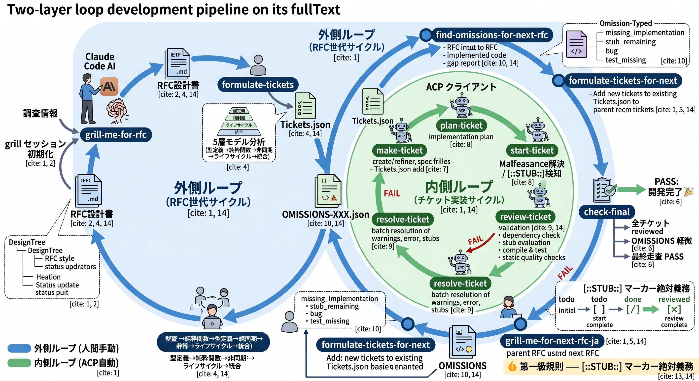

# conver — 二層ループ開発パイプライン

## 概要

conver は、**二層ループ構造**にもとづく開発パイプラインを実現するスラッシュコマンド群を提供するプロジェクトです。

- **外側ループ**: 設計（RFC）の世代サイクル。人間が Claude Code にスラッシュコマンドを入力して実行します。
- **内側ループ**: チケットの実装サイクル。ACP クライアントによって自動化されます。

```
                       外側ループ（RFC世代サイクル）
  ┌──────────────────────────────────────────────────────────────────────┐
  │                                                                      ▼
  grill → formulate ──→ [内側ループ] ──→ find ───→ formulate-for-next → grill(次)
   ▲                        │              │       ▲                     │
   │                        │ 内側ループ    │       │                     │
   │                        │ (自動実行:ACP)│ check-final                 │
   │                        ▼              ├── PASS: 完了                │
   │                   make → plan → start → review → resolve            │
   │                              ↑  FAIL ─┘                             │
   └──────────────────────────────┴── formulate-for-next へ継続 ──────────┘
```



## 自動化の境界

| ループ | 実行主体 | コマンド | 説明 |
|--------|----------|----------|------|
| **内側** | ACP クライアント（自動） | `make` → `plan` → `start` → `review` → `resolve` → `find` | チケットの実装〜完了までの一連の流れを自動実行 |
| **外側** | 人間（手動） | `grill`, `formulate`, `formulate-for-next`, `grill-me-for-next-rfc-ja`, `check-final` | 設計判断・ループ継続判断は人間が行う |

内側ループは ACP クライアントが自動的に回し続けます。外側ループの各ステップは、人間が Claude Code 上で該当のスラッシュコマンドを実行することで進行します。

---

## スラッシュコマンド一覧

### 外側ループ（人間実行）

#### `/grill-me-for-rfc <調査情報パス> <RFC出力パス>`

調査情報をもとに、RFC 設計書を対話型セッション（grill）で書き上げます。

**入力**: 調査情報のファイル/ディレクトリパス  
**出力**: IETF スタイルの RFC 設計書（.md）

**プロセス**:
1. `init.js` が DesignTree / Status.json / CheckList.md を初期化
2. AI がユーザーに設計判断を質問（Yes/No または選択肢形式）
3. DesignTree のノードを resolved にしていく
4. 全ノード解決 → CheckList.md 生成 → RFC 執筆
5. TBD / TODO / スタブ / 委譲 の混入禁止

**制約**:
- 「完全網羅・スコープ委譲禁止・スタブ禁止」
- 各設計判断にはコードスニペットを伴わせる
- セクション構成は IETF スタイル（Abstract, Motivation, Design, Implementation, Appendix）

#### `/formulate-tickets <設計書パス>`

設計書（RFC）を分析し、依存関係に基づくフェーズとチケットに分解して `Tickets.json` を生成します。

**入力**: RFC 設計書のファイルパス  
**出力**: 設計書と同階層の `Tickets.json`

**プロセス**:
1. 設計書を5層モデル（型定義→純粋関数→非同期→ライフサイクル→統合）で分析
2. 依存グラフに基づいてフェーズを設計
3. 各フェーズにチケットを追加（1チケット・1不変条件）
4. 全チケットは status `todo` で初期化

**既に `Tickets.json` が存在する場合は上書き確認を行います。**

#### `/formulate-tickets-for-next <OMISSIONSパス>`

`OMISSIONS-XXX.json` の内容を埋めるために、既存の `Tickets.json` にフェーズ・チケットを追加・拡張します。

**入力**: `OMISSIONS-XXX.json` のパス  
**出力**: 既存 `Tickets.json` にチケット追加（上書きなし）

**`/formulate-tickets` との違い**:
- 既存の `Tickets.json` を読み取り、不足チケットを追加するのみ
- 既存のチケットやフェーズは一切変更しない
- 各追加チケットは対応する omission ID を参照する

#### `/grill-me-for-next-rfc-ja <OMISSIONSパス> <NEXT_RFC出力パス>`

`OMISSIONS-XXX.json` を入力として、次の世代の RFC を grill セッションで書き上げます。

**入力**: `OMISSIONS-XXX.json` のパス + 次RFCの出力パス  
**出力**: 次世代 RFC 設計書（.md）

**既存の `/grill-me-for-rfc` との違い**:
- OMISSIONS を（調査情報の代わりに）入力として受け取る
- 出力される RFC には親RFCのパスと OMISSIONS ファイルのパスがメタデータとして記述される
- grill 質問は OMISSIONS の内容に基づいて生成される

**次RFCのメタデータ**:
```markdown
---
parent-rfc: <親RFCファイルのパス>
parent-omissions: <OMISSIONSファイルのパス>
---
```

#### `/check-final <最上位親RFCパス>`

開発完了条件をチェックするゲートです。以下の3条件がすべて満たされた場合のみ PASS を返します。

**入力**: 最上位の親RFCファイルのパス（parent-rfc を持たない最初のRFC）

**チェック条件**:
1. **全チケット `reviewed`**: `Tickets.json` の全チケットの status が `reviewed` である
2. **OMISSIONS 軽微**: 最新の `OMISSIONS-XXX.json` の内容が次RFCを書くほどではない
3. **最終走査 PASS**: 最上位親RFCのディレクトリ配下の全RFC・全OMISSIONS を走査し、矛盾や漏れがない

**結果**:
- **PASS** 🎉 → 開発完了。すべての条件を満たしています。
- **FAIL** → 未達条件を具体的に報告し、次のアクションを提案します。

---

### 内側ループ（ACP 自動実行）

以下のコマンドは ACP クライアントによって自動実行されます。各コマンドの詳細は `.claude/commands/` 配下の定義ファイルを参照してください。

#### `/make-ticket [チケットID | タイトル]`

実装仕様書（spec）を作成・詳細化します。

- 引数なし → ヒアリングからタイトル決定
- `P{phaseID}-{ticketID}` → 既存チケットの深掘り
- 文字列 → 新規 spec のタイトルとして作成

**出力**: `spec/*.md` + `Tickets.json` へのチケット登録

#### `/plan-ticket <チケットID>`

チケットの実装計画を策定し、承認を得ます。

- 変更ファイル一覧
- Boy Scout 改善（翻訳可能性）
- テスト計画（ユニットテスト最優先）
- 実装手順
- 物理的レビュー方法
- リスク

計画は `Tickets.json` のチケットフィールドに保存されます。

#### `/start-ticket <チケットID>`

計画に従い実装を実行します。完了後 status を `done` に遷移します。

**必須ステップ**:
- Malfeasance 犯罪の緊急解決
- スタブの解決
- 不完全実装の能動的探索（7パターン）
- コンパイル検証 + テスト
- 品質チェック（`run-quality-checks.js`）

#### `/review-ticket <チケットID>`

`done` チケットの品質検証を行います。通過後 status を `reviewed` に遷移します。

**検証項目**:
- 依存関係の整合性検証
- Malfeasance 犯罪の解決確認
- スタブ評価
- コンパイル検証 + ユニットテスト
- 静的品質チェック
- 翻訳可能性チェック

#### `/resolve-ticket <ディレクトリパス>`

指定ディレクトリ配下の警告・エラー・スタブ・犯罪を一括解決します。

- `cargo check` / `cargo test` の警告・エラー解決
- 未解決スタブの犯罪登録
- 全犯罪の解決
- 最終検証

#### `/find-omissions-for-next-rfc <RFCファイルパス>`

RFC の設計内容と実際の実装コードを比較し、漏れ・矛盾・不足を発見して `OMISSIONS-XXX.json` に出力します。

**出力**: `{RFC_DIR}/OMISSIONS-XXX.json`

**発見する omission の種類**:
| 種別 | 説明 |
|------|------|
| `missing_implementation` | RFC で定義されているが未実装 |
| `incomplete_implementation` | 部分的にしか実装されていない |
| `design_deviation` | RFC の設計と異なる実装 |
| `bug` | 明らかなバグ |
| `stub_remaining` | `[::STUB::]` が残ったまま |
| `test_missing` | RFC で要求されているがテストがない |
| `inconsistency` | 設計全体で矛盾している状態 |

---

## チケットのステータス遷移

```text
   todo ──────→ done ──────→ reviewed
  (初期状態)   (start完了)  (review完了)
```

- `list-phases-and-tickets.js` の表示: `todo` → `[ ]`, `done` → `[/]`, `reviewed` → `[x]`

---

## データモデル

### Tickets.json

`Tickets.json` は RFC の実装を管理する中心的なデータストアです。

```
Tickets.json
├── title: string
├── metadata: { source, generatedAt, ... }
├── phases[]
│   ├── id: integer
│   ├── name: string
│   ├── externalDependencies: string
│   └── tickets[]
│       ├── id: integer (フェーズ内連番)
│       ├── phaseId: integer
│       ├── title: string
│       ├── status: "todo" | "done" | "reviewed"
│       ├── background, scope[], testVerification[]
│       ├── notes, changes[], instrumentation
│       ├── startedAt, completedAt
│       └── relatedTicketIds, referenceSection
```

### OMISSIONS-XXX.json

`find` コマンドが出力する、RFC設計と実装のギャップを記録したファイルです。

```
OMISSIONS-XXX.json
├── parentRfcPath: string (親RFCのパス)
├── parentRfcTitle: string
├── generatedAt: string (YYYY-MM-DD)
├── summary: string
└── omissions[]
    ├── id: string (O-001形式)
    ├── type: enum (7種)
    ├── severity: enum (critical/high/medium/low)
    ├── rfcSection: string
    ├── description: string
    ├── details: string
    ├── affectedFiles: string[]
    ├── suggestedResolution: string
    └── resolvedInNextRfc: boolean
```

### チケットID命名規則

- フェーズID: `P0`, `P1`, ... / `PX`（独立フェーズ）
- チケットID: `P{phaseID}-{ticketID}`（例: `P0-1`）
- 全コマンドの引数でこの形式を使用

---

## スクリプト群

`.claude/scripts/tickets/` 配下に CRUD 操作を提供するスクリプト群があります。

### チケットCRUD

| スクリプト | 説明 |
|---|---|
| `add-ticket.js` | チケット追加（単一） |
| `get-ticket.js` | チケット取得（複合キー） |
| `update-ticket.js` | チケット更新 |
| `delete-ticket.js` | チケット削除 |
| `bulk-add-tickets.js` | チケット一括追加 |
| `bulk-update-tickets.js` | チケット一括更新 |
| `bulk-delete-tickets.js` | チケット一括削除 |

### 表示・検索

| スクリプト | 説明 |
|---|---|
| `list-phases-and-tickets.js` | チェックリスト形式表示 |
| `all-tickets.js` | 全一覧（フィルタ可能） |
| `search-tickets.js` | 全文検索 |
| `get-ticket-as-markdown.js` | Markdown 形式で取得 |

### OMISSIONS

| スクリプト | 説明 |
|---|---|
| `next-omissions-number.js` | 次番号採番 |
| `list-omissions.js` | OMISSIONS 一覧表示 |

### フェーズ管理

| スクリプト | 説明 |
|---|---|
| `add-phase.js` | フェーズ追加 |
| `add-px-phase.js` | PX（独立）フェーズ追加 |
| `write-tickets-json-template.js` | Tickets.json スケルトン生成 |

### spec

| スクリプト | 説明 |
|---|---|
| `create-spec.js` | spec ファイルスケルトン生成 |

### 品質・犯罪・スタブ

| スクリプト | 説明 |
|---|---|
| `review/run-quality-checks.js` | 静的品質チェック |
| `review/generate-report.js` | 品質レポート生成 |
| `review/find-all-stubs.js` | スタブ検出 |
| `scan-crimes.sh` | 犯罪スキャン |
| `malfeasance-create.js` | 犯罪レコード作成 |
| `malfeasance-update.js` | 犯罪レコード更新 |
| `malfeasance-all.js` | 犯罪一覧 |

### grill

| スクリプト | 説明 |
|---|---|
| `.claude/scripts/grill-me-for-rfc/init.js` | grill セッション初期化 |
| `.claude/scripts/grill-me-for-rfc/update-tree.js` | DesignTree CRUD |
| `.claude/scripts/grill-me-for-rfc/tree-query.js` | DesignTree 検索・表示 |
| `.claude/scripts/grill-me-for-rfc/update-status.js` | ステータス更新 |
| `.claude/scripts/grill-me-for-rfc/session-status.js` | セッション状況表示 |
| `.claude/scripts/grill-me-for-rfc/check-all-schema.js` | スキーマ検証 |
| `.claude/scripts/grill-me-for-rfc/generate-checklist.js` | CheckList.md 生成 |
| `.claude/scripts/grill-me-for-rfc/list-files.js` | 調査ファイル一覧 |
| `.claude/scripts/grill-me-for-rfc/validate-question-format.js` | 質問形式検証 |

### 共通ライブラリ

| ファイル | 説明 |
|---|---|
| `lib/tickets.js` | チケット共通ユーティリティ |
| `lib/ticket-config.js` | 設定管理 |
| `lib/validate-tickets.js` | Tickets.json スキーマ検証 |
| `lib/validate-omissions.js` | OMISSIONS スキーマ検証 |
| `lib/malfeasance-utils.js` | 犯罪レコード操作 |
| `lib/validate-malfeasance.js` | Malfeasance.json スキーマ検証 |

---

## 第一級規則 — `[::STUB::]` マーカー絶対義務

不完全な実装（スタブ・モック・仮実装・プレースホルダー等）にはすべて `[::STUB::]` マーカーを付与しなければなりません。これを「犯罪」として Malfeasance.json に記録し、解決するまで次ステップに進めません。

対象となるパターン:
1. `todo!()`, `unimplemented!()`, `panic!()`
2. 空の関数本体（`fn foo() {}`）
3. 未実装の `return Ok(())` / `return None`
4. コメントアウトされた実装コード
5. `TODO` / `FIXME` / `HACK` / `XXX`
6. Mock / Fake オブジェクト
7. `#[allow(...)]` による警告抑制

---

## はじめかた

1. `/grill-me-for-rfc` で設計判断を確定し、RFC を書く
2. `/formulate-tickets` で RFC から `Tickets.json` を生成する
3. ACP クライアントが内側ループ（make→plan→start→review→resolve→find）を自動実行する
4. `find` が出力した `OMISSIONS-XXX.json` を確認する
   - 軽微なら `/check-final` で完了確認
   - 次の設計が必要なら `/formulate-tickets-for-next` → `/grill-me-for-next-rfc-ja` で次世代へ
5. `/check-final` が PASS を返したら 🎉 開発完了
