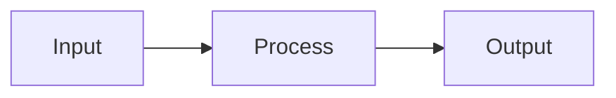

# Mermaidをテキスト図として描画する

Node.jsと `beautiful-mermaid` を使用し、MermaidソースをASCII／Unicodeのテキスト図に変換する。SVGやブラウザは使用しない。

## インストール

```bash
npm install beautiful-mermaid
```

## CLIスクリプト

以下を `mermaid-text.mjs` として保存する。

```js
#!/usr/bin/env node
import { readFileSync } from "node:fs";
import { renderMermaidASCII } from "beautiful-mermaid";

const args = process.argv.slice(2);
const markdown = args.includes("--markdown");
const ascii = args.includes("--ascii");
const files = args.filter(arg => arg !== "--markdown" && arg !== "--ascii");

if (files.length > 1 || files.some(arg => arg.startsWith("-") && arg !== "-")) {
  console.error("Usage: node mermaid-text.mjs [file|-] [--markdown] [--ascii]");
  process.exit(1);
}

try {
  const file = files[0];
  const source = readFileSync(file && file !== "-" ? file : 0, "utf8");
  const diagram = renderMermaidASCII(source, {
    useAscii: ascii,
    colorMode: "none",
  });

  process.stdout.write(
    markdown ? "```text\n" + diagram + "\n```\n" : diagram + "\n"
  );
} catch (error) {
  console.error(error instanceof Error ? error.message : String(error));
  process.exitCode = 1;
}
```

## 入力例

`diagram.mmd` を作成する。



入力は生のMermaidソース。Markdownのコードフェンスは含めない。

## 実行

### コンソールに表示

```bash
node mermaid-text.mjs diagram.mmd
```

デフォルトではUnicode罫線を使用する。

### 標準入力から描画

```bash
echo 'graph LR; A --> B --> C' | node mermaid-text.mjs
cat diagram.mmd | node mermaid-text.mjs -
```

### Markdownとして保存

```bash
node mermaid-text.mjs diagram.mmd --markdown > diagram.md
```

`text` コードフェンス付きのテキスト図を出力する。Mermaid対応のMarkdownビューアは不要。

既存ドキュメントの末尾に追加する場合：

```bash
printf '\n\n' >> README.md
node mermaid-text.mjs diagram.mmd --markdown >> README.md
```

### ASCII文字だけで描画

```bash
node mermaid-text.mjs diagram.mmd --ascii
node mermaid-text.mjs diagram.mmd --ascii --markdown > diagram.md
```

`--ascii` はASCII文字だけの出力を指定する。指定しなければUnicode罫線を使用する。入力ラベルに日本語などを含める場合、そのラベル自体までASCIIに変換するものではない。

## オプション

| オプション | 内容 |
|---|---|
| `file` | Mermaidソースファイル |
| `-` またはファイル指定なし | 標準入力を読む |
| `--markdown` | Markdownの `text` コードフェンスで囲む |
| `--ascii` | Unicode罫線ではなくASCII文字を使用 |

`colorMode: "none"` を固定し、ANSIカラーのエスケープシーケンスを出力しない。

## 注意点

- Mermaid公式レンダラーの完全互換品ではない。対応する構文を使用する。
- このCLIは上記スクリプトで実装するもので、パッケージ内蔵CLIではない。
- 表示イメージではなく、実際のレンダラーが返した文字列を出力する。
- 再現性が必要なプロジェクトでは `package-lock.json` を管理し、以後は `npm ci` でインストールする。

## 公式ドキュメント

https://github.com/lukilabs/beautiful-mermaid
