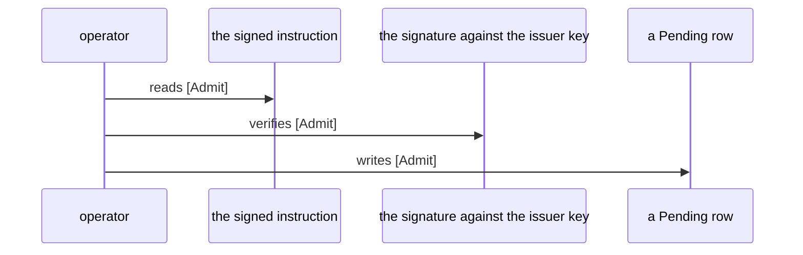
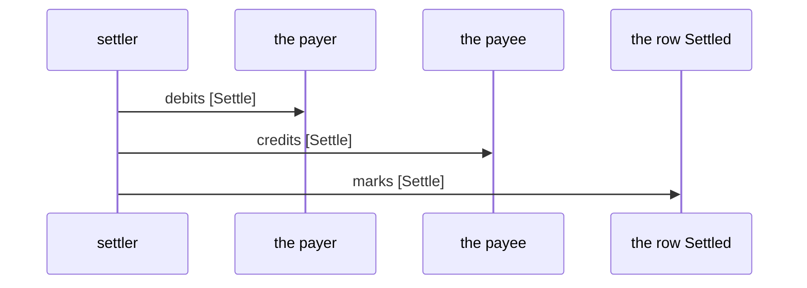

# ledger.md — sequences

- specification sha256: bae3bb680783bfeb475d747a06172198b4564c1f8c5d8de908fd36f7eb3db8fa
- specification lines: 60
- schema version: 2

## Pins

- predicate line: 10
- row schema line: 14
- enumerations: OperationStatus (closed)
- blocks: 10

## Sequences

- front-matter 1-23 notASequence
- admission 24-26 direct
- rejection 27-33 notASequence
- settlement 34-35 viaNeighbour
- cancellation 36-48 notASequence
- settlement-replays-admission 49-50 unread
- supplied-rule 51-58 notASequence
- non-operation 59-60 unread

## Steps

- admission-1 operator / reads / the signed instruction / the instruction is signed
- admission-2 operator / verifies / the signature against the issuer key / the signature verifies
- admission-3 operator / writes / a Pending row / the row exists
- settlement-1 settler / debits / the payer / the row is pending
- settlement-2 settler / credits / the payee / the payer was debited
- settlement-3 settler / marks / the row Settled / the payee was credited

## Operations

- Admit positioned definition
- Settle positioned definition
- LedgerStatus suppliedRule designer_supplied

## Diagrams

## Verify

`node .claude/scripts/educe-sequences/rail/run.mjs <spec-file>` exits 0
