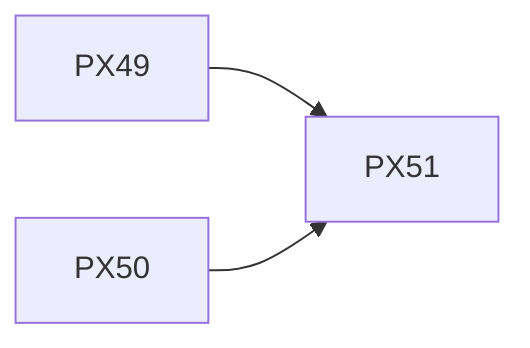

# make-ticket.md 改修: パイプライン情報連携の完成

## Summary

`make-ticket.md` の「新規作成」ワークフローにおける Step 7（現在は dump-ticket-graph-commands.js 単独実行）を、以下の2段階に拡張する:

1. **Step 7-1**: グラフ・ディレクトリツリーパスの決定（パイプライン情報がなければ静かにスキップ）
2. **Step 7-2**: `dump-ticket-graph-commands.js` + `dump-node-context-to-spec.js` の順次実行

パイプライン情報が機械的に spec に書き込まれることで、AI は Step 6 の Background / Scope / Test Plan 記述時にそれを自然に参照できる。新たなステップの追加は必要ない。

これにより、graphify → boundify → split の全情報資産が機械的に spec へ書き起こされ、かつ「決定論的に確定できる情報はスクリプトが、解釈が必要な部分はAIが」という明確な役割分担が確立する。

## Background

### 現在の Step 7 の問題

現在の `make-ticket.md` の Step 7 は以下の内容である:

```markdown
#### Step 7: dump-ticket-graph-commands.js の実行

graphify-rfc で生成されたグラフが存在する場合、dump-ticket-graph-commands.js を実行して
spec に「RFC設計グラフ構造探索コマンド」セクションを自動追記する：
```

このステップには以下の問題がある:

1. **情報不足**: query.js コマンドのみでは spec の読者はグラフへの「入り口」しか得られない。ノードの kind やエッジ関係などのコンテキストは spec に存在しない
2. **グラフパスの導出が不明**: `--graph=<設計書ディレクトリ>/<設計書名>-GRAPH.json` と書いてあるが、実際のチケット作成時にどの設計書のパスを使うかの決定基準が不明
3. **AI の役割が曖昧**: 機械的情報が書き込まれた後、AI がそれをどう活用すべきかの指示がない
4. **Dirs-Tree.json の参照がない**: split で生成されたディレクトリ構造情報が完全に欠落
5. **グラフが存在しない場合の代替手段がない**: グラフなしでも spec 作成は行われるが、その場合の情報源の指定がない

### パイプライン全体像における本チケットの位置づけ

本チケット（PX-51）は、graphify → boundify → split → make のパイプラインを完成させる「最終接合部」である:

```
graphify ─── GRAPH.json ──┐
                           ├──→ dump-ticket-graph-commands.js  (PX-49) ──┐
boundify ── Dirs-Tree.json┘                                              │
                           ├──→ dump-node-context-to-spec.js   (PX-50) ──┤
split ───── Tickets.json ──┘                                              │
                                                                          │
make-ticket.md 改修 (PX-51) ←─────────────────────────────────────────────┘
                                        （Step 6 で AI が自然に参照）
```

PX-49 と PX-50 が個別のスクリプトの修正/作成であるのに対し、PX-51 はそれらを統合し、パイプライン全体として完結させる役割を持つ。

### 情報トレーサビリティの完成形

改修後、1枚の spec が保持する情報は以下になる:

| セクション | 情報源 | 生成方法 |
|-----------|--------|---------|
| Summary | AI | 対話 + 調査結果 |
| Background | AI + 機械的情報 | 機械的情報を踏まえたAI記述 |
| Scope | AI + 機械的情報 | ノード範囲を機械的に確定 + AIが自然に参照 |
| Investigation | AI | 調査結果の記録 |
| **RFC設計グラフ構造探索コマンド** | dump-ticket-graph-commands.js | 機械的（PX-49） |
| **設計コンテキスト: ノード詳細** | dump-node-context-to-spec.js | 機械的（PX-50） |
| **設計コンテキスト: ノード間関係性** | dump-node-context-to-spec.js | 機械的（PX-50） |
| **設計コンテキスト: 実装ファイルパス** | dump-node-context-to-spec.js | 機械的（PX-50） |
| Test Plan | AI | 機械的情報を踏まえたAI記述 |
| Boy Scout Rule | AI | コードレビュー計画 |
| Acceptance Criteria | AI | 完了条件の定義 |
| Notes | AI | 補足情報 |

機械的生成セクション（4セクション）と AI 記述セクション（7セクション）が明確に分離され、実装者は spec だけですべての情報にアクセスできる。

## Scope

### 変更対象

- `tools/conver/.claude/commands/make-ticket.md` — コマンド定義ファイル
  - **新規作成ワークフロー**: Step 7 を拡張（既存のdump-ticket-graph-commands.js実行は維持し、パイプライン情報が存在する場合のみdump-node-context-to-spec.jsを追加実行）
  - **深掘りワークフロー**: Step 2（フィールド補完）の後に機械的情報書き込みステップを追加
  - **使用スクリプト一覧**: dump-node-context-to-spec.js を追加

### 改修後の Step 7 の設計

```markdown
#### Step 7: 設計コンテキストの spec 自動書き起こし

このステップでは、graphify → boundify → split のパイプラインで蓄積された情報を
機械的に spec に書き込む。2段階で構成される。

パイプライン情報が存在しない場合（スポットチケットなど）は、何も書かずに静かにスキップする。
既存の make-ticket の動作（ヒアリング・対話・メッセージ提案など）は一切変更しない。

##### Step 7-1: グラフ・ディレクトリツリーパスの決定

設計書（RFC）が存在する場合、そのパスから以下のファイルパスを導出する:

- **`$DOC_PATH`**: 設計書（RFC）のファイルパス
  - `Tickets.json` の `metadata.source` フィールドから取得する（唯一の信頼できる情報源）
  - `metadata.source` が存在しない場合（アドホックチケットなど）、この Step 全体を静かにスキップする
- **`$GRAPH_PATH`**: `$(dirname "$DOC_PATH")/$(basename "$DOC_PATH" .md)-GRAPH.json`
- **`$DIRS_TREE_PATH`**: `$(dirname "$DOC_PATH")/$(basename "$DOC_PATH" .md)-Dirs-Tree.json`

3ファイルすべてが存在する場合のみ Step 7-2 を実行する。1つでも欠けている場合は
静かにスキップする（ユーザーへの通知や確認は行わない）。

##### Step 7-2: スクリプトによる機械的書き込み（前提: PX-49, PX-50）

```bash
# (1) query.js 探索コマンドの追記（PX-49 の修正が有効であることが前提）
node .claude/scripts/rfc-graph/dump-ticket-graph-commands.js \
  --tickets=Tickets.json \
  --graph=$GRAPH_PATH \
  --source=$DOC_PATH

# (2) ノード詳細・エッジ関係・ファイルパスの追記（PX-50 のスクリプトが存在することが前提）
node .claude/scripts/rfc-graph/dump-node-context-to-spec.js \
  --tickets=Tickets.json \
  --graph=$GRAPH_PATH \
  --dirs-tree=$DIRS_TREE_PATH \
  --ticket-key=$TICKET_KEY
```

これにより spec に機械的情報が書き込まれた状態になる。AI は Step 6 で
Background/Scope/Test Plan を記述する際に、すでに spec 内にあるこれらの
機械的情報を自然に参照して記述を生成する。新たなステップの追加は不要である。
```

### 深掘りワークフローの改修

深掘りワークフローでは Step 1（チケット取得）の後、Step 2（フィールド補完）との間に設計コンテキスト書き込みステップを挿入する。パス導出は新規作成と同じ `metadata.source` ベースのロジックを使用する:

```markdown
#### Step 2a: 設計コンテキストの spec 自動書き込み

新規作成時の Step 7（設計コンテキストの spec 自動書き起こし）と全く同じ手順を実行する。
既存チケットの nodeIds が設定されている場合、dump-ticket-graph-commands.js と
dump-node-context-to-spec.js で spec に設計コンテキストを追記する。

$DOC_PATH の導出は新規作成と同一（Tickets.json の metadata.source を信頼）。
深掘り時も推測によるフォールバックは行わず、metadata.source がない場合は静かにスキップする。
```

### 使用スクリプト一覧への追記

`dump-node-context-to-spec.js` をスクリプト一覧表に追加する:

```
| `dump-node-context-to-spec.js` | `--tickets=<path> --graph=<path> --dirs-tree=<path> --ticket-key=<key>` | 設計コンテキスト（ノード詳細・エッジ関係・ファイルパス）を spec に自動追記 |
```

### 変更しないもの

- make-ticket.md の引数解釈ロジック（既存の `PX-{id}` 解釈はそのまま）
- Step 1-6, 8-11 の内容（変更不要）
- 犯罪点検（Step 9）の位置と内容
- ステータス更新（Step 10）のロジック
- 深掘りワークフローの基本構造（Step 1 → Step 2a(新設) → Step 2 → Step 3 → Step 4 の順。Step 1/2/3/4 の内容は変更しない）

## Non-scope

- PX-49 の修正（dump-ticket-graph-commands.js の resolveSpecPath）は含めない
- PX-50 のスクリプト作成は含めない
- `dump-ticket-graph-commands.js` の Dirs-Tree.json 対応は含めない（本スクリプトは query.js コマンドのみの責務）
- make-ticket.md 以外のコマンドファイル（plan-ticket.md, start-ticket.md, review-ticket.md）の改修は含めない
- テストファイルの修正は含めない（make-ticket.md はコマンド定義でありテスト対象外）

## Investigation

### 現状の make-ticket.md 分析

`/Users/kawata/shyme/zasso/tools/conver/.claude/commands/make-ticket.md` の現状:

**Step 7（L143-155）**:
```markdown
#### Step 7: dump-ticket-graph-commands.js の実行

graphify-rfc で生成されたグラフが存在する場合、dump-ticket-graph-commands.js を実行して
spec に「RFC設計グラフ構造探索コマンド」セクションを自動追記する：

```bash
node .claude/scripts/rfc-graph/dump-ticket-graph-commands.js \
  --tickets=Tickets.json \
  --graph=<設計書ディレクトリ>/<設計書名>-GRAPH.json \
  --source=<設計書パス>
```

グラフが存在しない場合、dump-ticket-graph-commands.js は「グラフファイルがありません」
メッセージを出力するが、処理自体は正常終了する。
`` ```

問題点:
1. `--graph` と `--source` のパスがプレースホルダー（`<...>` 形式）であり、機械的に決定できない
2. Dirs-Tree.json の参照がない
3. スポットモード（パイプライン情報なし）でも実行できることの明示がない

**Step 6（L120-122）**:
```markdown
**「RFC設計グラフ構造探索コマンド」セクションについて**: このセクションは
dump-ticket-graph-commands.js によって後続の Step X で自動追記される。spec 作成時点では
記述不要だが、グラフ探索クエリの起点となる nodeIDs がチケットに存在することを意識して
spec を設計する。
```

この記述は適切（Step 7 の事前説明として機能している）。Step 7 の改修に合わせて微調整の可能性あり。

### 設計書パス決定の判断基準

`$DOC_PATH` の決定は以下の判断基準に従う:

1. `Tickets.json` の `metadata.source` フィールドを唯一の信頼できる情報源として参照する
2. `metadata.source` が存在しない場合はステップを静かにスキップする（推測による誤選択を避ける）

### 改修内容の具体例

改修後の `make-ticket.md` の該当セクションは以下のようになる:

```markdown
#### Step 7: 設計コンテキストの spec 自動書き起こし

このステップでは、graphify → boundify → split のパイプラインで蓄積された情報を
機械的に spec に書き込む。2段階で構成される。

パイプライン情報が存在しない場合（スポットチケットなど）は、何も書かずに静かにスキップする。
既存の make-ticket の動作（ヒアリング・対話・メッセージ提案など）は一切変更しない。

##### Step 7-1: グラフ・ディレクトリツリーパスの決定

Tickets.json の metadata.source を確認し、設計書（RFC）のパスを特定する。
特定できた場合、以下のファイルパスを導出する:

```bash
# Tickets.json と同じディレクトリから設計書を特定
DOC_PATH=$(node -p "try { const t=require('./Tickets.json'); t.metadata?.source || '' } catch(e){''}")
if [ -z "$DOC_PATH" ]; then
  # metadata.source がない場合は静かにスキップ（推測による誤選択を避ける）
  echo "（設計書パスが特定できないため、設計コンテキストの自動書き込みをスキップします）"
  exit 0
fi

GRAPH_PATH="$(dirname "$DOC_PATH")/$(basename "$DOC_PATH" .md)-GRAPH.json"
DIRS_TREE_PATH="$(dirname "$DOC_PATH")/$(basename "$DOC_PATH" .md)-Dirs-Tree.json"
```

3ファイル（設計書 / GRAPH.json / Dirs-Tree.json）すべてが存在する場合のみ、
Step 7-2 を実行する。欠けている場合は静かにスキップする。

##### Step 7-2: スクリプトによる機械的書き込み

```bash
# (1) query.js 探索コマンドの追記
node .claude/scripts/rfc-graph/dump-ticket-graph-commands.js \
  --tickets=Tickets.json \
  --graph="$GRAPH_PATH" \
  --source="$DOC_PATH"

# (2) ノード詳細・エッジ関係・ファイルパスの追記
node .claude/scripts/rfc-graph/dump-node-context-to-spec.js \
  --tickets=Tickets.json \
  --graph="$GRAPH_PATH" \
  --dirs-tree="$DIRS_TREE_PATH" \
  --ticket-key="$TICKET_KEY"
```

これにより spec に機械的情報が書き込まれた状態になる。AI は Step 6 で
Background/Scope/Test Plan を記述する際に、すでに spec 内にあるこれらの
機械的情報を自然に参照して記述を生成する。新たなステップの追加は不要である。
```

## Test Plan

### ユニットテスト計画

make-ticket.md はコマンド定義ファイルであり、テストは以下の観点で実施する:

1. **ドライラン検証（手動）**: 改修後の make-ticket.md の Step 7 に従い、実際の Tickets.json と GRAPH.json を使ってスクリプトを実行し、spec に正しく追記されることを確認
2. **既存テストの回帰確認**: `make test-conver` が全件 PASS すること

### ユニットテスト不可能な項目（例外）

- 改修後の make-ticket.md の動作確認は E2E 手動テスト（実際のチケット作成フローを通じて確認）
- コマンド定義ファイル自体のテストフレームワークは存在しない

## Boy Scout Rule — 翻訳可能性計画

- `make-ticket.md` の Step 7 は現在プレースホルダー（`<...>`）が多く、機械的に実行可能なコマンドになっていない。これを具体的なコマンド例に書き換える
- スクリプトの実行パス（`.claude/scripts/`）の一貫性を確認する（現在は相対パスと絶対パスが混在している）
- コメントの日本語とコマンドの英語が混在している箇所を整理する

## Acceptance Criteria

- [x] 実装要件を満たしている
- [ ] make-ticket.md の新規作成 Step 7 が2段階（パス決定→機械書き込み、スキップは静かに）に改修されている
- [ ] make-ticket.md の深掘りワークフローに設計コンテキスト書き込みステップが追加されている
- [ ] グラフパス決定ロジックが実用的である（metadata.source からの導出のみ。なければ静かにスキップ）
- [ ] パイプライン情報が欠けている場合、静かにスキップする（ユーザー確認なし）
- [ ] スポットモード（パイプライン情報なし）でも既存の全動作が完全に維持される
- [ ] 翻訳可能性の検証が通っている
- [ ] 既存テストが通過している

## Notes

### 依存関係

- **PX-49** (必須前提): dump-ticket-graph-commands.js の resolveSpecPath バグ修正が完了していること
- **PX-50** (必須前提): dump-node-context-to-spec.js スクリプトが作成されていること
- **PX-1-48** (関連): referenceSection 機械生成 — Step 7-1 のパス決定ロジックと関連

### 実装順序



PX-49 と PX-50 の完了を待ってから PX-51 に着手する。PX-51 の実装時には:
1. 両スクリプトが正常動作していることを確認
2. 実際の Tickets.json + GRAPH.json + Dirs-Tree.json でドライラン
3. 生成された spec セクションの内容を確認
4. 最終確認後に make-ticket.md を改修

### 情報トレーサビリティ完成図

改修完了後、1枚の spec から実装者がアクセスできる情報:

```
spec を開く
  │
  ├── 「RFC設計グラフ構造探索コマンド」 → query.js コマンド → グラフ探索
  │
  ├── 「設計コンテキスト: ノード詳細」 → 全ノードの kind/summary/language
  │
  ├── 「設計コンテキスト: ノード間関係性」 → エッジ種別・依存方向・内外区別
  │     ├── depends_on → 先行実装必須のチケット
  │     ├── precedes → 後続チケットへの影響
  │     └── part_of → 同一チケット内の構造関係
  │
  ├── 「設計コンテキスト: 実装ファイルパス」 → 全ファイルの物理的位置
  │
  └── (Step 6 AI 記述) → 機械的情報を参照した Background/Scope/Test Plan
```

これにより、実装者は spec だけで完全なトレーサビリティを得られ、RFC / GRAPH.json / Dirs-Tree.json を直接参照する必要がなくなる。
